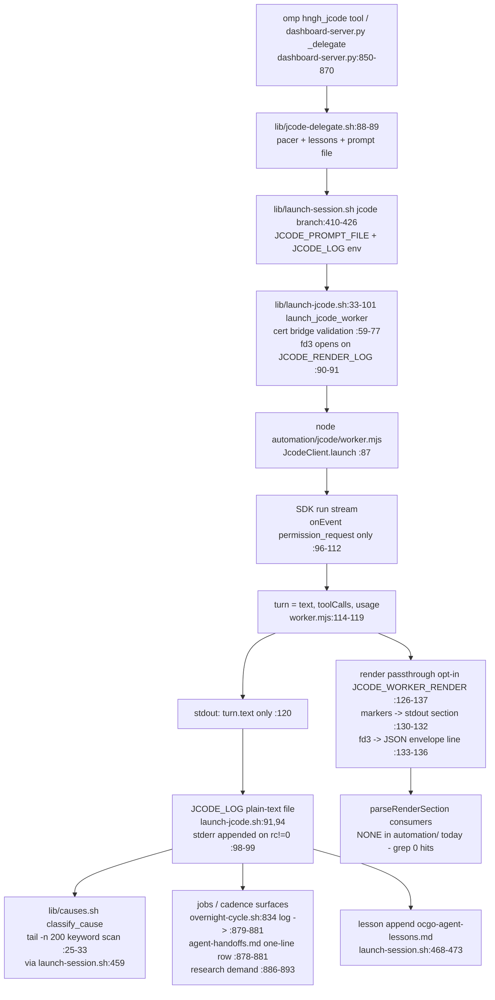

# viz-transport: worker.mjs transport lane map (2026-09-15)

## Scope

How `automation/jcode/worker.mjs` produces its one-turn plain-text output,
what `JcodeClient` (@1jehuang/jcode-sdk) exposes beyond the final string,
and where stdout lands downstream. File:line evidence throughout.

## SDK surface actually used

- `JcodeClient.launch({workingDir, jcodeHome})` — worker.mjs:87-90
- `client.createSession()` — worker.mjs:93
- `client.run(session_id, prompt, {autoApprove, onEvent(ev)})` — worker.mjs:94-113.
  `onEvent` receives stream events; worker.mjs filters to `ev.ev === "permission_request"`
  only (worker.mjs:97). All other event kinds (message deltas, markdown blocks,
  tool-call events) are discarded: the shim keeps only the resolved `turn`.
- Resolved `turn` object: `{text, toolCalls, usage}` per render-blocks.mjs:69-70
  (`buildEnvelope` reads `t.text`, `t.toolCalls`, `t.usage`). So the SDK does
  return more than a string — tool calls and token usage survive — but the shim's
  stdout contract emits only `turn.text` (worker.mjs:120).
- `client.respondToPermission(session_id, request_id, allow|deny)` — worker.mjs:101,106,109
- `client.close()` — worker.mjs:146

Markdown message blocks / streaming deltas: not surfaced by the shim. Render
blocks are NOT SDK message blocks; they are fenced ```hngh-render <kind>```
sections embedded in the final text, extracted by render-blocks.mjs:42-67.

## Transport flow



## Hop-by-hop: lossy vs lossless

| Hop | Evidence | Verdict |
|---|---|---|
| SDK turn -> shim stdout | worker.mjs:120 `process.stdout.write(turn.text || "")` | LOSSY: `toolCalls` and `usage` dropped unless render mode on |
| Stream events -> shim | worker.mjs:97 returns early on non-permission events | LOSSY: all stream/message/markdown events discarded by design |
| Render blocks extraction | render-blocks.mjs:42-67 | LOSSY for model text: fences stay embedded in stdout text (only parseRenderSection strips them, and no consumer calls it yet); unclosed fences dropped :65 |
| buildEnvelope | render-blocks.mjs:71-88 | LOSSLESS for text blocks + tool name/error + usage; LOSSY: tool inputs/outputs not carried, only `name`+`error` :77-79 |
| fd3 side channel | render-blocks.mjs:143-149 | LOSSLESS when JCODE_RENDER_LOG set (launch-jcode.sh:90-91); silent drop (returns false, never fatal) when fd3 closed — intentional |
| Marker section through shell redirect | render-blocks.mjs:10-15 rationale | preserved via stdout markers; fd3 would be dropped by plain redirection, hence two transports |
| stdout -> JCODE_LOG file | launch-jcode.sh:91,94 | LOSSLESS byte copy (plus optional marker section if mode=markers) |
| stderr on failure -> log tail | launch-jcode.sh:98-99 | LOSSY: only last 2000 bytes of stderr appended |
| log -> classify_cause | causes.sh:25-33 tail -n 200 keyword scan | LOSSY: classification only; render markers in tail force class "unknown" (causes.sh:32-33 comment: marker tail means unknown regardless) |
| log -> agent-handoffs.md | overnight-cycle.sh:878-881 | LOSSY: one metadata line (slug, rc, disposition, log path, model, cause); log content never copied |
| log -> research tsv demand | overnight-cycle.sh:886-893 append_research_subject on dead:missing-knowledge/design | LOSSY: derived signal only |
| log -> lessons file | launch-session.sh:468-473 append_ocgo_lesson | LOSSY: one cause-class line |
| prompt in | worker.mjs:44 single argv blob; launch-jcode.sh:79-81 | LOSSLESS at this hop; envelopes never carry the prompt (worker.mjs:125 comment) |

## Key finding

The lane is already dual-capable: `JCODE_WORKER_RENDER=markers|fd3|both` produces
structured v1 envelopes (render-blocks.mjs:20-25) without changing the stdout
contract, but `grep -rn "parseRenderSection\|HNGH-RENDER" automation/` finds zero
consumers — nothing downstream currently parses envelopes. All existing surfaces
(agent-handoffs.md, research tsv, lessons, causes classification) consume the
plain-text log lossily via keyword scans and single-line metadata.

## Downstream surface index

- agent-handoffs.md rows: scripts/overnight-cycle.sh:878-881; dashboard-server.py:24-29,85,111,145
- dispatch/digests: budget row launch-session.sh:479-481; overnight cycle results/blocked events :846-850
- research tsv: overnight-cycle.sh:345 (research-lines tail into prompts), :886-893 (demand append)
