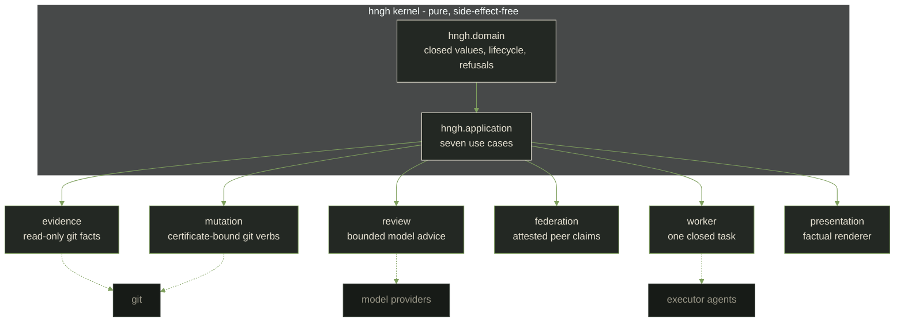

# Hngh

[](CHANGELOG.md)
[](LICENSE)
[](docs/core/clean-architecture-charter.md)
[](#verify)
[](.github/workflows/ci.yml)

---

`[ I. WHAT IT IS ]`

## An agent harness whose every step leaves a trace

Hngh turns development work into short, bounded cycles - plan, check,
record, close - that an automated agent can run while a human keeps the
final say. The kernel (`hngh.domain` + `hngh.application`) is a pure
Common Lisp spine: it reads no clock, no file, no network, no
subprocess, and refuses anything unknown or unverified. The outside
world plugs in at explicit ports; authority is a certificate bound to
evidence and rechecked at the moment of action. Its ambition is
megastructure-scale; its method is paperwork. That is not a
contradiction - paperwork is the building material. Not the agent that
can do the most; the agent whose every step leaves a trace.

The kernel decides. Ports connect. Certificates permit one action.



Dependency arrows point inward only. The dotted edges are injected
transports - the kernel never dials out on its own. The law and the
promotion ladder: [docs/core/clean-architecture-charter.md](docs/core/clean-architecture-charter.md).

---

`[ II. PROOF OF LIFE ]`

## Look at the machine

- A live [ASCII dashboard render](docs/media/linear.txt) - the
  timeline view the operator sees, drawn from the same data the webapp
  renders (`--dance` motion is best seen live).
- A [worked example](docs/core/worked-example.md): one full
  create-run-to-close-run cycle and one real automation beat, quoted
  from captured records - nothing staged.
- The [daily journal](docs/journal/2026-08-25.md) - the project
  publishes a journal of its own construction, written from the same
  ledger that governs its releases. Latest entry:
  [2026-09-11](docs/journal/2026-09-11.md).
- A [recent automation digest](automation/digest/2026-09-11.md) - what
  the machine hall actually fired today, with the model leg named on
  every beat.

---

`[ III. HOW IT WORKS ]`

## One run, one certificate, one trace

A run is one bounded work cycle with a closed lifecycle:

```text
created -> armed -> running -> checkpointed
created -> cancelled | dead
armed -> cancelled | dead
running -> cancelled | evacuated | dead
checkpointed -> running | cancelled | evacuated | dead
cancelled | evacuated | dead -> afterlife -> scored -> archived
```

Every other transition refuses. Terminal states are permanent; retry
means a new run, never a silent continuation. The standing properties:

- Fail-closed: unknown, malformed, duplicate, or unverified input is
  refused, never guessed, never skipped.
- Evidence: receipts record what happened; they justify but never
  grant power.
- Certificates: permission for exactly one action (prepare, stage,
  commit, or push), bound to specific files and evidence, rechecked
  immediately before the action.
- Clean architecture: the core logic depends on nothing external; the
  outside world plugs in at the edges through explicit ports, and the
  read-only evidence adapter is the first edge.
- The harness governs its own repository: behavior changes ride the
  loop - proposal -> verdict -> certificate -> executor - under real
  evidence, and the loop-history guard machine-checks that sentence on
  every code-surface commit.

`record: docs/records/2026-08-24-command-surface-dogfood.md` holds the
first end-to-end exercise of that loop; `exit codes: 0 accepted, 1
refused, 2 malformed, 3 transport fault`.

---

`[ IV. WHY ]`

## The furnace and the ledger

Most open-source agent harnesses are built to move fast. Their winning
trait is normally throughput: how many tokens a model can burn in a
loop, in a session, in an agent fan-out. They optimize capability and
autonomy, and they are honest about it: sandbox you, hand you a long
tool list, and let the loop run.

A furnace is a useful machine, and so is a busy agent. But a furnace is
a machine you watch from outside; when it fails you learn about it
after the fact. When an agent acts without a record, you can only judge
it by what came back, never by what was decided on the way. A 2026
[empirical study of 70 public agent-harness projects](https://arxiv.org/abs/2604.18071)
(H. Wei, "Architectural Design Decisions in AI Agent Harnesses", April
2026) puts it soberly: sandboxing is common, high-assurance audit is
rare, and growing a harness does not reliably grow its governance.
Capability and accountability do not move in lockstep.

Hngh is built the other way around. It prizes the smallest property
most harnesses defer: that every decision is a fact you can walk back
to. Decide what is valid first, record what happened, keep a person's
final say. The kernel enforces that by refusing to guess at the outside
world at all. It reads no clock, no file, no network, no subprocess;
the outside world plugs in later through explicit ports. Not the agent
that can do the most; the agent whose every step leaves a trace.

---

`[ V. WHAT EXISTS ]`

## Five things you can touch today

- A pure kernel with a suite past 2,889 checks (`make test`) and a closed
  run lifecycle - `detail: docs/core/component-map.md`.
- A governance loop that certifies and executes its own repository
  changes: 45 of 60 commits in one day were candidate-bound
  (`record: docs/journal/2026-08-25.md`).
- An operator command surface (`scripts/hngh`, 19 verbs) with strict
  exit codes and no implicit persistence.
- A live automation tier from `automation/`: single-tick cadence
  timers, a fail-first spend governor, a self-watch ledger, and a
  nerve-center webapp (Schedule / Sessions / System / Research / Logs).
- Read-only integration surfaces: a five-tool MCP server and the omp
  bridge (`scripts/omp-bridge`) that gates delegated agent sessions
  through create-run and admit-transport.

The full rung-by-rung inventory lives in
[docs/core/component-map.md](docs/core/component-map.md). The grouped
summary below is the stranger's version.

### The kernel and governance

- Pure domain values (profile, mission, role, loadout, run, receipt,
  score, afterlife) with a closed lifecycle.
- Seven application use cases: create-run, admit-transport, arm-run,
  start-run, checkpoint, (policy-gated) close-run, select-course.
- Governance: proposal-evidence ledger, deterministic evaluation of
  ten principles, closed failure-disposition policy, non-mutating
  candidate authorization certificate.
- Real evidence chain: certificates mint only from an operator-produced
  verdict file plus genuine repository evidence - revision, content
  hashes, working-tree state.
- Mutation executor rechecks every certificate fact against fresh
  evidence, then sends only the certificate-bound fixed Git action.
- Distributed attestation (rungs 11-12, 14-15): carrier-bundle and
  http-claim evidence fetch, pinned-key registry, RSA and Ed25519
  signature verification through one bounded openssl call.

### Outer adapters (none run by default)

- Read-only evidence adapter over an injected process transport.
- Bounded model-review adapter: reviewers advise, never decide; no
  default provider transport exists.
- Bounded `:worker` transport (rung 18): a completed task binds a
  worker evidence fact - a self-report is evidence, never acceptance.
- Model and terminal transports admitted only behind loadout
  admission (rung 10).
- `scripts/worker-driver`: one-shot worker cycle as one explicit
  operator invocation; the schedule belongs to the operator.

### Operator surface

- `scripts/hngh`: 19 verbs, strict exit codes, `--store=PATH` only.
- Nerve-center webapp: Schedule, Sessions, System, Research, Logs,
  with a session observatory parsing live agent transcripts.
- Full-screen dashboard TUI (`scripts/dashboard-tui`) and desktop OSD
  operative overlay, fed from the same read-only renderer.
- Interface grading loop (`scripts/grade-interface`) feeding every UI
  iteration - `detail: docs/project/ui-grades.md`.

### The live machine

- Cadence tiers from one minute to daily (`automation/cadence/`),
  watchdog, digests, fail-first spend governor
  (`automation/cadence-params.tsv`).
- Fail-closed model fallback chain with quota legs
  (`automation/lib/model.sh`) - see the integration section in
  [docs/architecture.md](docs/architecture.md).
- omp integration live: orient brief, five-tool MCP server, `hngh_propose`
  plan surface (`record: docs/records/2026-09-11-omp-integration.md`).
- opencode executor armed 2026-09-11 as the delegated-session executor
  with a spend attribution emitter
  (`record: docs/records/2026-09-11-opencode-executor.md`).

---

`[ VI. WHAT THIS IS NOT ]`

## Honest boundaries

- Pre-release. Nothing has been released yet; development lives under
  Pre-release in the [CHANGELOG](CHANGELOG.md). Not production ready.
- No daemon. Every tier is an operator-installed single-tick timer.
  Each future capability is admitted the same way everything else is:
  through a proposal, a check, and a record.
- No secrets in the repo. Keys live outside it; the automation tier
  reads an operator-sourced environment and pins nothing here.
- The live machine is one operator's desktop today. The kernel
  installs fine as a library; the cadence tier, model quota legs, and
  tailnet defaults are wired to a specific operator environment
  (`record: docs/research/2026-09-10-peer-standard-review.md`,
  finding 1). An `automation/bootstrap` is the prescribed fix - not
  built yet.
- A worker is a tool, never the source of truth. The final say stays
  with a human.

---

`[ VII. VERIFY ]`

## Build and test it yourself

```sh
git clone https://github.com/boundring/hngh
cd hngh
make test          # needs SBCL (2.x); prints the current check count
make verify-candidate   # read-only whole-tree evidence bundle
```

The verify-candidate bundle requires an explicit, ordered manifest of
regular repository-relative files. It reports whole-tree state as
evidence, refuses escaping/malformed/unsafe/duplicate candidates, and
performs no Git mutation, provider call, service start, or archive
read.

---

`[ VIII. POSTURE ]`

## License, governance, releases

- AGPL-3.0-or-later ([LICENSE](LICENSE)).
- Governance and contribution rules: [GOVERNANCE.md](GOVERNANCE.md),
  [CONTRIBUTING.md](CONTRIBUTING.md) (DCO sign-off on every commit),
  [SECURITY.md](SECURITY.md) (private coordinated disclosure).
- No tagged release yet; the pre-release history is in
  [CHANGELOG.md](CHANGELOG.md). The first tagged release accompanies
  the kernel API being declared stable.

---

`[ IX. THE CORRIDOR ]`

## Where this is going

Hngh is not headed toward a busier agent. It is headed toward a wider
corridor: a system that routes many kinds of work, local and remote
models, priced routes, and eventually pooled hardware, through the same
ledger, the same certificate, and the same human-closable cycle. What
changes at each step is the machine on the outside, never the rule the
core holds.

At full width, the corridor is a lattice of small ledgered machines -
each an Hngh node running the same narrow rulebook, each guarding its
own boundary, none large in anything except evidence. A node learns
what its own wall taught it and shares the lesson as a fact a neighbor
can cite. One machine never learns what a thousand machines each failed
once. The full statement of that horizon, and the near-term harness
work it rests on, is in [docs/intent.md](docs/intent.md) and
[docs/project/system-harness-roadmap.md](docs/project/system-harness-roadmap.md).

---

`[ X. THE DOOR ]`

## Read on

Start at [docs/README.md](docs/README.md): intent first, then the
contracts. Records and the retirement archive cover the project's prior
state; the active baseline lives here. The long-form record is
assembled into one spine, [docs/publication/book.md](docs/publication/book.md)
(with an [EPUB](docs/publication/hngh-memoir.epub)), generated by
`scripts/generate-publication --ebook`.

The machine runs from the `automation/` subtree -
[automation/README.md](automation/README.md) documents the cadence
tiers, the watchdog, and the digest surfaces. Who builds Hngh and how
it is attributed: [CONTRIBUTORS.md](CONTRIBUTORS.md).
