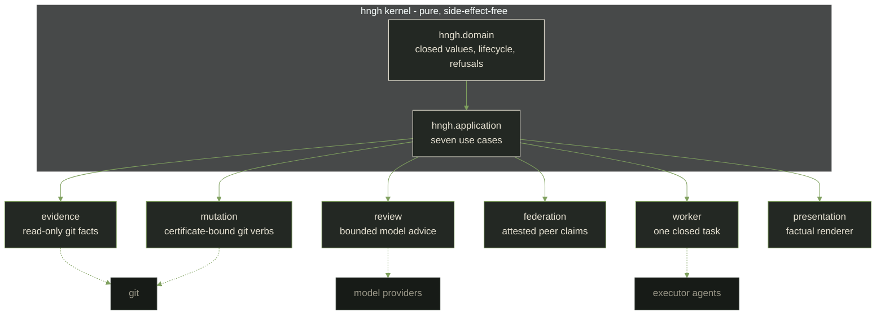

# Hngh

<!-- SPDX-License-Identifier: AGPL-3.0-or-later -->

> Somewhere below the ground floor, a machine keeps its own minutes.
> It has been taking them for a while. They are all in order.

A machine that lives in the basement and got good at its job: agentic
development with a certificate at the decision point and a receipt at
the mutation point. The kernel (Common Lisp, pure by charter) runs the
ledger; an automation tier runs the clock around it; the human's final
say rides the whole surface.

**Type:** agent harness with a ledger spine · ako/design lineage:
[clean-architecture-charter](docs/core/clean-architecture-charter.md)
& [presentation-boundary](docs/design/presentation-boundary.md) ·
**Language:** Common Lisp (SBCL 2.x) · **License:**
AGPL-3.0-or-later · **Status:** pre-release, not production ready
([CHANGELOG](CHANGELOG.md)) · **Check count:** the suite states its own size - past 2,889 checks
(`make test`), with the count guarded by a doc-numbers test that
refuses drift.

[](.github/workflows/ci.yml)

---

## The premise

Most agent harnesses optimize throughput: sandbox you, hand you a long
tool list, let the loop run. Hngh is built the other way around - it
prizes the smallest property most harnesses defer: that every decision
is a fact you can walk back to. Decide what is valid first, record
what happened, keep a person's final say. The kernel enforces that by
refusing to guess at the outside world at all: no clock, no file, no
network, no subprocess - the outside world plugs in later through
explicit ports.

Not the agent that can do the most; the agent whose every step leaves
a trace.



Dependency arrows point inward only. The dotted edges are injected
transports - the kernel never dials out on its own. The law and the
promotion ladder: [clean-architecture-charter](docs/core/clean-architecture-charter.md).

---

## The machine hall you can see

A pure kernel with a suite
([make test](docs/core/test-boundary.md)) and a closed run lifecycle.
A governance loop that certifies and executes its own repository
changes: an [automation tier](automation/README.md) with single-tick
cadence timers from one minute to daily, a fail-first spend governor,
a fail-closed model chain, digests, and a self-watch ledger
([STATE-OF-PROJECT](docs/project/STATE-OF-PROJECT.md), the torch
sentinels) - all observable in
[STATE.md](automation/STATE.md) breadcrumbs, one run per event. An
omp integration live with the five-tool MCP server and an opencode
executor as delegated-session executors
([record](docs/records/2026-09-11-opencode-executor.md)). Read-only
integration surfaces: the five-tool MCP server and the omp bridge
([omp-bridge](docs/records/2026-09-11-omp-integration.md)) that gates
delegated agent sessions through create-run and admit-transport.

The daily dispatch regenerates each morning from the same live feeds
the journal uses - only the block between the `dispatch:begin` /
`dispatch:end` sentinels below is machine-rewritten; the rest of this
README stays hand-edited. The full history of what changed lives in
the [records index](docs/records/README.md) and the [daily
journal](docs/journal/2026-09-11.md); the whole verified run is
[component-map](docs/core/component-map.md) - the grouped summary is
the stranger's version, under [what exists](#what-exists).

<!-- dispatch:begin -->
| 2026-09-12 | 6 | $8.32 | 0 | 40 |

Deep read: [the journal](docs/journal/2026-09-12.md).
<!-- dispatch:end -->

---

## Lifecycle and refusals

A run is one bounded work cycle with a closed lifecycle:

```text
created -> armed -> running -> checkpointed
created -> cancelled | dead
armed -> cancelled | dead
running -> cancelled | evacuated | dead
checkpointed -> running | cancelled | evacuated | dead
cancelled | evacuated | dead -> afterlife -> scored -> archived
```

Every other transition refuses. Terminal states are permanent; retry
means a new run, never a silent continuation. The standing properties:

- Fail-closed: unknown, malformed, duplicate, or unverified input is
  refused, never guessed, never skipped.
- Evidence: receipts record what happened; they justify but never
  grant power.
- Certificates: permission for exactly one action (prepare, stage,
  commit, or push), bound to specific files and evidence, rechecked
  immediately before the action.
- Clean architecture: the core logic depends on nothing external; the
  outside world plugs in at the edges through explicit ports, and the
  read-only evidence adapter is the first edge.
- The harness governs its own repository: behavior changes ride the
  loop - proposal -> verdict -> certificate -> executor - under real
  evidence, and the loop-history guard machine-checks that sentence on
  every code-surface commit.

[The worked example](docs/core/worked-example.md) holds one full
create-run-to-close-run cycle and one real automation beat, quoted
from captured records - nothing staged. Exit codes: `0 accepted, 1
refused, 2 malformed, 3 transport fault`.

---

## One navigation table

The [docs read-order](docs/README.md) is the truth for the whole
document family - the table below is its doorway (one row per stop;
docs verified linked both ways at the edit gate):

| Where to go | What it is for |
|---|---|
| [docs/README.md](docs/README.md) | the read-order itself: start here |
| [Intent](docs/intent.md) | why Hngh exists and where it is going |
| [Architecture](docs/architecture.md) | the current kernel and boundary map |
| [The plans contract](docs/project/plans/README.md) | how work gets planned, checked, and retired |
| [Roadmap](docs/project/roadmap.md) | the ordered rebuild frontier |
| [Decisions](docs/project/decisions.md) | decisions already made |
| [Records](docs/records/README.md) | evidence, decisions, and cutover history |
| [The live automation tier](automation/README.md) | cadence, watchdog, digests, and the model chain |
| [The journal](docs/journal/2026-09-11.md) | the project's own daily record |
| [The long-form record](docs/publication/book.md) | the assembled memoir (EPUB alongside it) |

---

## What exists

- A pure kernel with a suite and a closed run lifecycle -
  [component-map](docs/core/component-map.md):
  - pure domain values (profile, mission, role, loadout, run,
    receipt, score, afterlife) with a closed lifecycle
  - seven application use cases: create-run, admit-transport,
    arm-run, start-run, checkpoint, (policy-gated) close-run,
    select-course
  - governance: proposal-evidence ledger, deterministic evaluation of
    ten principles, closed failure-disposition policy,
    non-mutating candidate authorization certificate
  - real evidence chain: certificates mint only from an
    operator-produced verdict file plus genuine repository evidence
    - revision, content hashes, working-tree state
  - mutation executor rechecks every certificate fact against fresh
    evidence, then sends only the certificate-bound fixed Git action
  - distributed attestation (rungs 11-12, 14-15): carrier-bundle and
    http-claim evidence fetch, pinned-key registry, RSA and Ed25519
    signature verification through one bounded openssl call
- Outer adapters (none run by default):
  - read-only evidence adapter over an injected process transport
  - bounded model-review adapter: reviewers advise, never decide; no
    default provider transport exists
  - bounded `:worker` transport - a completed task binds a worker
    evidence fact; a self-report is evidence, never acceptance
  - model and terminal transports admitted only behind loadout
    admission
  - [worker-driver](scripts/worker-driver): one-shot worker cycle as
    one explicit operator invocation; the schedule belongs to the
    operator
- Operator surface:
  - [scripts/hngh](scripts/hngh): 19 verbs, strict exit codes,
    `--store=PATH` only
  - nerve-center webapp: Schedule, Sessions, System, Research, Logs,
    with a session observatory parsing live agent transcripts
  - full-screen dashboard TUI
    ([scripts/dashboard-tui](scripts/dashboard-tui)) and desktop OSD
    operative overlay, fed from the same read-only renderer
  - an interface grading loop
    ([scripts/grade-interface](scripts/grade-interface)) feeding
    every UI iteration
- The live automation tier (from [automation/](automation/README.md)):
  - cadence tiers from one minute to daily, watchdog, digests,
    fail-first spend governor, self-watch ledger
  - fail-closed model fallback chain with quota legs - see the
    integration section in [architecture](docs/architecture.md)
  - omp integration live: orient brief, five-tool MCP server,
    `hngh_propose` plan surface
    ([record](docs/records/2026-09-11-omp-integration.md))
  - opencode executor as the delegated-session executor with a spend
    attribution emitter
    ([record](docs/records/2026-09-11-opencode-executor.md))
- Read-only integration surfaces: the five-tool MCP server and the
  omp bridge
  ([scripts/omp-bridge](scripts/omp-bridge)) that gates delegated
  agent sessions through create-run and admit-transport.

The full rung-by-rung inventory lives in
[component-map](docs/core/component-map.md) - the grouped summary
above is the stranger's version.

---

## Why this shape

Most open-source agent harnesses are built to move fast. Their winning
trait is normally throughput. They optimize capability and autonomy,
and they are honest about it: sandbox you, hand you a long tool list,
and let the loop run. A 2026 [empirical study of 70 public
agent-harness projects](https://arxiv.org/abs/2604.18071) (H. Wei,
"Architectural Design Decisions in AI Agent Harnesses", April 2026)
puts it soberly: sandboxing is common, high-assurance audit is rare,
and growing a harness does not reliably grow its governance.
Capability and accountability do not move in lockstep. Hngh is built
the other way around, as stated at the top - and the practical
expression of that is the governance loop described above, not a
principle for later.

---

## What this is not

- Pre-release. Nothing has been released yet; development lives under
  Pre-release in the [CHANGELOG](CHANGELOG.md). Not production ready.
- Not a published package yet. There is no install story beyond the
  source tree; the surface is [this repository](docs/README.md) today.
- Not production ready. The exact posture is honest in
  [CHANGELOG](CHANGELOG.md) and the
  [pre-release boundary](docs/project/roadmap.md).
- No daemon. Every tier is an operator-installed single-tick timer.
  Each future capability is admitted the same way everything else is:
  through a proposal, a check, and a record.
- No secrets in the repo. Keys live outside it; the automation tier
  reads an operator-sourced environment and pins nothing here.
- Not multi-tenant yet. The live machine is one operator's desktop;
  the cadence tier, model quota legs, and tailnet defaults are wired
  to a specific operator environment
  ([peer-standard review](docs/research/2026-09-10-peer-standard-review.md),
  finding 1). It is a bounded, honest desktop machine - not a
  multi-user deployment.
- A worker is a tool, never the source of truth. The final say stays
  with a human.

---

## The annex

- [Verify](#verify): how to build and test it yourself.
- [License, governance, releases](#posture): the legal and
  contribution posture.
- [Where this is going](#where-this-is-going): the corridor.
- [The door](#the-door): the read-on surface.

### Verify

```sh
git clone https://github.com/boundring/hngh
cd hngh
make test          # needs SBCL (2.x); prints the current check count
make verify-candidate   # read-only whole-tree evidence bundle
```

The verify-candidate bundle requires an explicit, ordered manifest of
regular repository-relative files. It reports whole-tree state as
evidence, refuses escaping/malformed/unsafe/duplicate candidates, and
performs no Git mutation, provider call, service start, or archive
read. The suite prints the live check count on every run, and the
[doc-numbers guard](tests/scripts/test-doc-numbers.py) refuses the
README when the named count drifts - that refusal is the drift
signal, not a broken gate.

### Governance and contribution law

Hngh governs its own repository. Behavior changes ride the loop
(proposal -> verdict -> certificate -> executor) under real evidence;
the [decisions ledger](docs/project/decisions.md) records the
adopted law, and [GOVERNANCE.md](GOVERNANCE.md),
[CONTRIBUTING.md](CONTRIBUTING.md) (DCO sign-off on every commit),
and [SECURITY.md](SECURITY.md) (private coordinated disclosure) state
the contribution mass. Unfamiliar with the vocabulary? The
[writing register](docs/design/writing-register.md) and
[gate inventory](docs/design/gate-inventory.md) define it, and the
[loop-history guard](tests/scripts/test-loop-history-guard.py)
maintains the verdict trail against forgetfulness.

### Posture

- AGPL-3.0-or-later ([LICENSE](LICENSE)).
- Governance and contribution rules:
  [GOVERNANCE.md](GOVERNANCE.md),
  [CONTRIBUTING.md](CONTRIBUTING.md) (DCO sign-off on every commit),
  [SECURITY.md](SECURITY.md) (private coordinated disclosure).
- No tagged release yet; the pre-release history is in
  [CHANGELOG.md](CHANGELOG.md). The first tagged release accompanies
  the kernel API being declared stable.

### Where this is going

Hngh is not headed toward a busier agent. It is headed toward a wider
corridor: a system that routes many kinds of work, local and remote
models, priced routes, and eventually pooled hardware, through the
same ledger, the same certificate, and the same human-closable cycle.
What changes at each step is the machine on the outside, never the
rule the core holds. At full width, the corridor is a lattice of small
ledgered machines - each an Hngh node running the same narrow rulebook,
each guarding its own boundary, none large in anything except evidence.
One machine never learns what a thousand machines each failed once.
The full statement of that horizon is in [intent](docs/intent.md) and
the [system-harness roadmap](docs/project/system-harness-roadmap.md).

### The door

Start at [docs/README.md](docs/README.md): intent first, then the
contracts. Records and the retirement archive cover the project's
prior state; the active baseline lives here. The long-form record is
assembled into one spine, [the memoir](docs/publication/book.md)
(with an [EPUB](docs/publication/hngh-memoir.epub)), generated by
`scripts/generate-publication --ebook`.

The machine runs from the [automation](automation/README.md) subtree
- the cadence tiers, the watchdog, and the digest surfaces. Who
builds Hngh and how it is attributed:
[CONTRIBUTORS.md](CONTRIBUTORS.md). The daily dispatch block guards
this README's machinery: it regenerates every morning from the same
live feeds the journal uses - the rest of this file is hand-edited,
and the machine-rewritten boundary is the sentinel block, never a
prose drift or a manual touch.

### Verify the prose, not the paint

The front door obeys three laws, checked at edit time by the
door machine (a check, not an art mandate):

- The check-count drift rule
  ([test-doc-numbers](tests/scripts/test-doc-numbers.py)): the README
  must carry the check-count sentence the doc-numbers guard computes
  from the live suite; drift is flagged without the README being
  rewritten by hand.
- The badge rule: no badge on the front door except the CI
  badge, which is generated from the repository's own workflow by the
  host origin. Static badge panels invite rot; this door carries one.
- The link rule: the read-order navigation
  table targets only files bytes can open. This README's rows
  were click-checked at edit time (docs file exists
  [components-map](docs/core/component-map.md); the
  [docs read-order](docs/README.md) is verified in the same edit).
- The dispatch sentinels: the machine rewrite
  ([daily-writeups](automation/jobs/daily-writeups.sh)) touches only
  the bytes between `dispatch:begin`/`dispatch:end` sentinels; the
  rest of this README stays hand-edited, and the sentinel frames
  stay fixed. The same convention guards the
  [torch sentinels](docs/project/STATE-OF-PROJECT.md).
