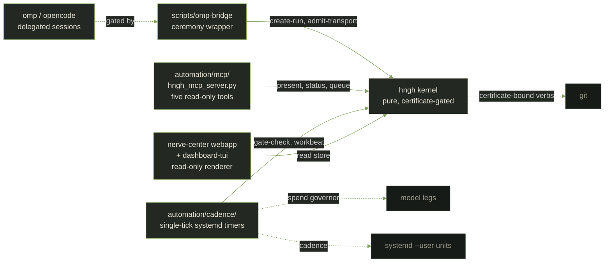

# Architecture

Hngh begins as a compact, side-effect-free kernel.

It stays small on purpose: the quiet center holds the rules while the
lattice of small ledgered machines does the moving.

## Current kernel

`hngh.domain` is an active Common Lisp-only library. It validates ordered
profile modes and creates pure mission, role, loadout, run, receipt, score, and
afterlife values. It does not read a clock, environment, path, provider payload,
or subprocess value.

A run always starts in `created`. Its closed lifecycle is:

```text
created -> armed -> running -> checkpointed
created -> cancelled | dead
armed -> cancelled | dead
running -> cancelled | evacuated | dead
checkpointed -> running | cancelled | evacuated | dead
cancelled | evacuated | dead -> afterlife -> scored -> archived
```

Every other transition refuses. Receipts, score records, and afterlife records
hold evidence only; they cannot change state or grant authority.

`hngh:validate-profile` remains a compatibility facade over the domain policy.
`hngh.application` currently contains the pure `create-run`, `admit-transport`,
`arm-run`, `start-run`, `checkpoint`, `close-run`, and `select-course` use cases with
their inward port contracts; `admit-transport` and `close-run` are policy-gated.
`checkpoint` admits only closed verification and manifest evidence through a
run-only request value. It has no persistence root, clock,
environment, provider payload, subprocess, service, or background process.

`hngh.adapters.evidence` is the first outer boundary: a read-only evidence
adapter with a fixed command set (repository revision, working-tree status,
file content hashing) and an injected process transport. It never decides
policy and cannot mutate anything.

`hngh.adapters.review` is a bounded model-review boundary: it turns a closed
review request into one fixed prompt, sends it through an injected reviewer
transport, and maps the structured output into sanitized findings and one
deterministic review evidence fact. Reviewers advise, never decide, and no
default provider transport exists.

`hngh.presentation` is the operator-visible renderer boundary: it turns
application results, domain runs and governance values, and adapter results
into plain factual strings, keeps refusals literal, and never mutates a
canonical value. The optional reference lexicon supplies display copy only
at a named surface; it cannot carry canonical control. Presentation imports
no adapter.

`hngh.main` is the composition root. `make-run-harness` composes the six
use cases into one run harness over injected or fail-closed default port
adapters (an in-memory record store, a per-harness identifier source, and a
clock), the coordinator functions wire the installed evidence, mutation, and
review adapters through injected transports, and `display` renders any
result through `hngh.presentation`. It starts no background work by import.

The installed outer boundaries beyond evidence and review are: the mutation
executor (rung 5), the filesystem record store (rung 8), the bounded `:model`
and `:terminal` transports behind loadout admission (rung 10), the federation
and attestation adapter (rungs 11-12, 14-15), and the bounded `:worker`
transport (rung 18). None of them runs by default: every one sits behind an
injected transport or an explicit admission receipt.

## Planned outer boundaries

```text
hngh.main -> hngh.presentation / hngh.adapters.*
          -> hngh.application
          -> hngh.domain
```

The dependency direction, promotion ladder, and composition rule live in the
[Clean Architecture charter](core/clean-architecture-charter.md). The public
responsibilities and allowed dependencies live in the
[component map](core/component-map.md). Tests and presentation data follow the
[test boundary](core/test-boundary.md) and
[presentation boundary](design/presentation-boundary.md). Real model and
terminal transports are admitted only under a separately approved run
loadout (rung 10), and the operator reviewer transport (rung 13) is
admitted by an explicit operator reviewer file.


Beyond these in-repo kernel boundaries, the live machine runs from
`automation/` (cadence tiers, watchdog, fail-first spend governor, model
fallback chain) and the `scripts/omp-bridge` adapter - outer adapters
that call the kernel CLI inward. The omp-hngh integration plan
(project/plans/2026-09-09-omp-hngh-integration.plan.md) adds the
operator-facing surfaces (MCP server, omp plugin) on the same
direction: outer code calls inward; the kernel stays side-effect-free.

## Integration surfaces

One diagram, then one block per surface: what it is, how it touches
hngh, what stays outside. The kernel calls none of these inward;
every contact is an injected transport or an admitted run.



### Git

The mutation executor executes only certificate-bound fixed Git verbs,
rechecked against fresh evidence at the moment of action
(`src/adapter/mutation.lisp`; component map). Commits that predate the
loop are recorded as history, never rewritten as governance.

### Model and quota legs

One fail-closed fallback chain in `automation/lib/model.sh`: unsloth
(local) -> remote (budget-gated openrouter) -> ollama -> deck -> kimi
(quota leg) -> ocgo (OpenCode Go quota leg, 5h-window paced) ->
archive-only. Pins route low-stakes calls local and research volume
onto quota legs; a pinned leg that misses falls through to the local
chain. The lobehub leg was dropped 2026-09-11 (operator decision,
commit `5b2ab55`). Session spend is governed separately by the session
caps in `automation/cadence-params.tsv`; a model failure degrades one
beat's content, never the control flow.

### systemd timers

Every cadence tier is an operator-installed single-tick unit under
`automation/systemd/` (install: `make enable` in `automation/`). No
daemon, no ambient state: a timer fires, one script runs once, exits.
The no-daemon boundary is a standing amendment target, not an
accident - anything ambient will be admitted the same way everything
else is: proposal, check, record.

### Dashboard and TUI

The nerve-center webapp (Schedule / Sessions / System / Research /
Logs) and `scripts/dashboard-tui` are read-only observability plus
certificate-gated action, fed from the operator store through the same
read-only renderer (`dashboard-readout`) the MCP tools use. Window
spawn and tiling happen from the browser; the kernel renders facts.

### MCP server

`automation/mcp/hngh_mcp_server.py` exposes five read-only tools
(present, status, queue-report, dashboard-readout, research-lines) to
any MCP-speaking client - landed 2026-09-11 with the omp integration
([record](records/2026-09-11-omp-integration.md)). Read-only verbs
are the CLI's own commands; the server adds no authority.

### omp / opencode executors

Delegated agent sessions are governed, not ambient: `scripts/omp-bridge`
gates an executor session through `create-run` and `admit-transport`
([2026-08-26 record](records/2026-08-26-omp-bridge.md)), and the
watchdog watches it work. Since 2026-09-11 the `session-executor` row
is armed to `opencode` (commit `be32b8a`), with a spend attribution
emitter turning opencode session telemetry into ledger rows
([executor record](records/2026-09-11-opencode-executor.md)). Secrets
stay operator-side; the executor never carries a mutation certificate.

