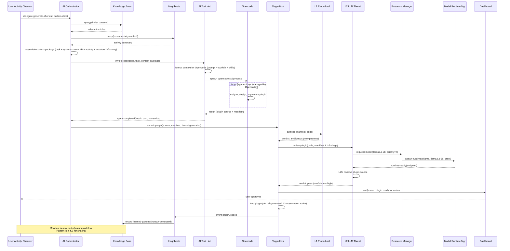
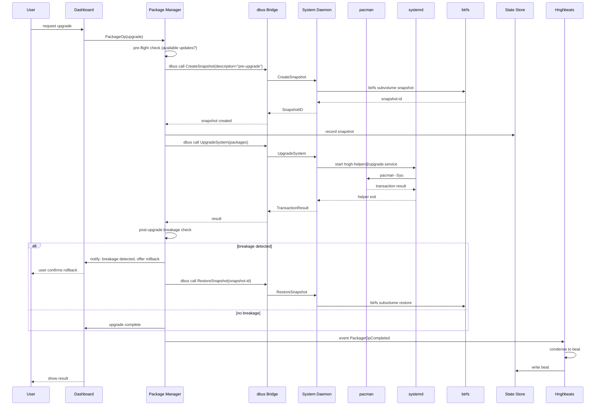
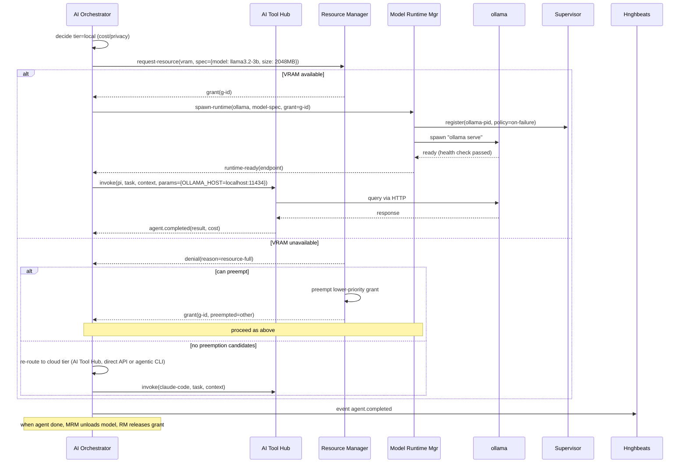
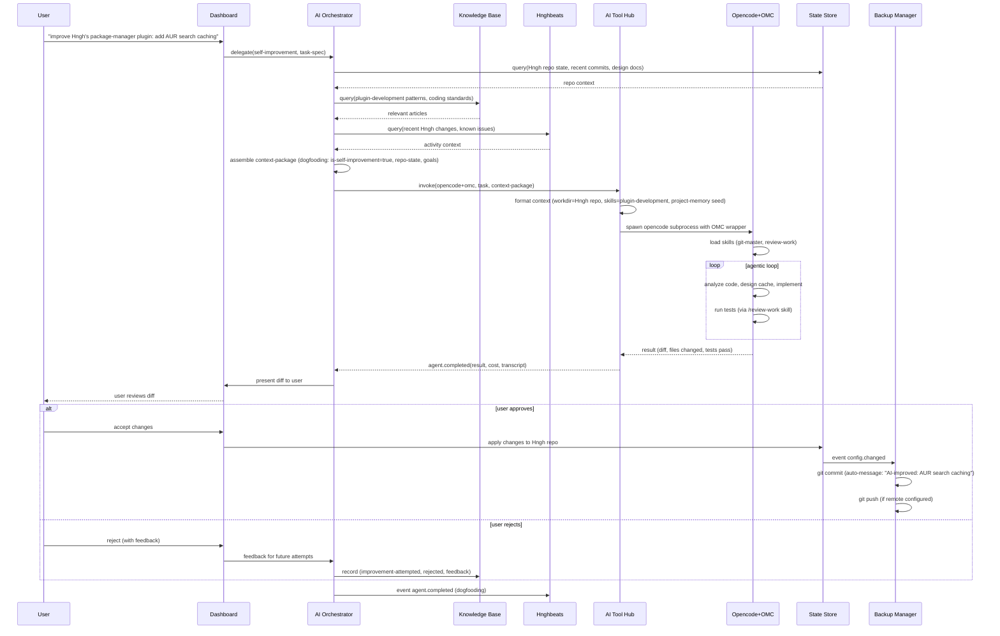
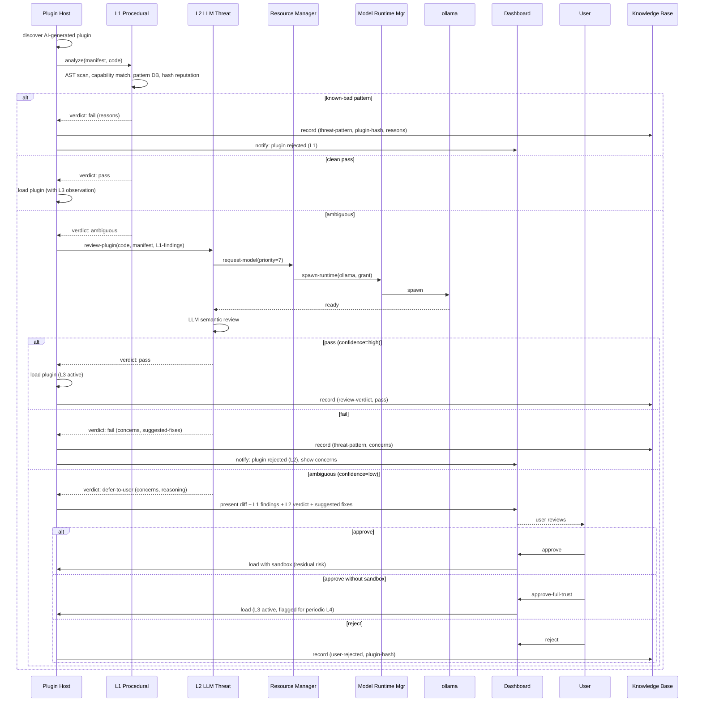

# Hngh Integration & Data Flow Design (Phase 4)

**Status**: Draft for review
**Date**: 2026-06-21
**Scope**: v0.1 integrations + critical flow sequence diagrams

---

## 1. Integration Map

Four integration layers, each with defined connection points and trust boundaries.

### 1.1 System Integration Layer

Hngh integrates with the OS via four substrates: systemd, dbus, pacman (libalpm), and the filesystem (btrfs, config files).

| Substrate | Integration Point | Hngh Component | Trust Boundary |
|---|---|---|---|
| **systemd (user instance)** | `hngh.service` runs as user unit | Core Image | User-trust; no privilege needed |
| **systemd (system instance)** | `hngh-system.service` + `hngh-helper@.service` template | System Daemon (C1) | Root-trust; mediated by dbus policy |
| **dbus (session bus)** | KDE, Notifications, portal services | dbus Bridge (B13), KDE Integration (B10) | User-trust; standard session bus |
| **dbus (system bus)** | systemd Manager, pacman hooks, udev, journald | dbus Bridge (B13) ↔ System Daemon (C1) | Crosses user/root boundary; dbus policy file enforces |
| **pacman (libalpm)** | Hooks in `/usr/share/libalpm/hooks/` and `/etc/pacman.d/hooks/` | Package Manager (B1) via System Daemon | Root-trust for hook execution; Hngh observes via journald |
| **pacman (transaction events)** | pacman emits dbus signals during transactions (if configured) or writes to `/var/log/pacman.log` | Package Manager subscribes via dbus Bridge or file watch | User-trust for observation; root-trust for execution |
| **AUR helpers (yay, paru)** | Subprocess invocation | Package Manager (B1) | User-trust; helpers run as user, call pacman via sudo/pkexec for root ops |
| **btrfs snapshots** | `btrfs subvolume snapshot` and `btrfs subvolume list` | System Config (B2) via System Daemon | Root-trust for snapshot create/restore; user-trust for list |
| **journald** | `journalctl --user` (user logs) and `journalctl` (system logs, via System Daemon subscription) | dbus Bridge (B13) subscribes; Hnghbeats (B6) condenses | User-trust for user logs; root-trust for system logs |
| **udev** | udev events via dbus or netlink | dbus Bridge (B13) | User-trust; udev broadcasts to subscribed clients |
| **X11 / Wayland** | Display server presence detection; window management hooks (v0.2 for buddies) | KDE Integration (B10) detects session type | User-trust |
| **KDE Plasma** | `kreadconfig`/`kwriteconfig`, dbus session bus (`org.kde.*`) | KDE Integration (B10) | User-trust; session bus only |
| **GTK theming** | `~/.config/gtk-3.0/settings.ini`, `gsettings` | System Config (B2) | User-trust |
| **Qt theming** | `~/.config/qt5ct/qt5ct.conf`, `~/.config/Trolltech.conf` | System Config (B2) | User-trust |

**Key integration patterns**:
- Hngh never calls pacman directly. All privileged package operations go: Package Manager → dbus Bridge → System Daemon → `hngh-helper@.service` → pacman.
- Hngh observes system events passively via dbus subscriptions (journald entries, udev events, systemd unit changes). Observation is user-trust; action is root-trust.
- btrfs snapshots are created before risky operations (package upgrades, config changes) and tracked in State Store. Restore requires explicit user confirmation.

### 1.2 AI Integration Layer

| Substrate | Integration Point | Hngh Component | Trust Boundary |
|---|---|---|---|
| **Agentic CLIs** (Opencode, OMC, omx, Pi, Cecli, Claude Code, Codex, Gemini-CLI) | Subprocess invocation with structured event capture | AI Tool Hub (B11) | User-trust; subprocesses run as user; API keys via env vars (never logged) |
| **Pi** (JSON Event Stream) | `pi --json` stdin/stdout JSONL | AI Tool Hub | User-trust; JSONL events parsed into Hngh events |
| **Cecli** (scriptable) | Python scripting API + sub-agents + hooks + MCP | AI Tool Hub | User-trust; Cecli manages its own sub-agents internally |
| **Direct API** (Anthropic, Google, OpenAI) | HTTPS to provider endpoints | AI Tool Hub (B11) | User-trust; secrets via Secrets Manager (B8) |
| **ollama** | HTTP API at `localhost:11434` | Model Runtime Manager (B4) | User-trust; VRAM granted by Resource Manager (A4) |
| **llama.cpp** | HTTP API or CLI | Model Runtime Manager (B4) | User-trust; VRAM granted |
| **unsloth** | Python subprocess (via Python bridge) | Model Runtime Manager (B4) | User-trust; VRAM granted; GPU-heavy |
| **comfyUI** | HTTP API | Model Runtime Manager (B4) | User-trust; VRAM granted; GPU-heavy |

**Key integration patterns**:
- AI Tool Hub invokes agentic CLIs as supervised subprocesses. Each tool's output is captured via its native structured event interface (Pi's JSONL, Cecli's scripting output, Opencode's task events) and normalized into Hngh events.
- API keys for cloud providers and agentic CLIs are retrieved from Secrets Manager at invocation time, passed as environment variables to the subprocess, and never written to logs or transcripts.
- Local model runtimes (ollama, llama.cpp, unsloth, comfyUI) are spawned by Model Runtime Manager only after Resource Manager grants VRAM. On preemption, Model Runtime Manager unloads the model and notifies AI Orchestrator.
- Tools can route to local models themselves (Pi and Cecli both support Ollama/LM Studio). When a tool manages its own local model access, Hngh's Resource Manager still arbitrates VRAM — the tool requests a model load through Hngh's resource protocol, not directly.

### 1.3 Data Layer

| Data Category | Storage | Owner | Versioned? | Trust |
|---|---|---|---|---|
| **Hngh core config** | `~/.hngh/config/hngh.lisp` | State Store (A3) | Git (Backup Manager) | User-trust |
| **Plugin config** | `~/.hngh/config/plugins/<name>/` | State Store | Git | User-trust |
| **Plugin registry** | `~/.hngh/state/plugins.lisp` | Plugin Host (A1) | Git | User-trust |
| **Hardware inventory** | `~/.hngh/state/hardware.lisp` | Resource Manager (A4) | Git (for reference) | User-trust |
| **Event journal** (raw) | `~/.hngh/journal/events/YYYY-MM-DD.lisp` | State Store | Git (append-only) | User-trust |
| **Hnghbeats** (condensed) | `~/.hngh/journal/hnghbeats/YYYY-MM-DD.lisp` | Hnghbeats (B6) | Git | User-trust |
| **Knowledge base** | `~/.hngh/knowledge-base/{articles,decisions,learned-patterns}/` | Knowledge Base (B12) | Git | User-trust |
| **Agent transcripts** | `~/.hngh/agents/<id>/transcript.lisp` | AI Orchestrator (B3) | Git (append-only) | User-trust |
| **Plugin state** | `~/.hngh/plugins/<name>/state/` | Each plugin | Git | User-trust |
| **Cost log** | `~/.hngh/state/plugins/ai-tool-hub/costs.lisp` | AI Tool Hub (B11) | Git (append-only) | User-trust |
| **Cross-plugin locks** | `~/.hngh/state/locks/` (file-based, one file per resource) | State Store (A3) | NOT versioned (ephemeral) | User-trust |
| **Secrets** (API keys, passwords, SSH keys) | Password manager backend (1Password, KeePassXC) or `~/.hngh/secrets/vault.age` (age-encrypted) | Secrets Manager (B8) | NOT in git tree | Secured by backend |
| **System config** (`/etc`, `/usr/lib/systemd/system/`) | Original locations on disk | System Config (B2) via System Daemon | Git-tracked copy in `~/.hngh/config/system/` (for diff/restore) | Root-trust for write; user-trust for tracking |

**Critical separation**: The git-versioned tree (`~/.hngh/`) NEVER contains secrets. Secrets live in:
- Password manager backends (1Password via `op` CLI, KeePassXC via `keepassxc-cli`), OR
- `~/.hngh/secrets/vault.age` (age-encrypted, NOT in the git tree, excluded by Backup Manager)

Secrets Manager declares which paths are secret; Backup Manager respects the exclusion list. This is enforced at the State Store level — writes to secret paths are routed to Secrets Manager, not the file tree.

### 1.4 Network Layer (v0.1 scope)

v0.1 network integrations are limited to outbound cloud API calls. Remote Hngh instances and knowledge-base sharing are v0.3.

| Substrate | Integration Point | Hngh Component | Direction |
|---|---|---|---|
| **Cloud LLM APIs** | HTTPS to `api.anthropic.com`, `generativelanguage.googleapis.com`, `api.openai.com` | AI Tool Hub (B11) | Outbound only |
| **Git remotes** (for backup) | HTTPS/SSH to configured remotes (GitHub, GitLab, private servers) | Backup Manager (B7) | Outbound push/pull |
| **Syncthing** (for backup sync) | Syncthing protocol to configured peers | Backup Manager (B7) via `syncthing` subprocess | Bidirectional (peer-to-peer) |
| **rsync** (for backup sync) | SSH to configured targets | Backup Manager (B7) via `rsync` subprocess | Outbound push |
| **Package repositories** | pacman mirrors, AUR | Package Manager (B1) via System Daemon | Outbound (pacman manages) |
| **AUR** | `aur.archlinux.org` via yay/paru | Package Manager (B1) | Outbound |

**No inbound network in v0.1.** Hngh does not listen on any port. All integrations are outbound. Remote instance coordination (v0.3) will introduce inbound listeners with authentication.

---

## 2. Event Schema (Bus Contract)

All intra-Hngh communication flows through the Event Bus (A2). Events are typed, namespaced, and append-only journaled. This is the contract between components.

### 2.1 Event Namespace

| Namespace | Producer(s) | Consumer(s) |
|---|---|---|
| `system.*` | dbus Bridge (B13) | Any subscriber |
| `plugin.*` | Plugin Host (A1) | Supervisor (A6), L3 (A7), Dashboard (B9) |
| `agent.*` | AI Orchestrator (B3) | Supervisor (A6), Hnghbeats (B6), Dashboard (B9) |
| `resource.*` | Resource Manager (A4) | Model Runtime Mgr (B4), AI Orchestrator (B3), LLM Threat (B5) |
| `threat.*` | L1/L3 (A7), L2/L4 (B5) | Dashboard (B9), KB (B12) |
| `user.*` | Dashboard (B9), user activity hooks | AI Orchestrator (B3), Hnghbeats (B6) |
| `hnghbeats.*` | Hnghbeats (B6) | Dashboard (B9), KB (B12) |
| `config.*` | State Store (A3), System Config (B2) | Backup Manager (B7), Dashboard (B9) |
| `dashboard.*` | Dashboard (B9) | Plugins registering widgets |
| `secret.*` | Secrets Manager (B8) | Audit log, L3 (A7) |

### 2.2 Key Event Types

```lisp
;; System events (from dbus Bridge, normalized)
(event :topic "system.systemd.unit-changed"
       :payload (unit :name "hngh.service" :active-state "active"))

(event :topic "system.pacman.transaction-started"
       :payload (targets ["linux" "linux-headers"] :operation :upgrade))

(event :topic "system.pacman.transaction-completed"
       :payload (targets [...] :before-hash "abc" :after-hash "def" :duration 45))

(event :topic "system.udev.device-changed"
       :payload (device "/dev/nvidia0" :action :added))

(event :topic "system.journald.entry"
       :payload (unit "hngh.service" :priority :info :message "Started Hngh"))

(event :topic "system.btrfs.snapshot-created"
       :payload (id 12345 :path "@/.snapshots/12345/snapshot" :description "pre-upgrade"))

;; Plugin lifecycle events
(event :topic "plugin.loaded"
       :payload (name "package-manager" :tier :first-party :version "0.1.0"))

(event :topic "plugin.unloaded"
       :payload (name "my-plugin" :reason :user-request))

(event :topic "plugin.load-failed"
       :payload (name "bad-plugin" :stage :L2-llm :reason "security concerns"))

;; Agent lifecycle events
(event :topic "agent.spawned"
       :payload (id "agent-001" :tool "opencode" :task-hash "sha256:..." :cost-estimate 0.05))

(event :topic "agent.progress"
       :payload (id "agent-001" :step "analyzing" :cost-so-far 0.02))

(event :topic "agent.completed"
       :payload (id "agent-001" :result <opaque> :cost 0.04 :duration 45.2 :tool "opencode"))

(event :topic "agent.failed"
       :payload (id "agent-001" :reason :timeout :partial-output "..."))

;; Resource events
(event :topic "resource.granted"
       :payload (grant-id "g-1" :kind :vram :spec (:model "llama3.2-3b" :size 2048) :holder "model-runtime-mgr"))

(event :topic "resource.preempted"
       :payload (grant-id "g-1" :holder "model-runtime-mgr" :reason :higher-priority))

(event :topic "resource.pressure"
       :payload (kind :vram :level :critical))

;; Threat events
(event :topic "threat.flag"
       :payload (plugin "suspicious-plugin" :severity :high :evidence <...> :layer :L3))

(event :topic "threat.review-verdict"
       :payload (plugin "ai-plugin" :verdict (:pass nil :confidence :high :concerns [...]) :layer :L2))

;; Hnghbeats events
(event :topic "hnghbeats.beat"
       :payload (category :package-ops :summary "Upgraded 15 packages" :details <...> :cost (:api-usd 0 :electricity-watt-h 8)))

;; Config events
(event :topic "config.changed"
       :payload (path "/etc/pacman.conf" :before <...> :after <...> :reason :package-op))

;; Secret events (audit, never includes values)
(event :topic "secret.accessed"
       :payload (name "anthropic-api-key" :requester "ai-tool-hub" :timestamp "2026-06-21T14:23:01"))

(event :topic "secret.denied"
       :payload (name "anthropic-api-key" :requester "unknown-plugin" :reason :not-authorized))
```

### 2.3 Event Delivery Semantics

- **At-least-once delivery**: events may be delivered more than once; consumers must be idempotent.
- **Ordering**: events within a single topic are delivered in publish order. Cross-topic ordering is not guaranteed.
- **Persistent subscriptions**: consumers can declare a subscription as `:persistent` — the bus tracks last-received event ID; on consumer restart, missed events are replayed from the journal.
- **Backpressure**: if a subscriber is slow, the bus queues up to N events (configurable per-subscription), then applies the subscription's drop policy (`:block`, `:drop`, `:queue`).

---

## 3. Integration Contracts

### 3.1 dbus Policy (System Daemon)

The System Daemon (C1) exposes a minimal set of dbus methods on the system bus. The dbus policy file (`/etc/dbus-1/system.d/org.hngh.System.conf`) declares exactly who may call what.

```xml
<!-- Simplified; actual file has full validation rules -->
<policy user="root">
  <allow own="org.hngh.System"/>
</policy>
<policy group="hngh">
  <!-- Package operations -->
  <allow send_destination="org.hngh.System"
         send_interface="org.hngh.System.PackageManager"
         send_member="InstallPackages"/>
  <allow send_destination="org.hngh.System"
         send_interface="org.hngh.System.PackageManager"
         send_member="RemovePackages"/>
  <allow send_destination="org.hngh.System"
         send_interface="org.hngh.System.PackageManager"
         send_member="UpgradeSystem"/>
  <!-- File operations (privileged paths only) -->
  <allow send_destination="org.hngh.System"
         send_interface="org.hngh.System.Files"
         send_member="WriteFile"/>
  <!-- Snapshot operations -->
  <allow send_destination="org.hngh.System"
         send_interface="org.hngh.System.Btrfs"
         send_member="CreateSnapshot"/>
  <allow send_destination="org.hngh.System"
         send_interface="org.hngh.System.Btrfs"
         send_member="RestoreSnapshot"/>
  <!-- Event subscriptions -->
  <allow send_destination="org.hngh.System"
         send_interface="org.hngh.System.Journal"
         send_member="Subscribe"/>
</policy>
```

**Method signatures** (typed, validated):
- `InstallPackages(names: [string], reason: string) -> TransactionResult` — names validated against pacman DB; reason journaled
- `WriteFile(path: string, content: bytes, mode: uint32) -> ok` — path must be in whitelist (`/etc/*`, `/usr/lib/systemd/system/*`); content size limited
- `CreateSnapshot(description: string) -> SnapshotID` — creates btrfs snapshot of root subvolume
- `SubscribeJournal(unit: string, priority: uint8) -> SubscriptionID` — streams matching journal entries as dbus signals

**No arbitrary command execution.** Every method is typed and specific. The System Daemon validates all arguments before spawning a `hngh-helper@.service` template unit.

### 3.2 Tool Invocation Protocol (AI Tool Hub)

Each tool in the registry has an invocation protocol. Common interface:

```
invoke(tool: ToolID, task: Task, context: ContextPackage, params: InvokeParams) -> InvocationID
```

**ContextPackage structure**:
```lisp
(context-package
  :task-spec (:description "Analyze user's repetitive package install pattern"
              :success-criteria "Produce a plugin that automates this"
              :constraints (:max-cost 0.10 :max-latency 300))
  :system-state (:hardware <...> :packages <...> :config <...>)
  :user-activity (:recent-actions <...> :identified-pattern <...>)
  :kb-articles (:relevant [...])
  :dogfooding (:is-self-improvement nil :repo-state <...>)
  :intra-tool-informing (:conventions "Follow Hngh coding standards"
                         :skills-to-activate ["plugin-development"]
                         :sub-agent-templates <...>
                         :mcp-servers <...>))
```

**Tool-specific formatting**:
- **Opencode**: context written to `workdir/.opencode/context.md` + skills loaded via config; invocation: `opencode --task <task-file> --workdir <workdir>`
- **Pi**: context as JSONL input to `pi --json --rpc` on stdin; events captured as JSONL on stdout
- **Cecli**: context as conventions file + workspace setup; invocation: `cecli --conventions <file> --workspace <dir> --message <task>` or via Python scripting API
- **OMC**: context seeded into project memory + wiki; invocation: `claude-code` with OMC wrapper
- **Direct API**: context as system message + user message; invocation: HTTPS POST to provider endpoint

**Event capture**:
- Pi: JSONL event stream → parsed into `agent.progress` events
- Cecli: stdout + scripting output → parsed into `agent.progress` events
- Opencode: task events (if exposed) or stdout → parsed into `agent.progress` events
- Direct API: HTTP response → `agent.completed` directly

**Cost tracking**: every invocation logs `(timestamp, tool, provider, model, tokens-in, tokens-out, cost-usd, task-hash, success)` to `state/plugins/ai-tool-hub/costs.lisp`.

### 3.3 Secrets Access Protocol

```
get-secret(name: SecretName, requester: PluginName) -> Secret | Denied
```

**Flow**:
1. Plugin calls `secrets:get(name, self-name)`.
2. Secrets Manager checks `config/plugins/secrets-manager/policy.lisp` — is this plugin authorized for this secret?
3. If authorized:
   a. Retrieve secret from backend (1Password via `op`, KeePassXC via `keepassxc-cli`, or local age-encrypted vault).
   b. Return secret to caller (in-memory only; never written to disk or logs).
   c. Emit `secret.accessed(name, requester, timestamp)` for audit log.
4. If denied:
   a. Emit `secret.denied(name, requester, reason)`.
   b. Emit `threat.flag(plugin=requester, severity=medium, evidence=unauthorized-secret-access, layer=L3)` — L3 catches this as suspicious behavior.

**Policy format**:
```lisp
(policy :plugin "ai-tool-hub"
        :secrets (:anthropic-api-key :google-api-key :openai-api-key))
(policy :plugin "backup-manager"
        :secrets (:git-ssh-key))
(policy :plugin "my-plugin"
        :secrets ())  ; explicitly none
```

**Backend unreachable handling**: if the password manager is locked or unavailable, return `Denied(reason=backend-locked)`; user notified via Dashboard to unlock. The secret is never cached — every access goes through the backend.

### 3.4 Backup Protocol

**Git tree versioning**:
- The `~/.hngh/` tree is a git repository (initialized by Backup Manager on first run).
- `.gitignore` excludes: `state/locks/`, `secrets/`, `plugins/*/cache/`, and any path declared by Secrets Manager.
- On every `config.changed` event, Backup Manager stages the affected file.
- Periodic auto-commit (Scheduler fires every N minutes, configurable): stages all changes, commits with auto-generated message, emits `backup.committed`.

**Remote sync**:
- Git push to configured remotes (HTTPS or SSH; SSH key from Secrets Manager).
- Syncthing: configured peers sync the tree directly (filesystem-level sync; Backup Manager ensures git index is committed before sync).
- rsync: SSH to configured targets; incremental sync.

**Restore**:
- User requests restore via Dashboard.
- Backup Manager checks for unsaved state → warns user; requires confirmation.
- Performs `git checkout <hash>` on the tree (or file-level restore for specific paths).
- Emits `backup.restored(hash, affected-paths)`.
- System Config may apply restored config to actual system files (via System Daemon).

### 3.5 Plugin Review Pipeline Contract

The review pipeline has a typed verdict schema that flows between L1, L2, and the user.

**L1 verdict** (from Procedural Threat Detection, A7):
```lisp
(l1-verdict :result :pass | :fail | :ambiguous
            :checks-run [:manifest-schema :capability-match :pattern-db :signature :hash-reputation]
            :failures [(:check :capability-match :reason "declared no network but code calls socket")])
```

**L2 verdict** (from LLM Threat Detector, B5):
```lisp
(l2-verdict :pass nil
           :confidence :high
           :concerns [(:severity :critical
                       :location "line 42"
                       :description "Executes rm -rf on user input without sanitization"
                       :suggested-fix "Use hngh.fs:safe-delete")]
           :reasoning "Plugin claims to be a log analyzer but includes destructive file ops..."
           :model "llama3.2-3b"
           :reviewed-at "2026-06-21T...")
```

**User review** (when L2 defers):
- Dashboard shows: plugin diff, L1 findings, L2 verdict and reasoning, suggested fixes.
- User chooses: `approve` (load with L3 observation), `approve-with-sandbox` (load sandboxed), `reject` (don't load; log to KB), `defer` (decide later).

**Verdict storage**: L2 verdicts stored at `~/.hngh/plugins/<name>/review-verdict.lisp`. L4 assessments stored at `state/plugin-observations/<name>/assessments.lisp`. Both journaled to KB as learned patterns.

---

## 4. Critical Flow Sequence Diagrams

### 4.1 Self-Improvement Loop (the defining flow)

**Trigger**: User Activity Observer (v0.2; v0.1 supports user-initiated) identifies repetitive action.



### 4.2 System Upgrade (system administration)



### 4.3 Local Model Subagent Spawn (resource-arbitrated)



### 4.4 Threat Detection L4 Review (security)

```mermaid
sequenceDiagram
    participant L3 as L3 Runtime Observation
    participant EB as Event Bus
    participant L4 as L2/L4 LLM Threat
    participant RM as Resource Manager
    participant MRM as Model Runtime Mgr
    participant OLL as ollama
    participant TUI as Dashboard
    participant KB as Knowledge Base

    L3->>L3: observe plugin behavior (syscall trace)
    L3->>L3: rules engine: flag! (undeclared network access)
    L3->>EB: event threat.flag(plugin, severity=high, evidence, layer=L3)
    EB->>L4: deliver event
    L4->>RM: request-model(llama3.2-3b, priority=7)
    RM->>MRM: spawn-runtime(ollama, grant)
    MRM->>OLL: spawn
    OLL-->>L4: ready
    L4->>L4: LLM reviews: flagged event + recent behavior context + plugin purpose
    L4->>L4: judgment: malicious (confidence=high)
    L4->>EB: event threat.assessment(plugin, malicious, reasoning)
    EB->>TUI: deliver
    L4->>EB: event agent.preempt (auto-suspend plugin)
    EB->>TUI: notify user: plugin suspended, evidence shown
    L4->>KB: record learned-pattern(threat, pattern-signature)
    Note over L3,KB: Pattern now in KB; future plugins with same signature caught at L1.
```

### 4.5 Hngh Self-Improvement (Dogfooding)



### 4.6 AI-Generated Plugin Review Pipeline



### 4.7 Backup to Remote

```mermaid
sequenceDiagram
    participant SS as State Store
    participant BM as Backup Manager
    participant SCH as Scheduler
    participant SM as Secrets Manager
    participant GIT as git
    participant HB as Hnghbeats
    participant TUI as Dashboard

    SS->>BM: event config.changed(path, before, after)
    BM->>BM: stage file in git
    SCH->>BM: fire(periodic-commit)
    BM->>BM: check for staged changes
    alt changes present
        BM->>BM: git add -A (respecting .gitignore)
        BM->>BM: git commit -m "auto: <summary>"
        BM->>SM: get-secret(git-ssh-key, requester=backup-manager)
        SM-->>BM: ssh-key (in-memory)
        BM->>GIT: git push origin main (with SSH key)
        GIT-->>BM: push result
        BM->>BM: release secret (never cached)
        BM->>HB: event backup.committed(hash, paths, message)
        HB->>TUI: beat (category=maintenance)
    else no changes
        Note over BM: skip
    end
    alt push failed
        BM->>TUI: notify: push failed (remote unreachable)
        TUI-->>U: user acknowledges; retry scheduled
    end
```

### 4.8 Secrets Access by Authorized Plugin

```mermaid
sequenceDiagram
    participant P as Plugin (AI Tool Hub)
    participant SM as Secrets Manager
    participant POL as Policy Check
    participant BE as Backend (1Password)
    participant L3 as L3 Observation
    participant HB as Hnghbeats
    participant TUI as Dashboard

    P->>SM: get-secret(anthropic-api-key, requester=ai-tool-hub)
    SM->>POL: check policy(plugin=ai-tool-hub, secret=anthropic-api-key)
    alt authorized
        POL-->>SM: allow
        SM->>BE: retrieve(anthropic-api-key)
        alt backend unlocked
            BE-->>SM: secret-value
            SM-->>P: secret (in-memory only)
            SM->>HB: event secret.accessed(name, requester, timestamp)
            Note over P: secret passed as env var to subprocess; never logged
        else backend locked
            BE-->>SM: error (locked)
            SM-->>P: denied(reason=backend-locked)
            SM->>TUI: notify: unlock 1Password to enable cloud AI
        end
    else unauthorized
        POL-->>SM: deny
        SM-->>P: denied(reason=not-authorized)
        SM->>HB: event secret.denied(name, requester, reason)
        SM->>L3: event threat.flag(plugin=P, severity=medium, evidence=unauthorized-secret-access)
        L3->>L3: record flag; may trigger L4 if pattern repeats
        SM->>TUI: notify: unauthorized plugin attempted secret access
    end
```

---

## 5. Open Integration Questions

### 5.1 pacman Hook Observation
pacman hooks fire during transactions, but observing them requires either:
- A custom pacman hook that emits a dbus signal (requires installing a hook file in `/usr/share/libalpm/hooks/`), OR
- Watching `/var/log/pacman.log` for transaction events (simpler, but less structured).

**Recommendation**: file watch on `pacman.log` for v0.1 (no system modification needed); custom hook for v0.2 if richer events are needed.

### 5.2 journald Subscription Granularity
journald can be subscribed via `journalctl -f` (subprocess) or via the dbus `org.freedesktop.LogControl` interface. The dbus interface is cleaner but less commonly used.

**Recommendation**: dbus subscription via System Daemon in v0.1; falls back to `journalctl -f` subprocess if dbus interface unavailable.

### 5.3 Tool Output Capture for Inter-Tool Context
When Opencode completes a task, its output (files changed, reasoning, test results) needs to be packaged as input for the next tool (e.g., Codex to implement, or Cecli to review). The exact format of this packaging depends on what each tool produces.

**Recommendation**: define a standard `ToolResult` schema that each tool's output is normalized into:
```lisp
(tool-result :tool "opencode"
              :task-hash "sha256:..."
              :output-files [(:path "src/foo.lisp" :action :modified)]
              :reasoning "Analyzed pattern; implemented cache..."
              :test-results (:pass 12 :fail 0)
              :cost 0.04
              :transcript-path "agents/agent-001/transcript.lisp")
```

AI Orchestrator uses this to assemble the next tool's context package.

### 5.4 Concurrent Plugin State Access
Multiple plugins may read/write the State Store concurrently. File-based locks (in `state/locks/`) handle cross-plugin transactional coordination, with atomic creation to prevent races.

**Recommendation**: State Store serializes writes to the same file (single-writer per path, enforced by file lock). Reads are concurrent (no lock needed). Plugins declare which paths they write in their manifest; State Store enforces the lock.

### 5.5 Tool Versioning and Compatibility
Agentic CLIs update frequently (Opencode, OMC, Pi, Cecli all have regular releases). An update may change the tool's event schema, breaking Hngh's capture.

**Recommendation**: AI Tool Hub's tool registry includes a `:schema-version` per tool. On invocation, if the tool's actual version doesn't match the registered schema, degrade to raw stdout capture and flag for mapping update. Tool registry updates ship as Hngh plugin updates (not requiring Hngh core changes).

### 5.6 Remote Instance Protocol (v0.3 sketch)
Remote Hngh instances in v0.3 will need a protocol for:
- Peer discovery and authentication (SSH keys via Secrets Manager)
- Event bus bridging (internal bus → network transport → remote internal bus)
- Knowledge base sharing (selective sync of articles/patterns)
- Delegation (Hngh on machine A delegates a task to Hngh on machine B)

**v0.1 design implication**: the event bus and state store are designed to be network-transparent. The event bus's pub/sub model and the state store's file-tree layout both extend naturally to a distributed setting. The dbus bridge plugin (B13) is the template for a "remote bridge" plugin in v0.3.

---

## Next Steps

Phase 4 is complete with this document. Phase 5 (Final Design Specification) will compile:
1. Executive summary + guiding principles
2. Glossary
3. Architecture overview (from ADR)
4. Component catalog (from components.md)
5. Data model + state authority (from ADR + integrations.md)
6. Integration map (from this document)
7. Security & trust model (from ADR + components.md)
8. Extensibility contract (from ADR + components.md)
9. Operational concerns (packaging, updates, observability — from ADR)
10. Phased implementation roadmap
11. Open questions / known risks

into a single `hngh-design-spec.md` — the source of truth.
