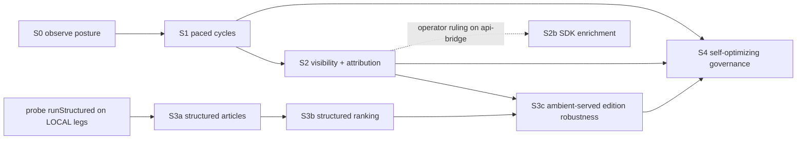

# Ambient integration -- staged design

Status: draft for ceremony - 2026-09-14 - scope: how hngh stages, observes,
and optimizes jcode ambient mode, and what the news refactor rides.
Synthesis of four exploration nodes (ambient-requirements,
hngh-integration-map, news-refactor-surface, jcode-capability-map); every
claim carries file:line or command evidence in the appendix.

## 0. The operator directive this design is audited against

The directive (paraphrased from the synthesis brief): hngh should be
fine-tuning / power-using any software it runs; ambient mode specifically
means folding in use + tracking + optimized config + management; the news
pipeline is subject to optimization. Every stage below is checked against
this in Sec. 5, and the audit is allowed to find the design drifting.

## 1. Position decision: delegate-wrapped ambient, internal scheduler off

jcode's `[ambient]` block (enabled=false, allow_api_keys=false,
pause_on_active_session=true, proactive_work=true) offers two postures:

| Posture | What runs it | Classification | Cost controls |
|---|---|---|---|
| A. hngh-initiated cycles | cadence step -> `lib/jcode-delegate.sh` | managed cadence-paced subsystem | zai/ocgo pacer rows, per-day cap, bridge lifecycle, budget row, supervision -- all landed |
| B. jcode-internal scheduler | jcode's own scheduler.rs loop | unobserved autonomous spend | none landed: invisible to budget ledger, watchdog, sessions-feed |

**Decision: Posture A now; Posture B stays disabled until stage 4 and only
after its tracking gaps close.** Rationale: the integration map is
unambiguous that delegate-wrapped cycles get pacer, budget attribution,
bridge-store supervision, and log classification for free
(jcode-delegate.sh:1-104, launch-session.sh:9-30/372-421), while internal
cycles are invisible to all four surfaces. Power-using the software (Sec. 0)
does not mean bypassing its instrumentation; the wrapper IS the power-use
path -- it consumes subscription quota inside declared pacing. This also
answers the delegation-matrix open question: with the wrapper, each cycle
IS a delegated session and rides invariant 7 (run-start -> observatory ->
run-end) without new ceremony; "ambient" is a params-declared cadence step
like research-beat, not a new fleet class.

## 2. Staged ladder

Stages 1-2 and 3a-3b are independent rails (real data dependencies only);
S3c is where ambient pays the news directive; S4 closes the optimize loop.

### Stage 0 -- observe the posture (zero spend, fixture-backed)

Rides: existing `[ambient]` config; hngh telemetry; cadence drop-in convention.
Adds:
- cadence-params rows (Inventory, one `key<TAB>value<TAB>provenance<TAB>note`
  row each): `ambient-poll-enabled=0`, `ambient-provider=zai`,
  `ambient-max-minutes=10`, `ambient-max-runs-day=8` (operator calibrates
  like the zai caps), `ambient-objective=` (empty = step no-ops fail-closed).
- `automation/cadence/hour/15-ambient-posture.sh` (model-free, like
  20-model-saturation): emits one telemetry row per day --
  `kind=ambient-posture: enabled, allow_api_keys, debug-control gate state
  (config/env/sentinel), sessions count under ~/.jcode/sessions`.
- fixture-backed test: gate off -> row with `enabled=0`, no other effect.

Exit: three consecutive daily posture rows; no spend occurred.
Why before anything: the ambient-requirements node never observed a live
cycle (confidence: medium). Observing the posture first is the fail-closed
default and gives stage 4 its baseline.

### Stage 1 -- paced ambient cycles (the use half)

Rides: `jcode-delegate.sh` wholesale -- pacer before spend (exit 75 path),
lessons tail, 1-30min timeout clamp, launch_session budget row + bridge
run-start/run-end. The step adds nothing ahead of the wrapper's pacer.
Adds: `automation/cadence/10m/01-ambient-poll.sh` (~40 lines) +
`automation/tests/test-ambient-poll.sh`:
1. `ambient-poll-enabled=0` or empty `ambient-objective` -> breadcrumb, exit 0, no spend.
2. per-UTC-day stamp enforces `ambient-max-runs-day` before the wrapper call (mirror of respawn-daily-cap).
3. call: `jcode-delegate.sh ambient-<slug> "$ambient-objective" "$ambient-max-minutes" "$ambient-provider"`.
4. telemetry row per attempt: `kind=ambient-cycle: slug, provider, outcome (ok|died|refused-75|capped)`, wall_s.

First objectives (declared via the `ambient-objective` param row, changed
only through the Inventory -- the change IS the declaration):
summarize the last-24h jcode sessions into a digest block for the newspaper
lanes; sweep research dispositions for parked rows. Objectives that write
code come only after cycles prove clean on read-only objectives.

Runtime ceiling: 10m poll / 10m wrapper cap => <=1 run per tick, <=2.4h/day
machine occupancy at `ambient-max-runs-day=8` (~17% ceiling before the
operator raises it with telemetry evidence). `pause_on_active_session=true`
already protects operator TUI time.

Exit: >=10 observed cycles with outcomes + budget rows; zero unclassified
spend.

### Stage 2 -- visibility + attribution (the tracking half)

Mostly free via the wrapper (bridge run, budget.md row with session class,
supervision replace-on-stall, plain-log classification). Adds:
- **2a**: tag ambient rows in sessions-feed. Delegated jcode sessions write
  under `~/.jcode/sessions/` so `jcode_rows()` already sees them
  (sessions-feed.py:486-544); the step is deriving `source=ambient/<slug>`
  from the session mission/slug prefix (S, no SDK, fixture-backed).
- **2b (gated)**: SDK `peekSession` enrichment of jcode detail.entries,
  replacing the 20-char-id log-tail hack (sessions-feed.py:519-522).
  Gated on the operator ruling the capability-map flagged: is a long-lived
  `jcode api-bridge` socket an allowed service, or must the feed spawn it
  per-run (no-daemon boundary)? Until ruled, the log-tail hack stays -- it
  is ugly, not wrong.

Exit: an ambient cycle visible end-to-end in the dashboard (row, entries,
budget line, bridge run) with zero new unattributed spend surfaces.

### Stage 3 -- what the news refactor rides (the news directive)

The pipeline (gdelt-news.py -> news-articles.py -> newspaper-edition.py,
hour/40-41 ticks, window 01:30-06:30, cap 6/day, budget 1024/article) is
optimized in three steps; only the last touches ambient.

- **3a -- structured article generation** (M). Behind the existing hermetic
  seam `NEWS_ARTICLES_MODEL_CMD` (news-articles.py:284-325), swap the
  free-text `model_reply` for jcode SDK `runStructured` with schema
  `{headline, body, image_subject, quotes[]}`. Gains: machine-checked
  120-200 word count, quote-verbatim validation, no mid-sentence cut
  (news-articles.py:317-324), inline usage telemetry replacing the
  tmp-modelused/tmp-tokensin/tmp-tokensout scratch files
  (news-articles.py:301-316). Laws preserved: LOCAL-leg pin (unsloth)
  unchanged, budget semantics unchanged, fabrication-forbidden moves from
  prompt-only to schema + post-validation, ASCII law as post-validation,
  fixture tests stay the gate. **Prereq probe (S): does runStructured
  structured output work on the unsloth/ollama OpenAI-compatible legs?**
  If not, 3a falls back to schema-prompt + stricter post-validation and
  says so in the record.
- **3b -- structured ranking** (S-M, depends 3a's seam). `runStructured`
  over collect_items output -> `{story_id, category, rank, rationale}`
  replacing TAG_RANK severity-only ordering (news-articles.py:113,187).
  Editor judgment (novelty, hngh-relevance) beats static bands; the
  hand-scored GDELT formula stays as the candidate generator.
- **3c -- ambient-served edition robustness** (M-L, depends 1+2+3b). Keep
  the 01:30-06:30 window gate and the edition.json idempotence marker
  exactly as they are. Ambient cycles (10m poll) watch digest completion
  inside the window and spread per-article generation with backoff instead
  of the current all-or-nothing hourly retry (newspaper-edition.py:95-109,
  131-151); failures self-report into the report queue. Deliberately
  descoped from "ambient triggers the build": a daily-deadline pipeline
  does not get a new trigger on an unproven subsystem -- that is stage 4
  territory after ambient has a track record.

### Stage 4 -- self-optimizing governance (the optimize/manage half)

- `automation/cadence/day/24-ambient-review.sh` (pattern:
  20-model-saturation): reads ambient-cycle/posture telemetry + budget
  rows, emits a headroom verdict and proposes Inventory row updates
  (max-runs-day, provider mix, objective rotation) -- proposals ride the
  governed config lane on the 30m cadence (governed-fleet invariant 9),
  not silent edits.
- Optimization law (anti-drift): **every knob hngh tunes must already have
  a telemetry row or ledger attribution covering it.** No optimizing the
  unmeasured. This is the design's answer to "optimized config +
  management" -- the loop is evidence -> proposal -> Inventory -> observe.
- Graduations, each behind evidence, not enthusiasm:
  - event-driven edition trigger (ambient watches digest completion and
    triggers the build) -- after 3c has a clean window record;
  - Posture B (jcode-internal scheduler) -- only after sessions-feed gains
    an `ambient_rows()` source AND budget attribution for internal cycles;
    enabling internal mode before its tracking exists is fail-open and is
    refused by this design;
  - `allow_api_keys=true` and debug-control enablement -- operator-only
    decisions; this design needs neither (the delegate path uses the
    normal CLI; the debug socket's command-execution risk is noted and
    not taken).

## 3. Boundaries

No kernel `src/`, `tests/`, `Makefile`, `hngh.asd` touches: all jcode-side
knobs are `~/.jcode/config.toml` (userspace), all hngh-side additions are
`automation/` drop-ins + Inventory rows (free-commit rule). Two-home split
holds: telemetry and budget rows stay in hngh's logs; transcripts stay
under `~/.jcode/`. The cadence 10m tier already has a systemd timer
(cadence/README.md:12) -- no timer wiring needed, answering an open
question from the integration map.

## 4. Worst-case walk

Pacer blocks every cycle for a week => stage 1 emits refused-75 rows, stage
0 posture rows keep flowing (model-free), stage 4 review surfaces "ambient
starved" as demand. No silent failure, no unattributed spend, no spend at
all. The design degrades to observation, which is stage 0 anyway.

## 5. Adversarial audit against the directive

- **D1 fine-tuning / power-using any software.** PASS by construction:
  the design consumes the Z.AI subscription through the paced wrapper
  (quota utilization, not conservation), adopts the SDK over
  file-format guessing, and stages raises to `ambient-max-runs-day` on
  telemetry evidence. Drift found and flagged: the day-cap default of 8
  is conservative; if the operator reads power-use as "saturate idle
  hours", the knob is theirs and stage 4 exists to propose the raise
  with data. Counter-audit: unbounded is not power-use either -- every
  other leg (zai, ocgo, kimi) lives under declared caps; ambient riding
  the same pacing is consistency, not restriction.
- **D2 use + tracking + optimized config + management.** PASS
  structurally: use = stage 1, tracking = stage 2 (+ free bridge/budget/
  supervision), optimized config = stage 4 evidence->Inventory loop,
  management = delegate lifecycle + watchdog + report queue. Gap found in
  audit: jcode-INTERNAL ambient cycles would still be untracked -- this is
  why Posture B is deferred behind its tracking prerequisites (Sec. 2 stage
  4 graduations) rather than merely "later".
- **D3 news subject to optimization.** PASS: stage 3 is a mandatory rail
  with its own prereq probe, not an ambient-dependent afterthought;
  3a/3b start independently of ambient. Drift found and fixed: the
  original exploration proposed event-driven edition assembly riding
  ambient immediately -- audited as putting a daily SLA on an unproven
  subsystem, descoped to 3c-with-window-preserved, full trigger deferred.
- **Cross-audit.** No stage requires the debug-control gate,
  `allow_api_keys`, a new daemon (2b is operator-gated), or kernel
  mutations. Fabrication-forbidden, ASCII, fail-closed, and
  dependency-inward laws each have named preservation points (Sec. 3a).

## 6. Not decided here (routes to the critique gate)

- api-bridge daemon ruling (gates 2b).
- runStructured structured-output support on LOCAL legs (gates 3a; probe
  specified, not run -- would have spent a model call).
- Whether `~/.jcode/ambient/transcripts/` exists on this host and how
  internal mode persists sessions (unverified; sidestepped by Posture A).
- First `ambient-objective` wording and `ambient-max-runs-day` calibration
  (operator taste, like the zai cap note).
- Whether delegated ambient sessions' missions render well enough in
  jcode_rows for 2a tagging without a session-JSON format guess (2a test
  will discover this against fixtures).

## Appendix -- evidence

| Claim | Evidence |
|---|---|
| ambient config knobs, all false/off | ~/.jcode/config.toml:249-257 |
| debug-control gate + command-execution risk | crates/jcode-app-core/src/server/util.rs:13-29, server/debug.rs:364 |
| wrapper: pacer exit 75, timeout clamp 1-30min, launch_session reuse | automation/lib/jcode-delegate.sh:1-104 |
| budget row + bridge run-start/end in launch_session | automation/lib/launch-session.sh:9-30; jcode executor branch 372-421 |
| jcode_rows metadata-only, log-tail hack, seams | automation/jobs/sessions-feed.py:486-544, 519-522, 49-55 |
| supervision/watchdog surfaces (omp+bridge only) | automation/jobs/agent-watchdog.sh:32-38; agent-supervision.py:5-33 |
| 10m tier timer exists; drop-in convention; self-gating | automation/cadence/README.md:3-15, 20-22 |
| Inventory row format + cap-row precedents | automation/cadence-params.tsv:1, 32-33 (zai caps), respawn-daily-cap |
| news pipeline, seams, caps, window | automation/jobs/news-articles.py:113-116, 187, 284-325, 301-316, 363-392; newspaper-edition.py:95-109, 131-151; cadence-params.tsv:55-57 |
| runStructured/peekSession/globalEvents surface | https://jcode.sh/sdk (GA docs); api-bridge present in jcode v0.84.0-dev --help |
| delegation matrix position, invariant 7 | docs/design/governed-fleet.md Sec. 4; roadmap stage 3 "landing" |
| validation: design only; no code run, no spend, no live cycle | this node (synthesize) |
