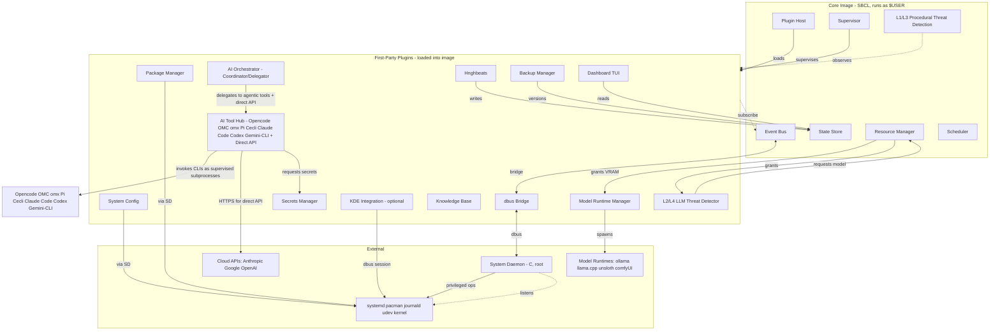

# Hngh Component Decomposition (Phase 3)

**Status**: Draft for review (v2 — restructured per AI Tool Hub merge)
**Date**: 2026-06-21
**Scope**: v0.1 components (with v0.2+ stubs noted)

---

## Architectural Principles: Dogfooding and Self-Improvement

Two principles shape the entire component design. They are not features; they are constraints on the architecture itself.

### Principle 1: Dogfooding Substrate
The agentic tools Hngh uses at runtime are the same agentic tools used to develop Hngh. The boundary between "Hngh using tools" and "Hngh being developed by tools" dissolves.

Consequence: Hngh's runtime *is* a dogfood scenario for Opencode, OMC, omx, Pi, Cecli. If Opencode+OMC can orchestrate a multi-agent task to write a plugin, it can orchestrate a multi-agent task to fix a user's pacman breakage. Same substrate, different prompts. The architecture does not distinguish "user asks Hngh to do X" from "Hngh asks Opencode to improve Hngh."

### Principle 2: Self-Improvement Loop
Hngh can spawn an agentic tool session to improve its own code, because that's the same thing it does for users. When Hngh identifies a UX bottleneck (repetitive user action), it spawns an Opencode session with activity context; the session generates a plugin or shortcut; the plugin enters the review pipeline; if approved, it's integrated. This is not a future feature — it's the defining pattern of the architecture.

### Three-Tier Agentic Model

| Tier | Examples | When to use | Owned by |
|---|---|---|---|
| **Agentic CLIs** (default) | Opencode, OMC, omx, Pi, Cecli, Claude Code, Codex, Gemini-CLI | Complex tasks: tool use, multi-step reasoning, file editing, system manipulation, agentic loops | AI Tool Hub (B11) |
| **Direct API** (exception) | Anthropic, Google, OpenAI HTTP APIs | Simple structured outputs (classify, extract, summarize), embeddings (v0.2+), cases where agentic overhead is wasteful | AI Tool Hub (B11) |
| **Local models** (cost/privacy) | ollama, llama.cpp, unsloth, comfyUI | Cost-sensitive, privacy-sensitive, offline, GPU-available — threat detection L2/L4 already uses this tier | Model Runtime Manager (B4) |

The AI Orchestrator (B3) routes between all three based on task, cost, privacy, and resources. The default is the agentic CLI. Direct API is the exception. Local models serve cost/privacy.

### Context Management: Inter-Tool Coordination with Task-Specific Intra-Tool Informing

Each agentic tool manages its own internal context mechanics (Opencode has `/compact`, OMC has memory/skills/notepad, Pi has sessions/compaction, Cecli has sessions/sub-agents). Hngh does *not* reimplement any of that.

But the boundary between "inter-tool" and "intra-tool" is not a hard wall. Hngh **informs** the tool's internal context management task-specifically — preparing configuration, skills, conventions, templates, and directives that the tool then uses internally. This is part of managing the inter-tool boundary: shaping what goes in and how, without controlling how the tool processes it.

**Inter-tool coordination** (Hngh owns):
- **What context to pass** to a tool at spawn (system state, user activity, task spec, KB articles)
- **How to transfer context** between tools on handoff (Opencode analyzes, Codex implements — Hngh packages the output as input)
- **Meta-context above all tools** — Hngh's view of what's happening, persisting across tool invocations and sessions
- **Dogfooding context** — when Hngh spawns an Opencode session to improve itself, it passes its own state, recent changes, goals

**Task-specific intra-tool informing** (Hngh prepares, tool consumes internally):
- **Cecli**: conventions files (coding patterns to follow), skills to activate (from Hngh's KB), sub-agent templates (how to delegate within Cecli for this task), custom system prompts (task-specific instructions), hook configurations (event-driven automation), MCP server configs (what tools Cecli can use), workspace setup (which repos)
- **Opencode**: skills, MCP server configs, project memory entries, task delegation patterns
- **OMC**: wiki pages, project memory, notepad entries, skill trigger keywords
- **Pi**: extensions, skills, prompt templates, custom model/provider configs (e.g., route to local Ollama for this task)
- **omx**: same as OMC

The distinction: Hngh prepares the *configuration and directives* that shape how the tool manages its own context for this task. Hngh does not manage the tool's session, compaction, or sub-agent loops — those belong to the tool. But Hngh informs them task-specifically, as part of managing the inter-tool boundary.

Knowledge Base (B12) is the long-term meta-context. Hnghbeats (B6) is the medium-term meta-context. AI Orchestrator assembles these into per-tool context packages (including intra-tool informing directives) at spawn time.

This division of labor is what makes the design feasible: Hngh is a *coordinator* that uses existing agentic frameworks as substrates, shaping their behavior task-specifically without reimplementing their internals.

---

## Overview

Three layers:
1. **Core Image** (SBCL process, 7 components) — the irreducible kernel.
2. **First-Party Plugins** (13 components, shipped with Hngh, loaded as tier-1) — the actual features.
3. **External Process** (1 component) — the privileged system daemon.

Plus managed external runtimes (ollama, llama.cpp, unsloth, comfyUI) — managed by Model Runtime Manager (B4). Plus agentic CLIs and cloud APIs — invoked by AI Tool Hub (B11).

**Change from v1**: B11 "Cloud AI Provider" + section E "External Agentic CLIs" merged into B11 "AI Tool Hub". AI Orchestrator (B3) restructured from implementer to coordinator/delegator.

---

## Structural Diagram



---

## A. Core Image Components

### A1. Plugin Host

**Purpose**: Load, unload, reload, and manage the lifecycle of all plugins (CL, Python, WASM).

**Inputs**:
- `event:PluginDiscovered(source:Source)` — from filesystem scan, AUR package install, or user import
- `fn:load(manifest:Manifest) -> LoadResult` — synchronous load request
- `fn:unload(name:PluginName) -> ok` — synchronous unload
- `fn:reload(name:PluginName) -> LoadResult` — hot reload (CL only, or full unload+load for others)

**Outputs**:
- `event:PluginLoaded(name, tier, manifest, review-verdict?)`
- `event:PluginUnloaded(name, reason)`
- `event:PluginReloaded(name, old-version, new-version)`
- `event:PluginLoadFailed(name, stage, reason)` — stage ∈ {`parse-manifest`, `L1-static`, `L2-llm`, `user-review`, `init`}
- Calls into L1 (Procedural Threat Detection) for static analysis
- Calls into L2 (LLM Threat Detector plugin) for ambiguous/AI-generated reviews
- Calls into Supervisor to register the new plugin

**Owned State**:
- Loaded plugin registry: `~/.hngh/plugins/registry.lisp` (list of loaded plugins, their packages, versions, load-time, trust tier)
- Plugin manifests cache (in-memory)
- Plugin dependency graph (in-memory, for reload ordering)

**Failure Modes**:
- Plugin fails L1 → reject with logged reason; no state change.
- Plugin fails L2 → reject with verdict; no state change.
- Plugin `init` crashes → Supervisor records failure, restarts per policy, or suspends after N failures.
- Hot-reload of CL plugin fails (new code has package conflict) → old version remains loaded, error logged.
- Plugin Host itself crashes → image-wide failure (the Host is core, supervised by systemd `hngh.service`).

**Lifecycle**:
- Startup: scan `~/.hngh/plugins/` and configured system paths → parse manifests → run L1 → load first-party → defer tier-2+ to user review or L2.
- Reload: `reload` event triggers unload-hooks → save plugin state → load new version → re-subscribe to bus.
- Shutdown: call each plugin's `cleanup` hook → save state → unregister from Supervisor.

---

### A2. Event Bus

**Purpose**: Pub/sub nervous system — all intra-Hngh communication flows through here.

**Inputs**:
- `fn:subscribe(topic:Topic, filter:Filter?, callback:Callback) -> SubscriptionID` — subscribe to events
- `fn:publish(topic:Topic, payload:Payload) -> ok` — publish an event
- `fn:unsubscribe(id:SubscriptionID) -> ok`

**Outputs**:
- Events delivered to subscribers via their callbacks (in-process for CL plugins) or via JSON-RPC push (Python subprocesses) or via WASM host imports.
- `event:BusDropped(event, reason)` — if a subscriber is slow/stalled and events are dropped (configurable policy: block / drop / queue)

**Topics** (structured namespace, not flat strings):
- `system.*` — from System Daemon (pacman events, systemd events, journald, udev)
- `plugin.*` — plugin lifecycle (loaded, unloaded, failed, reload)
- `agent.*` — AI agent lifecycle (spawned, completed, failed, cost-event)
- `resource.*` — GPU/VRAM state changes (model-loaded, model-unloaded, pressure, preempt)
- `threat.*` — L1/L3 flags, L4 verdicts
- `user.*` — user activity (session start, command run, preference change)
- `hnghbeats.*` — condensed journal events
- `config.*` — configuration changes
- `dashboard.*` — widget registration, UI events

**Owned State**:
- Subscription table (in-memory; rebuilt on restart)
- Event backlog for slow-subscriber policy (in-memory, optional persistence for `persistent` subscriptions)
- Event log: every published event is append-only journaled to `~/.hngh/journal/events/` (owned by State Store, not Bus — Bus just emits)

**Failure Modes**:
- Subscriber callback crashes → Supervisor restarts the owning plugin; Bus continues delivering to other subscribers.
- Subscriber is slow → policy applies (default: queue up to N events, then drop with `BusDropped` emission).
- Bus itself crashes → image-wide failure; events published during downtime are lost (mitigation: plugins can declare subscriptions as `persistent` → State Store preserves last-received event ID; on restart, bus replays from journal).

**Lifecycle**:
- Startup: zero subscribers; plugins subscribe during their `init` hook.
- Runtime: pure message passing; no persistent state of its own (subscriptions are in-memory).
- Shutdown: stop accepting publishes; flush queued deliveries; unsubscribe all.

---

### A3. State Store

**Purpose**: Canonical source of truth for all persisted Hngh state. Hybrid file tree + one SQLite for locks.

**Inputs**:
- `fn:read(path:StatePath) -> Value` — read from the file tree
- `fn:write(path:StatePath, value:Value) -> ok` — write (triggers `config.*` or `state.*` event)
- `fn:lock(resource:ResourceID, ttl:Duration) -> LockID` — acquire cross-plugin lock (SQLite)
- `fn:release(lockID:LockID) -> ok`
- `fn:append(journal:JournalID, event:Event) -> ok` — append to journal (append-only, no rewrite)
- `fn:snapshot() -> TreeHash` — hash the whole state tree (for backup integrity)
- `fn:migrate(from:Version, to:Version) -> ok` — schema migration (runs migration scripts)

**Outputs**:
- `event:StateWritten(path, old, new)` — for subscribers (e.g., Backup Manager triggers on `config.*` writes)
- `event:LockAcquired(resource, holder)`
- `event:LockReleased(resource)`
- `event:JournalAppended(journal, event)`

**Layout**:
```
~/.hngh/
  state/
    locks.db                  # SQLite, cross-plugin transactional locks (only opaque store)
    hardware.lisp             # discovered hardware inventory (audited at startup)
    plugins.lisp              # plugin registry
  journal/
    events/                   # append-only raw event log (one file per day)
    hnghbeats/                # condensed summaries (derived from events/)
  config/
    hngh.lisp                 # Hngh core config
    plugins/<name>/          # per-plugin config files (git-versioned)
  knowledge-base/
    articles/                # curated KB articles
    decisions/               # recorded design decisions
    learned-patterns/        # threat patterns, optimization patterns
    agents/<id>/transcript.lisp  # per-agent conversation transcripts
  backups/                   # backup metadata, not the backups themselves
  plugins/
    <name>/state/            # plugin-owned state, plugin-defined format
    <name>/manifest.yaml
    <name>/review-verdict.yaml   # for AI-generated
    <name>/code/             # plugin source (CL system or Python module or WASM)
```

**Owned State**:
- The entire `~/.hngh/` tree is the owned state (except `plugins/*/code/` which is owned by Backup Manager for versioning, and `agents/*/transcript.lisp` which is owned by AI Orchestrator).
- SQLite `locks.db` schema: `(resource_id TEXT, holder TEXT, acquired_at INT, ttl INT)`.

**Failure Modes**:
- File write fails (disk full, permissions) → return error to caller; caller decides (most plugins retry or notify user).
- SQLite lock acquisition fails (resource already locked) → return `LockError`; caller can wait or fail.
- Corruption (file or SQLite) → State Store detects on next read; triggers `event:StateCorrupted(path)` → Backup Manager offers restore from last good snapshot.
- Migration fails → State Store rolls back to pre-migration state; Hngh refuses to start with clear error.

**Lifecycle**:
- Startup: read `state/hardware.lisp` (or trigger audit if missing); open `locks.db`; replay any pending persistent subscriptions from `journal/events/`.
- Runtime: serve reads/writes/locks/appends.
- Shutdown: flush pending writes; release all locks held by the image; fsync.

---

### A4. Resource Manager

**Purpose**: Arbitrate constrained resources (GPU/VRAM, CPU, memory, network) among requestors. The *arbiter*, not the *user*.

**Inputs**:
- `fn:request-resource(kind:ResourceKind, spec:ResourceSpec, priority:Priority, preemptible:Bool) -> Grant|Denial` — request a resource grant
  - `ResourceKind ∈ {vram, cpu-affinity, memory, network-bandwidth, model-load}`
  - `ResourceSpec` for VRAM: `{model: ModelID, size: MB, dtype: f16|q8|q4, min: MB, max: MB}`
- `fn:release(grant:GrantID) -> ok`
- `fn:status() -> ResourceStatus` — current allocation map, free capacity, queued requests
- `event:HardwareChanged(kind, detail)` — from udev/dbus (GPU hotplug, VRAM change)
- `fn:preempt(grant:GrantID, reason:PreemptReason) -> ok` — force release (used internally, or by Supervisor under pressure)

**Outputs**:
- `event:ResourceGranted(grantID, kind, spec, holder)`
- `event:ResourceReleased(grantID, reason)`
- `event:ResourcePreempted(grantID, holder, reason)` — emitted when RM preempts (e.g., higher-priority request needs VRAM)
- `event:ResourcePressure(kind, level)` — `level ∈ {normal, elevated, critical}` — subscribers (e.g., Model Runtime Manager) can proactively unload
- `event:ResourceStatusChanged(status)`

**Priority levels** (0 lowest, 9 highest):
- 9: user-interactive (TUI dashboard, user-initiated query)
- 7: threat detection (L4 LLM review — security-critical but not always-on)
- 5: user-spawned subagent
- 3: background (hnghbeats condenser, periodic tasks)
- 1: best-effort (preemption candidate)

**Owned State**:
- `state/hardware.lisp` — hardware inventory (GPU model, VRAM total, CPU cores, memory, network interfaces), audited at startup via lshw/lspci/`/proc/meminfo`.
- In-memory: current allocation map (who holds what grant, how much, priority, preemptible flag).
- In-memory: wait queue for denied-but-queued requests.

**Failure Modes**:
- OOM (request denied, no preemption candidates) → return `Denial(reason=resource-full)`; caller can queue or fail.
- Hardware disappears (GPU hot-unplug) → `HardwareChanged` event; RM revokes all grants for that resource; affected plugins notified via `ResourcePreempted(reason=hardware-gone)`.
- RM itself crashes → image-wide failure; on restart, all prior grants are invalid (runtimes must be re-spawned by their managers).

**Lifecycle**:
- Startup: hardware audit → write `state/hardware.lisp` → initialize allocation map (empty) → subscribe to `system.udev` for hardware changes.
- Runtime: arbitrate requests; preempt per policy; emit pressure events.
- Shutdown: release all grants (notifies holders); runtimes are expected to clean up.

---

### A5. Scheduler

**Purpose**: Time-based triggers — timers, cron-like schedules, integration with systemd timers.

**Inputs**:
- `fn:schedule(name:ScheduleName, spec:ScheduleSpec, action:Action) -> ScheduleID`
  - `ScheduleSpec ∈ {interval:Duration, at:TimeOfDay, cron:CronExpr, systemd-timer:UnitName}`
  - `Action`: either an event to publish, or a plugin function to call
- `fn:cancel(id:ScheduleID) -> ok`
- `fn:list() -> [Schedule]`
- `event:SystemdTimerFired(unit, reason)` — from dbus bridge when a systemd timer activates

**Outputs**:
- Fires the scheduled action at the specified time → either `event:<custom>` or direct plugin call.
- `event:ScheduleFired(id, name, action, result)`
- `event:ScheduleFailed(id, reason)` — e.g., target plugin not loaded

**Owned State**:
- `config/hngh.lisp#schedules` — user-defined schedules (git-versioned)
- In-memory: pending timer queue, sorted by next-fire time.
- Integration with systemd timers: Scheduler can register a systemd user timer (via systemd API) for schedules that must survive Hngh restart, or keep in-memory for ephemeral schedules.

**Failure Modes**:
- Target plugin not loaded at fire time → `ScheduleFailed`; retry per policy or skip.
- Schedule spec invalid → reject at `schedule` call.
- Scheduler drift (clock issues) → NTP sync handles; Scheduler reports drift in status.

**Lifecycle**:
- Startup: read schedules from config; subscribe to `system.systemd.timer` events; arm in-memory timers.
- Runtime: fire actions; emit events.
- Shutdown: cancel in-memory timers; persistent systemd timers survive independently.

---

### A6. Supervisor

**Purpose**: Lifecycle management for all plugins and spawned agents — restart policies, health checks, escalation.

**Inputs**:
- `fn:register(component:ComponentID, policy:RestartPolicy, healthcheck:HealthCheck?) -> ok`
  - `RestartPolicy ∈ {always, on-failure, never}`
  - `HealthCheck`: `{interval:Duration, check-fn:Fn, timeout:Duration}`
- `fn:report-health(component:ComponentID, status:HealthStatus) -> ok` — components call this proactively (or Supervisor polls)
- `event:PluginLoaded`, `event:PluginUnloaded` — from Plugin Host; Supervisor auto-registers on load
- `event:AgentSpawned`, `event:AgentTerminated` — from AI Orchestrator; Supervisor auto-registers
- `fn:restart(component:ComponentID, reason:RestartReason) -> ok`
- `fn:suspend(component:ComponentID, duration:Duration?) -> ok` — pause a component (stops delivering events to it)

**Outputs**:
- `event:ComponentRestarted(component, reason, attempt-count)`
- `event:ComponentSuspended(component, duration)`
- `event:ComponentEscalated(component, reason)` — emitted when max-restarts-per-window exceeded → notifies user via Dashboard
- `event:ComponentHealthDegraded(component, status)`

**Owned State**:
- Component registry: `state/components.lisp` — registered components, their policies, restart counts, last-restart time.
- Restart window tracking (in-memory): per-component, count restarts in last N seconds.
- Suspension state (in-memory).

**Failure Modes**:
- Health check timeout → restart per policy.
- Restart fails (component crashes on init) → increment counter; if exceeds window, `Escalated` event → user notification.
- Supervisor itself crashes → image-wide failure (Supervisor is core); on restart, all plugins reload from scratch (State Store preserves their persisted state).

**Lifecycle**:
- Startup: empty registry; Plugin Host and AI Orchestrator register components as they load/spawn.
- Runtime: monitor health; enforce policies.
- Shutdown: call `cleanup` on each registered component (via Plugin Host for plugins, AI Orchestrator for agents); wait for graceful exit or force-kill after timeout.

---

### A7. Procedural Threat Detection (L1 + L3, built-in)

**Purpose**: Always-on, deterministic threat detection. L1 runs at plugin load (static analysis). L3 runs continuously (runtime observation).

This is **built into the image** (not a plugin) because it must run before any plugin loads, and must observe all plugins without itself being unloadable.

**Inputs — L1 (pre-flight)**:
- Called by Plugin Host before any plugin loads:
  - `fn:analyze-manifest(manifest:Manifest) -> L1Verdict`
  - `fn:analyze-code(code:Code, language:Lang, manifest:Manifest) -> L1Verdict`
    - `L1Verdict ∈ {Pass, Fail(reasons), Ambiguous(reasons)}`

**Inputs — L3 (runtime observation)**:
- Subscribes to `plugin.*`, `agent.*`, `system.*` events.
- For CL plugins in-image: uses SBCL's `sb-sprof`/trace + declared package imports to monitor behavior.
- For Python subprocesses: wraps subprocess spawn with `strace`/`bpftrace` or reads from a watcher daemon.
- For WASM: host runtime provides syscall log.

**L1 Checks**:
- Manifest schema validation
- Declared capabilities vs. actual code behavior (AST scan for CL, `ast` for Python, WASM import scan):
  - Plugin declared `network: []` but code calls `socket`? → `Fail`
  - Plugin declared `subprocess: [pacman]` but code spawns `rm`? → `Fail`
- Known-bad pattern DB (signature-style): `state/patterns.lisp` (maintained, updateable via KB)
- Trust tier + signature verification (for `signed-community` tier)
- Hash reputation (is this plugin hash in the KB's known-malicious list?)

**L3 Checks** (rules engine, runs on every observed event):
- Behavior vs. declared capabilities:
  - File access outside declared paths → flag
  - Network to undeclared host → flag
  - Subprocess not in manifest → flag
  - Dbus call to undeclared bus name → flag
  - Model query to undeclared model → flag
- Rate anomalies:
  - Plugin spawns 50 subprocesses in 10s → flag (unless manifest declares batch)
  - Plugin reads 10k files in 60s → flag
- Flagged events → `event:ThreatFlag(plugin, severity, evidence)` → L4 (LLM Threat Detector) invoked

**Outputs**:
- `event:ThreatFlag(plugin, severity, evidence, layer:L1|L3)`
- `event:ThreatClear(plugin)` — when L3 observes sustained benign behavior
- `L1Verdict` returned synchronously to Plugin Host
- Calls into L2 (LLM Threat Detector plugin) on `Ambiguous`

**Owned State**:
- `state/patterns.lisp` — known-bad pattern DB (procedural signatures, updateable)
- `state/plugin-observations/<name>.lisp` — per-plugin L3 observation log (append-only, rolled to hnghbeats)
- In-memory: per-plugin behavior baseline (built over first N minutes of observation)

**Failure Modes**:
- L1 pattern DB corrupt → fail-open (warn user, continue with reduced checks) OR fail-closed (refuse to load any plugin) — **configurable, default fail-closed for AI-generated tier, fail-open for first-party**.
- L3 watcher process crashes → Supervisor restarts; observation gap logged (gap window is a known unknown).
- L3 performance overhead too high → degrade to sampling mode (observe 10% of events); flag in dashboard.

**Lifecycle**:
- Startup: load pattern DB; initialize observation logs; subscribe to events.
- Runtime: L1 on every load; L3 continuous.
- Shutdown: flush observation logs; save baselines.

---

## B. First-Party Plugins

### B1. Package Manager

**Purpose**: Manage installation, removal, upgrade, and configuration of system packages via pacman, yay, paru.

**Inputs**:
- User commands (via Dashboard TUI or direct API): `install`, `remove`, `upgrade`, `search`, `info`, `list-installed`, `list-aur`.
- `event:UserCommand(cmd:package-op)` from Dashboard.
- `event:SchedulerFired` for scheduled update checks.
- `event:system.pacman.hook(hook-name, target)` from dbus bridge (pacman hooks fire).

**Outputs**:
- Privileged operations requested via dbus to System Daemon: `install`, `remove`, `upgrade`.
- `event:PackageOpStarted(op, packages, requester)`
- `event:PackageOpCompleted(op, result, packages, before-state, after-state)`
- `event:PackageOpFailed(op, reason, packages)` — includes breakage detection
- `event:PackageBreakageDetected(packages, symptoms)` — triggers Backup Manager restore offer
- Writes to State Store: `config/plugins/package-manager/history.lisp` (log of all ops, for journal)

**Capabilities** (manifest):
- `subprocess`: `[]` — does NOT spawn pacman directly; all privileged ops via System Daemon.
- `dbus.system`: `[org.hngh.System]` — only this bus name.
- `knowledge-base.read`: true (reads KB for known breakage patterns).
- `knowledge-base.write`: true (writes new breakage patterns discovered).

**Owned State**:
- `config/plugins/package-manager/history.lisp` — every op ever performed (timestamp, op, packages, before/after hash, requester, result).
- `config/plugins/package-manager/prefs.lisp` — user prefs (default AUR helper, auto-upgrade policy, breakage-checklist).

**Failure Modes**:
- System Daemon denies request (policy) → `PackageOpFailed(reason=policy-denied)`; user notified.
- pacman fails (e.g., conflict) → `PackageOpFailed` with pacman's error; user notified; breakage-detection logic checks if system is in inconsistent state.
- AUR helper (yay/paru) missing → degrade to pacman-only; notify user; offer to install helper.
- Breakage detected post-upgrade → offer btrfs snapshot rollback (integrates with System Config / Backup Manager).

**Lifecycle**: loaded at startup; runs continuously; responds to user commands and scheduled checks.

---

### B2. System Config

**Purpose**: Manage system configuration files (`/etc`, `/usr/lib/systemd/system`, `~/.config`), with version control via git, and btrfs snapshot integration for rollback.

**Inputs**:
- User commands: `edit-file`, `get`, `set`, `diff`, `restore-snapshot`, `list-snapshots`.
- `event:PackageOpCompleted` (from Package Manager) — may need to re-apply config after upgrade.
- `event:system.btrfs.snapshot-created` — track available snapshots.

**Outputs**:
- Privileged file writes via System Daemon: `write-file(path, content)`, `chown`, `chmod`.
- `event:ConfigChanged(path, before, after, reason)` — `reason ∈ {user-edit, package-op, hngh-applied, restore}`
- `event:SnapshotCreated(id, description, timestamp)`
- `event:SnapshotRestored(id, affected-paths)`
- Git operations on the config tree (via Backup Manager, which owns the git repo).

**Capabilities**:
- `filesystem.write`: `[/etc/*, ~/.config/*, /usr/lib/systemd/system/*]` (mediated by System Daemon for `/etc` and `/usr`).
- `dbus.system`: `[org.hngh.System]`.
- `knowledge-base.read`: true.

**Owned State**:
- `config/plugins/system-config/managed-paths.lisp` — which paths are under Hngh's management (vs. user-managed).
- `config/plugins/system-config/snapshots.lisp` — btrfs snapshot inventory (read from `btrfs subvolume list`).

**Failure Modes**:
- Write to `/etc` denied by System Daemon → `ConfigChangeFailed`; user notified.
- Git conflict on config tree → defer to user (Dashboard shows conflict; user resolves).
- btrfs snapshot restore fails → `SnapshotRestoreFailed`; offer file-level restore from Backup Manager.

**Lifecycle**: loaded at startup; runs continuously.

---

### B3. AI Orchestrator (Coordinator/Delegator)

**Purpose**: Coordinate high-level tasks, route to AI Tool Hub (agentic CLIs, direct API) or Model Runtime Manager (local models), manage inter-tool context, maintain meta-context across agent lifetimes.

**Critical distinction**: The AI Orchestrator does NOT implement agent loops, tool use, or context compaction. Those belong to the tools it delegates to (Opencode, OMC, omx, Pi, Cecli, etc.). The Orchestrator is a *coordinator* — it assembles context packages, selects the right tool, delegates, observes progress, and manages handoffs. This is the anti-reinvention principle: Hngh uses existing agentic frameworks as substrates.

**Inputs**:
- User requests (via Dashboard): `delegate(task, preferences)`, `list-agents`, `kill-agent`, `meta-context()`.
- Plugin requests: any plugin can call `ai:delegate` or `ai:handoff` (per their manifest `ai` capabilities).
- `event:AgentSpawned` (internal, for Supervisor registration).
- `event:AgentCompleted` / `event:AgentFailed` (from AI Tool Hub and Model Runtime Manager).
- `event:ResourcePressure` — from Resource Manager; may preempt/queue agents.
- `event:Hnghbeat` — recent activity feeds meta-context.
- KB query results — for context package assembly.

**Outputs**:
- Delegation calls to AI Tool Hub: `delegate(tool?, task, context-package, params)`.
- Delegation calls to Model Runtime Manager: `spawn-runtime(model-spec, task, grant)`.
- `event:AgentSpawned(id, tool, task, context-hash, cost-estimate)`
- `event:AgentProgress(id, step, cost-so-far)` — forwarded from AI Tool Hub
- `event:AgentCompleted(id, result, total-cost, duration, tool-used)`
- `event:AgentFailed(id, reason, state-at-failure)`
- `event:AgentPreempted(id, reason)` — released VRAM; queued or killed.
- `event:AgentHandoff(from-agent, to-tool, context-delta)` — when orchestrating between tools
- Writes to State Store: `agents/<id>/transcript.lisp` (append-only), `agents/<id>/state.lisp` (current state, context window summary, pending handoffs)

**API**:
- `fn:delegate(task:Task, prefs:DelegatePrefs) -> AgentID`
  - `DelegatePrefs`: `{prefer-tool: ToolID?, prefer-tier: agentic|local|cloud|any, max-cost: USD?, max-latency: ms?, privacy: local-only|any, model: ModelID?}`
  - Returns an AgentID; the actual invocation is handled by AI Tool Hub or Model Runtime Manager.
- `fn:handoff(from:AgentID, to-tool:ToolID, context-delta:ContextDelta) -> AgentID`
  - Packages the output/context of one tool as input for another. Hngh's inter-tool context management in action.
- `fn:meta-context(scope:Scope) -> MetaContext`
  - Assembles meta-context for a task: recent activity (from Hnghbeats), relevant KB articles, system state, user preferences.
- `fn:kill(agent:AgentID, reason) -> ok`
- `fn:list-agents() -> [AgentStatus]`

**Meta-Context Assembly** (the real intelligence of the Orchestrator):
When a task is delegated, the Orchestrator assembles a context package:
1. **Task spec** — what's being asked, success criteria, constraints
2. **System state** — current hardware, packages, config, recent changes (from State Store + Hnghbeats)
3. **User activity context** — relevant recent user actions (from Hnghbeats; full User Activity Observer is v0.2)
4. **KB articles** — relevant knowledge base entries (queried from KB by task semantics)
5. **Dogfooding context** — if the task is self-improvement (improving Hngh's own code), includes Hngh's repo state, recent commits, design docs

This package is passed to the AI Tool Hub, which formats it appropriately for the selected tool (Opencode prompt, Cecli context, direct API system message, etc.).

**Self-Improvement Pathway**:
When Hngh identifies a self-improvement opportunity (v0.2+ with User Activity Observer; v0.1 supports user-initiated):
1. User or observer identifies a bottleneck or improvement opportunity
2. AI Orchestrator assembles context (activity log, system state, KB patterns)
3. Delegates to AI Tool Hub → spawns Opencode/OMC session with context
4. Opencode session designs/implements a plugin or shortcut
5. New plugin enters review pipeline (L1 → L2 → user approval)
6. Plugin loads; Hnghbeats records the sequence; KB records the learned pattern
7. The shortcut is now part of the user's workflow — and is shareable via KB

This is the defining pattern of the architecture: Hngh is a system harness that uses agentic tools to improve itself and its user's experience.

**Owned State**:
- `agents/<id>/transcript.lisp` — append-only conversation transcript per agent (owned here, stored in State Store). Note: this is the *inter-tool* transcript (what Hngh passed, what tool returned). The tool's *internal* transcript (e.g., Opencode's session) is managed by the tool itself.
- `agents/<id>/state.lisp` — agent's current state, context package summary, pending handoffs, cost-so-far.
- `state/active-agents.lisp` — in-memory registry of live agents (not persisted; rebuilt on restart).
- `config/plugins/ai-orchestrator/policies.lisp` — routing policies, max-concurrent-agents, default tools, cost caps, privacy defaults.
- `config/plugins/ai-orchestrator/handoff-templates.lisp` — templates for inter-tool context packaging (how to format output of Tool A as input for Tool B).

**Failure Modes**:
- Agent hangs (no heartbeat for N seconds) → Supervisor restarts or kills; Orchestrator may re-delegate with adjusted context.
- Local model OOM → Resource Manager preempts; Orchestrator re-routes to AI Tool Hub (cloud/agentic) or queues.
- Cloud API failure (rate limit, auth) → AI Tool Hub handles retry/backoff; if persistent, `AgentFailed`; Orchestrator may re-route to local model.
- Subagent spawn denied (capability not in caller's manifest) → `SpawnDenied`; caller notified.
- Agent context package too large → Orchestrator triggers KB compaction (summarize older context) or splits task.
- Tool unavailable (e.g., Opencode not installed) → degrade to available tools; notify user; offer to install via Package Manager.

**Lifecycle**: loaded at startup; agents spawned on-demand; persists transcripts across restarts; meta-context rehydrated from Hnghbeats + KB on restart.

---

### B4. Model Runtime Manager

**Purpose**: Spawn, configure, and manage local model runtimes: ollama, llama.cpp, unsloth, comfyUI. The *spawner* and *lifecycle manager*; not the arbiter (that's Resource Manager).

**Inputs**:
- Requests from AI Orchestrator: `spawn-runtime(kind, model-spec, resource-grant)`.
- Resource grants from Resource Manager (VRAM allocation).
- `event:ResourcePreempted(grant, reason)` → must unload the affected model.
- `event:ResourcePressure` → proactively unload coldest models.
- User commands: `list-models`, `load-model`, `unload-model`, `model-status`.

**Outputs**:
- Subprocess spawns: `ollama serve`, `llama-cli`, `python -m unsloth`, `comfyui` — managed as supervised subprocesses.
- `event:RuntimeStarted(kind, model, pid, port, grant)`
- `event:RuntimeStopped(kind, model, reason)` — `reason ∈ {user-unload, preempted, crashed, idle-timeout}`
- `event:RuntimeReady(kind, model, endpoint)` — health check passed; ready for queries.
- `event:RuntimeFailed(kind, model, error)`

**API**:
- `fn:spawn(kind:RuntimeKind, model:ModelSpec, grant:GrantID) -> RuntimeID`
  - `RuntimeKind ∈ {ollama, llama-cpp, unsloth, comfyui}`
  - `ModelSpec`: `{name, path, quant, min-vram, max-vram, dtype, port?}`
- `fn:stop(runtime:RuntimeID) -> ok`
- `fn:query(runtime:RuntimeID, prompt:String, params) -> Response` — convenience wrapper; or AI Orchestrator calls the runtime directly via HTTP.
- `fn:list-runtimes() -> [RuntimeStatus]`

**Owned State**:
- `config/plugins/model-runtime/known-models.lisp` — discovered local model files (HuggingFace cache, ollama models dir, custom paths).
- `config/plugins/model-runtime/prefs.lisp` — default quant, default port range, idle-timeout, health-check interval.
- `state/plugins/model-runtime/active.lisp` — currently running runtimes, their pids, ports, grants.

**Failure Modes**:
- Runtime spawn fails (binary missing, port in use, VRAM insufficient despite grant) → `RuntimeFailed`; AI Orchestrator notified; can retry with different spec.
- Runtime crashes → Supervisor (for subprocesses) restarts per policy; if persistent, `RuntimeFailed` and grant released.
- VRAM preempted → unload model; emit `RuntimeStopped(reason=preempted)`; AI Orchestrator queues pending queries or routes to cloud.
- Health check fails (runtime hung) → kill + restart; if repeated, escalate to user.

**Lifecycle**: loaded at startup; discovers available runtimes (which are installed); does NOT auto-spawn any (spawns on-demand from AI Orchestrator requests or user command).

---

### B5. LLM Threat Detector (L2 + L4)

**Purpose**: LLM-based semantic review of plugins. L2 at load time (ambiguous or AI-generated). L4 on L3-flag or periodic.

**Inputs — L2**:
- Called by Plugin Host on `Ambiguous` L1 verdict or AI-generated tier:
  - `fn:review-plugin(code, manifest, l1-findings, context) -> ReviewVerdict`
  - `ReviewVerdict`: `{pass: Bool, confidence: High|Med|Low, concerns: [Concern], suggested-fixes: [Fix], reasoning: String}`

**Inputs — L4**:
- `event:ThreatFlag(plugin, severity, evidence)` → triggers on-demand L4 review of the flagged behavior.
- Scheduler fires (adaptive, 7-day max) → L4 reviews behavior summaries since last review.
- User request (via Dashboard) → on-demand review of a plugin's recent activity.

**Outputs**:
- `event:ReviewVerdict(plugin, verdict, layer:L2|L4)` → Plugin Host acts on L2, user notified on L4.
- `event:ThreatAssessment(plugin, assessment:Benign|Suspicious|Malicious, reasoning)` → Dashboard + KB.
- Writes verdict to `~/.hngh/plugins/<name>/review-verdict.yaml` (L2) or `state/plugin-observations/<name>/assessments.lisp` (L4).
- Writes learned patterns to KB (`knowledge-base/learned-patterns/threats/`).

**API**:
- `fn:review-plugin(code, manifest, l1-findings) -> ReviewVerdict` (L2)
- `fn:review-behavior(plugin, since:Time, evidence:[Event]) -> BehavioralAssessment` (L4 on-flag or periodic)
- `fn:explain(plugin, question:String) -> Explanation` (on-demand, user-facing)

**Model Acquisition**:
- Requests model load from Resource Manager (priority 7 — security-critical).
- Default model: small (1-3B params), local, loaded on-demand, unloaded after review.
- If VRAM unavailable, queue (review is not latency-sensitive; better to wait than fail).

**Owned State**:
- `config/plugins/llm-threat/prefs.lisp` — review cadence, model preference, confidence thresholds.
- `state/plugins/llm-threat/history.lisp` — every review performed (timestamp, plugin, verdict, model used, cost).

**Failure Modes**:
- Model load denied (VRAM full, no preemption candidates) → review queued; if urgent (L2 on AI-generated), block plugin load until review can complete.
- Model produces invalid verdict (JSON parse fail, missing fields) → retry with stricter prompt; if repeated, fail-closed (reject plugin for L2; escalate to user for L4).
- L4 periodic review overdue (GPU never idle for >7 days) → force review at next opportunity, even if cost; emit `ReviewOverdue`.

**Lifecycle**: loaded at startup (but inert — no model resident); activates on L2 call or L4 trigger.

---

### B6. Hnghbeats

**Purpose**: Condense the raw event journal into human-readable and LLM-optimized summaries. The narrative log of Hngh's life.

**Inputs**:
- Subscribes to all `*.*` events (wildcard, low priority).
- Reads `journal/events/` (raw events) for rollup.
- `event:SchedulerFired` for periodic condensation.

**Outputs**:
- Writes to `journal/hnghbeats/YYYY-MM-DD.lisp` — daily condensed log.
- `event:Hnghbeat(category, summary, details)` — for subscribers (Dashboard, KB).
- Categories: `system-changes`, `package-ops`, `agent-activity`, `costs`, `threat-events`, `user-activity`, `errors`.
- Each entry: `{timestamp, category, actor, action, before, after, reason, cost?}`.

**Format** (human-readable lisp data):
```lisp
(beat :timestamp "2026-06-21T14:23:01"
       :category :package-ops
       :actor "user"
       :action "pacman -Syu"
       :before (hash-packages ...)
       :after (hash-packages ...)
       :reason "user-initiated upgrade"
       :cost (electricity-watt-h 12 :api-usd 0))
```

**Owned State**:
- `journal/hnghbeats/` (owned here, in State Store).
- `config/plugins/hnghbeats/prefs.lisp` — retention policy (delete raw events after N days, keep beats forever), condensation interval, categories enabled.

**Failure Modes**:
- Condensation falls behind (high event rate) → degrade to sampling; flag in dashboard; user can increase interval.
- Beat write fails → retry; if persistent, events still journaled raw (no data loss, just no condensation).

**Lifecycle**: loaded at startup; runs continuously; periodic condensation per Scheduler.

---

### B7. Backup Manager

**Purpose**: Version-control the Hngh state tree (`~/.hngh/` minus secrets), plus user's dotfiles and system config. Distinguishes version-controlled config from secrets (which never enter this tree).

**Inputs**:
- `event:StateWritten(path, old, new)` → if path is in a "git-tracked" subtree, stage the change.
- `event:ConfigChanged` (from System Config) → stage corresponding file.
- User commands: `commit`, `push`, `pull`, `diff`, `restore`, `snapshot-status`.
- `event:SchedulerFired` for periodic auto-commits.

**Outputs**:
- Git operations on `~/.hngh/` (and optionally `~/` dotfiles).
- `event:BackupCommitted(hash, paths, message)`
- `event:BackupPushed(remote, status)`
- `event:BackupRestored(hash, affected-paths)`
- Syncs via `syncthing` or `rsync` (configured remote targets).

**Capabilities**:
- `subprocess`: `[git, syncthing, rsync]`
- `filesystem.read`: `[~/.hngh/*]` (the whole tree; never reads secrets paths — those are excluded by convention, enforced by Secrets Manager)
- `network`: `[configured-remotes]`

**Owned State**:
- `config/plugins/backup-manager/remotes.lisp` — configured git remotes, syncthing targets, rsync targets.
- `config/plugins/backup-manager/ignore.lisp` — paths excluded from version control (secrets paths, caches, large blobs).
- `state/plugins/backup-manager/history.lisp` — every commit, push, restore.

**Secrets Exclusion** (critical):
- The `.gitignore` (or equivalent) of the Hngh tree excludes:
  - `state/locks.db` (ephemeral)
  - `config/plugins/secrets-manager/*` (secrets manager config — the *manager* config, not the secrets themselves, but still sensitive)
  - `state/plugins/*/cache/` (caches)
  - Any path declared by Secrets Manager as a secret store
- Secrets Manager and Backup Manager coordinate: Secrets Manager declares paths; Backup Manager respects the exclusion list.

**Failure Modes**:
- Git conflict → defer to user (Dashboard shows conflict).
- Remote unreachable → log; retry per policy.
- Backup restore would overwrite unsaved state → warn user; require explicit confirmation.

**Lifecycle**: loaded at startup; listens for `StateWritten` events; periodic auto-commit per Scheduler.

---

### B8. Secrets Manager

**Purpose**: Manage authentication credentials — API keys, SSH keys, passwords — via integration with password managers (1Password, KeePassXC) or a local encrypted vault. **Secrets never enter the git-versioned state tree.**

**Inputs**:
- `fn:get-secret(name:SecretName, requester:PluginName) -> Secret|Denied` — retrieve a secret (requester must be authorized in policy)
- `fn:set-secret(name, value, metadata)` — store (via password manager or local vault)
- `fn:list-secrets() -> [SecretRef]` (names only, never values)
- `fn:authorize(plugin:PluginName, secret:SecretName) -> ok|Denied`
- User commands: `add-secret`, `remove-secret`, `grant-access`, `revoke-access`.

**Outputs**:
- Secrets provided to authorized requesters only.
- `event:SecretAccessed(name, requester, timestamp)` — audit log (never includes the value).
- `event:SecretGranted(plugin, secret)`
- `event:SecretDenied(plugin, secret, reason)`
- Notifies Backup Manager of paths to exclude (via `event:SecretPathDeclared(path)`).

**Backends** (configurable, pluggable):
- `1password`: via `op` CLI.
- `keepassxc`: via `keepassxc-cli`.
- `local-vault`: age-encrypted file in `~/.hngh/secrets/vault.age` (the only local option; not git-tracked).

**Capabilities**:
- `subprocess`: `[op, keepassxc-cli, age]`
- `filesystem.read`: `[~/.hngh/secrets/vault.age]` (only this path)
- `filesystem.write`: `[~/.hngh/secrets/]` (only this dir)

**Owned State**:
- `config/plugins/secrets-manager/backend.lisp` — which backend, its config.
- `config/plugins/secrets-manager/policy.lisp` — which plugin can access which secret (the access policy).
- `state/plugins/secrets-manager/access-log.lisp` — audit log of every get/set/grant/revoke.
- The secrets themselves are NOT owned here — they live in the backend (password manager or vault).

**Failure Modes**:
- Backend unreachable (1Password not signed in, KeePassXC locked) → `SecretDenied(reason=backend-locked)`; user notified to unlock.
- Unauthorized plugin requests secret → `SecretDenied(reason=not-authorized)`; `event:ThreatFlag` emitted (this is exactly what L3 watches for).
- Vault corrupt → restore from backup (Backup Manager has the vault file, but it's encrypted; restore is just file copy).

**Lifecycle**: loaded at startup; does NOT auto-unlock any backend; user unlocks via Dashboard.

---

### B9. Dashboard TUI

**Purpose**: Primary user interface in v0.1. Text-based dashboard (terminal UI) for all system monitoring and control.

**Inputs**:
- User keystrokes / commands.
- Subscribes to: `system.*`, `plugin.*`, `agent.*`, `resource.*`, `threat.*`, `hnghbeats.*`, `config.*`.

**Outputs**:
- Renders TUI (via Common Lisp TUI library — `cl-charms` or `croatoan`).
- Emits user commands as events: `event:UserCommand(cmd, args)`.
- `event:DashboardWidgetRegistered(widget)` — other plugins can register widgets (e.g., a "package ops" panel, a "GPU status" panel).

**Views**:
- Overview (system status, active agents, recent events)
- Packages (installed, available updates, AUR, history)
- Agents (active, recent, costs, transcripts)
- Resources (VRAM, CPU, memory, models loaded)
- Threats (recent flags, verdicts, observation status)
- Logs (hnghbeats live feed)
- Config (managed paths, recent changes, diff)
- Secrets (access log, policy — never values)
- Plugins (loaded, by tier, recent reviews)

**Owned State**:
- `config/plugins/dashboard/layout.lisp` — user's preferred layout, enabled widgets.
- In-memory: current view, scroll position, filter state.

**Failure Modes**:
- TUI library failure → degrade to line-mode (plain stdout); user notified.
- Event flood → rate-limit display (drop events above N/sec; show "event flood" indicator).

**Lifecycle**: loaded at startup; runs while user is attached; can run headless (no TUI render) for SSH-only or service mode.

---

### B10. KDE Integration (optional)

**Purpose**: Integrate with KDE Plasma: theming, plasmoids, notifications, KRunner, khotkeys.

**Inputs**:
- Subscribes to `config.*` (theme changes), `plugin.*` (notifications).
- Reads KDE config via `kreadconfig` / `kwriteconfig`.
- `event:UserCommand` from KRunner (if registered).

**Outputs**:
- Writes KDE config files (`~/.config/kdeglobals`, `~/.config/kcminputrc`, etc.) — via direct file write (user files, no privilege needed).
- dbus session bus calls: `org.kde.plasma.*, org.kde.Notification, org.kde.krunner`.
- `event:KDEThemeChanged(theme)` — when KDE theme changes, can propagate to Qt/GTK theming plugins.

**Capabilities**:
- `dbus.session`: `[org.kde.*]`
- `filesystem.write`: `[~/.config/*]` (user config only, no privilege)

**Failure Modes**:
- KDE not installed → plugin loads but is inert; Dashboard notes "KDE not detected."
- dbus session bus unavailable (headless) → plugin no-ops.

**Lifecycle**: loaded only if `hngh-kde` package installed AND KDE detected; otherwise not loaded.

---

### B11. AI Tool Hub (absorbs former Cloud AI Provider + External Agentic CLIs)

**Purpose**: Unified interface for all cloud-based AI access — agentic CLIs and direct API. The single component that crosses the boundary between Hngh's in-process world and external AI tools/services. Hngh does *not* reimplement agentic harnesses; it invokes existing ones as supervised subprocesses and captures their structured output.

**Design principle**: The default is the agentic CLI. Direct API is the exception, not the baseline. This honors the core vision — Hngh takes advantage of existing agentic tooling rather than reinventing it. The agentic tools are the substrate; Hngh is the coordinator.

**Tool Registry** (configurable, extensible — new tools added via config, not code changes):

| Tool | Type | Provider(s) | Integration Interface | Key Capabilities |
|---|---|---|---|---|
| **Opencode** | Agentic CLI | Multi-provider (Anthropic, Google, OpenAI, local) | Subprocess + structured event capture | Multi-agent orchestration, skills, MCP servers, task delegation, context management, `/compact` |
| **oh-my-claudecode (OMC)** | Orchestration layer on Claude Code | Anthropic | Subprocess (wraps Claude Code) | Team mode, ralph loops, wiki, project memory, notepad, skills registry, sub-agents |
| **oh-my-codex / omx** | Orchestration layer on Codex | OpenAI | Subprocess (wraps Codex) | Same orchestration patterns as OMC, different underlying model |
| **Pi** | Agentic CLI | Multi-provider (subscription + API key) | Subprocess + JSON Event Stream mode (stdin/stdout JSONL) or RPC mode | Skills, extensions, prompt templates, sessions with branching/compaction, SDK for embedding, custom models/providers |
| **Cecli** | Agentic CLI | Multi-provider (OpenAI, Anthropic, Gemini, GROQ, LM Studio, xAI, Ollama, OpenRouter, Copilot, Vertex, Bedrock, +more) | Subprocess + scriptable via Python + sub-agents + hooks + MCP servers | Agent mode (autonomous codebase exploration/modification), skills system, sub-agents (autonomous delegation to dedicated LLM sessions), git integration, repo maps, edit formats, TUI mode, workspaces |
| **Claude Code** | Agentic CLI | Anthropic | Subprocess | Direct Anthropic agentic access (used when OMC layer isn't needed) |
| **Codex** | Agentic CLI | OpenAI | Subprocess | Direct OpenAI agentic access |
| **Gemini-CLI** | Agentic CLI | Google | Subprocess | Direct Google agentic access |
| **Direct API (Anthropic)** | Direct API | Anthropic | HTTPS | Simple structured outputs: classify, extract, summarize. Exception case. |
| **Direct API (Google)** | Direct API | Google | HTTPS | Same — exception case. |
| **Direct API (OpenAI)** | Direct API | OpenAI | HTTPS | Same — exception case. |

**Tool Specification Format** (in `config/plugins/ai-tool-hub/tools.lisp`):
```lisp
(tool :id opencode
      :type :agentic-cli
      :command "opencode"
      :args (lambda (task context) ...)
      :providers (:anthropic :google :openai :local)
      :context-format :opencode-prompt   ; how to package context for this tool
      :event-capture :jsonl               ; how to capture output (jsonl, rpc, stdout, https-response)
      :cost-model :per-query              ; :per-query, :per-token, :subscription
      :capabilities (:code-editing :system-manipulation :multi-step-reasoning :tool-use :file-editing :mcp)
      :session-management :internal       ; :internal (tool manages its own), :external (Hngh manages)
      :hot-reload nil                     ; can the tool hot-reload its config?
      :dogfooding t)                      ; is this tool used to develop Hngh itself?
```

A new agentic CLI released next year is just a new entry in this registry — no code changes to Hngh.

**Inputs**:
- Delegation requests from AI Orchestrator: `invoke(tool:ToolID?, task:Task, context:ContextPackage, params:InvokeParams) -> InvocationID`
  - If `tool` is nil, AI Tool Hub selects based on task requirements, capabilities, cost, and availability.
- `event:ResourcePressure` — if a tool needs local model access (e.g., Pi with Ollama), coordinate with Resource Manager.
- User commands: `list-tools`, `tool-status`, `invoke-tool` (direct user invocation bypassing Orchestrator).
- Secrets from Secrets Manager: API keys for direct API calls; passed as env vars to subprocess invocations, never logged.

**Outputs**:
- `event:ToolInvocationStarted(invocation-id, tool, task-hash, estimated-cost)`
- `event:ToolInvocationProgress(invocation-id, event-stream-event)` — structured events from the tool (Pi's JSON event stream, Cecli's sub-agent events, Opencode's task events) normalized into Hngh's event format.
- `event:ToolInvocationCompleted(invocation-id, result, actual-cost, duration, transcript-path)`
- `event:ToolInvocationFailed(invocation-id, error, exit-code, partial-output)`
- Writes to State Store: `state/plugins/ai-tool-hub/invocations/<id>.lisp` (invocation log), `state/plugins/ai-tool-hub/costs.lisp` (unified cost log across all tools and direct API).

**API**:
- `fn:invoke(tool:ToolID?, task:Task, context:ContextPackage, params:InvokeParams) -> InvocationID`
  - `InvokeParams`: `{max-cost: USD?, max-latency: ms?, timeout: Duration?, env: {KEY: VAL}, workdir: Path?}`
  - Returns immediately with an InvocationID; results come via events.
- `fn:list-tools() -> [ToolSpec]` — all registered tools, their capabilities, availability, current cost
- `fn:capabilities(tool:ToolID) -> [Capability]` — what this tool can do (for AI Orchestrator routing decisions)
- `fn:estimate-cost(tool:ToolID, task:Task) -> USD` — rough cost estimate
- `fn:select-tool(task:Task, preferences:DelegatePrefs) -> ToolID` — selection logic (used internally, exposed for transparency)
- `fn:kill(invocation:InvocationID) -> ok`

**Tool Selection Logic** (when AI Orchestrator doesn't specify a tool):
1. Filter by capability: does the task need code editing? system manipulation? multi-step reasoning?
2. Filter by availability: is the tool installed? is its provider available (API key set? local model loaded?)
3. Filter by privacy: if task requires local-only (e.g., threat detection), exclude cloud tools.
4. Filter by cost: if `max-cost` specified, exclude tools that would exceed it.
5. Rank remaining tools by: preference (`prefer-tool`), cost, latency, recent success rate.
6. Default to agentic CLI (Opencode/OMC/omx/Pi/Cecli) over direct API. Direct API only when task is simple structured output.

**Cost Tracking** (unified across all tools and direct API):
- Every invocation logged with: timestamp, tool, provider, model, tokens-in, tokens-out, cost-usd, task-hash, success.
- `state/plugins/ai-tool-hub/costs.lisp` — append-only, queryable for dashboards and cost optimization (v0.2 Cost Optimizer uses this).
- Cost estimates are best-effort; actual costs confirmed on completion.

**Context Packaging** (the bridge between AI Orchestrator and tools):
Each tool has a `:context-format` that defines how Hngh's ContextPackage becomes the tool's input. The ContextPackage has two layers:

1. **Invocation input** (what the tool processes):
   - `:opencode-prompt` — formatted as a prompt string + context files in workdir
   - `:pi-jsonl` — formatted as Pi's RPC/JSON event stream input
   - `:cecli-context` — formatted as Cecli's context + conventions file
   - `:direct-api-system-message` — formatted as system message + user message for direct API

2. **Intra-tool informing directives** (task-specific configuration that shapes how the tool manages its own context):
   - **Cecli**: conventions file (`--conventions`), skills to activate (`/skills`), sub-agent templates, custom system prompt, hook configs, MCP server configs, workspace setup
   - **Opencode**: skills to load, MCP server configs, project memory entries, task delegation patterns
   - **OMC**: wiki pages to seed, project memory entries, notepad entries, skill trigger keywords
   - **Pi**: extensions to enable, skills, prompt templates, custom model/provider config (e.g., "use Ollama for this task")
   - **omx**: same as OMC

AI Tool Hub does the translation for both layers. AI Orchestrator assembles the ContextPackage (including intra-tool informing directives, sourced from KB and task requirements); AI Tool Hub formats it for the selected tool. Hngh informs the tool's internal context management task-specifically, but does not manage the tool's session, compaction, or sub-agent loops — those belong to the tool.

**Failure Modes**:
- Tool not installed → `ToolInvocationFailed(reason=not-installed)`; AI Orchestrator may re-route to available tool; user notified; offer to install via Package Manager.
- Tool crashes (subprocess exits non-zero) → `ToolInvocationFailed` with exit code and partial output; Supervisor may restart per policy (if invocation is idempotent); otherwise, AI Orchestrator decides re-delegation.
- Tool hangs (no output for timeout) → kill subprocess; `ToolInvocationFailed(reason=timeout)`; partial output preserved.
- API key invalid/expired (for direct API or CLI auth) → `ToolInvocationFailed(reason=auth)`; user notified to update key via Secrets Manager.
- Rate limit → retry with backoff (handled per-tool); if persistent, `ToolInvocationFailed`; AI Orchestrator may re-route.
- Cost exceeds `max-cost` mid-invocation → kill (if possible); `ToolInvocationFailed(reason=cost-exceeded)`; partial output preserved.
- Tool's event stream unparseable (format change after update) → degrade to raw stdout capture; flag for mapping update.

**Capabilities** (manifest):
- `subprocess`: `[opencode, omc, omx, pi, cecli, claude, codex, gemini, curl]` — all registered CLI tools + curl for direct API
- `network`: `[api.anthropic.com, generativelanguage.googleapis.com, api.openai.com, +per-tool-provider-hosts]`
- `secrets.read`: `[anthropic-api-key, google-api-key, openai-api-key, +tool-specific-keys]` (authorized via Secrets Manager policy)
- `knowledge-base.read`: true (tools may need KB context)
- `knowledge-base.write`: true (tools may record learned patterns)
- `filesystem.write`: `[workdir-per-invocation]` — each invocation gets a temporary workdir

**Owned State**:
- `config/plugins/ai-tool-hub/tools.lisp` — tool registry (the heart of this component)
- `config/plugins/ai-tool-hub/prefs.lisp` — default tool preferences, fallback order, cost caps
- `config/plugins/ai-tool-hub/context-formats/` — per-tool context packaging templates
- `state/plugins/ai-tool-hub/invocations/<id>.lisp` — per-invocation log (tool, task, context-hash, events, result, cost)
- `state/plugins/ai-tool-hub/costs.lisp` — unified cost log (append-only)

**Lifecycle**: loaded at startup; discovers available tools (which are installed); does NOT auto-invoke any; invocations on-demand from AI Orchestrator or user. Each invocation is supervised via Supervisor (A6).

---

## C. External Process

**Purpose**: Curated, context-compacted knowledge base — supplements and expands Hngh's tooling. The "long-term memory" for both procedural and agentic use.

**Inputs**:
- Writes from any plugin with `knowledge-base.write` capability (via `fn:write-article`, `fn:record-decision`, `fn:record-pattern`).
- Reads from any plugin with `knowledge-base.read` (via `fn:query`, `fn:get-article`).
- `event:ReviewVerdict` (L2/L4) → record threat patterns.
- `event:Hnghbeat` → condense into daily summaries.
- `event:AgentCompleted` → optionally record agent-derived insights.

**Outputs**:
- `event:KnowledgeBaseUpdated(category, article-id)`
- Query results to callers.
- Feeds context to AI Orchestrator (agents can request KB context for their prompts).

**Structure** (files in `knowledge-base/`):
```
articles/             # curated how-to, reference, architecture
  <slug>.lisp
decisions/            # recorded design decisions (ADRs, micro-decisions)
  <id>.lisp
learned-patterns/
  threats/            # from L2/L4 verdicts
    <pattern-id>.lisp
  optimizations/      # from Cost Optimizer (v0.2+)
  workflows/          # from user activity analysis (v0.2+)
```

Each entry:
```lisp
(article :id "pacman-rollback-btrfs"
         :title "How to roll back a pacman breakage via btrfs snapshot"
         :tags (:pacman :btrfs :rollback :breakage)
         :body "..."
         :sources ("https://wiki.archlinux.org/...")
         :created-at "..."
         :updated-at "..."
         :confidence :high)
```

**API**:
- `fn:query(text:String, tags:[Tag]?, limit:Int) -> [ArticleRef]` — semantic search (v0.1: keyword/tag; v0.2+: embeddings via local model).
- `fn:get-article(id) -> Article`
- `fn:write-article(article) -> id`
- `fn:record-decision(decision) -> id`
- `fn:record-pattern(pattern) -> id`

**Owned State**:
- The entire `knowledge-base/` tree (in State Store, git-versioned via Backup Manager).
- `state/plugins/knowledge-base/index.lisp` — search index (in-memory, rebuilt on startup).

**Failure Modes**:
- Index corrupt → rebuild from files (slow but safe).
- Write fails (disk) → retry; if persistent, caller notified.
- Query returns nothing → caller handles (no crash; empty result is valid).

**Lifecycle**: loaded at startup; runs continuously; updates as plugins write.

---

### B13. dbus Bridge

**Purpose**: Translate between Hngh's internal event bus and the systemd session/system bus. The single plugin that crosses the user/system trust boundary.

**Inputs — Internal**:
- Subscribes to Hngh internal events that need external delivery (e.g., a Hngh event that should become a dbus signal).
- Receives `fn:call-system(method, args)` from plugins (a typed RPC to the System Daemon).

**Inputs — External**:
- dbus system bus signals: `org.freedesktop.systemd1.Manager`, `org.freedesktop.DBus`, pacman hooks via dbus, udev via dbus.
- dbus session bus signals: `org.kde.*`, `org.freedesktop.Notifications` (for KDE Integration).
- `event:SystemdUnitChanged(unit, active-state)` from systemd manager.
- `event:PacmanHookFired(hook, target)` from pacman hook (if pacman exposes one; else via pacman log file watch).
- `event:UdevDeviceChanged(device, action)` from udev.

**Outputs**:
- Translates external dbus signals → Hngh internal events: `event:system.systemd.unit-changed`, `event:system.pacman.hook`, `event:system.udev.device-changed`, `event:system.journald.entry` (via journal subscription).
- Translates internal Hngh calls → dbus method calls to System Daemon.
- `event:BridgeDropped(external-event, reason)` — if a translation fails (e.g., schema mismatch).

**Capabilities**:
- `dbus.system`: `[org.freedesktop.*]` (broad, but mediated by dbus policy file on system daemon side).
- `dbus.session`: `[org.kde.*, org.freedesktop.Notifications]`

**Owned State**:
- `config/plugins/dbus-bridge/mapping.lisp` — event translation rules (external dbus signal → internal event topic).
- In-memory: subscription table for external signals.

**Failure Modes**:
- dbus bus unavailable → `BridgeDropped`; retry connection; if persistent, degrade (Hngh runs without external events, but can't react to system changes).
- Translation schema mismatch (upstream changes a signal's signature) → `BridgeDropped`; log; user may need to update mapping.

**Lifecycle**: loaded at startup; runs continuously; maintains external subscriptions.

---

## C. External Process

### C1. System Daemon (`hngh-system.service`)

**Purpose**: Privileged operations and event subscriptions, running as root. Small, stateless, no AI, no plugins. ~500 LoC of C.

**Inputs**:
- dbus method calls from Hngh (via dbus bridge): `InstallPackages`, `RemovePackages`, `UpgradeSystem`, `WriteFile`, `Chown`, `Chmod`, `RestoreSnapshot`, `SubscribeJournal`, `SubscribeUdev`.
- Every call is validated against the dbus policy file (XML installed with the package).

**Outputs**:
- Executes the requested operation (spawns `hngh-helper@.service` template unit for the actual work).
- Returns result via dbus reply.
- Emits dbus signals for system events (journald entries, udev events, pacman hooks) — dbus bridge subscribes.

**Validation**:
- Each method has a dbus policy: who may call it (only `org.hngh.User`), with what arguments (no unrestricted strings — paths must be in a whitelist, package names validated against pacman db).
- No "arbitrary command execution" method — every operation is typed and specific.

**Owned State**: **None.** Stateless. All state lives in the user daemon. The system daemon is a pass-through.

**Failure Modes**:
- Helper unit fails (pacman conflict) → return error to Hngh; Hngh handles (Package Manager emits `PackageOpFailed`).
- System daemon crashes → systemd restarts per unit policy; pending operations lost (Hngh must retry; idempotent design preferred).
- dbus policy violation (caller not authorized) → denied at dbus level; logged.

**Lifecycle**:
- Started by systemd at boot (`hngh-system.service`).
- Template units (`hngh-helper@.service`) instantiated per-operation, exit when done.
- No shutdown state to preserve; stateless.

---

## D. Managed External Runtimes

These are not Hngh components — they are spawned and managed by the Model Runtime Manager (B4), with resources granted by Resource Manager (A4).

- **ollama**: spawned as `ollama serve` subprocess; HTTP API at `:11434`; managed lifecycle.
- **llama.cpp**: spawned as `llama-cli` or `llama-server`; HTTP API; managed lifecycle.
- **unsloth**: spawned as Python subprocess (via the Python bridge); manages model fine-tuning workflows.
- **comfyUI**: spawned as `comfyui` subprocess; HTTP API; managed lifecycle; GPU-heavy.

Each is supervised (Supervisor tracks its pid, restart per policy). Resource Manager grants VRAM before spawn; revokes on preempt.

---

## E. External Agentic CLIs and Cloud APIs (invoked by AI Tool Hub)

These are invoked as supervised subprocesses by the AI Tool Hub (B11) when the AI Orchestrator (B3) delegates a task:

- **Opencode** — primary agentic substrate; the dogfooding anchor (Hngh uses it to develop itself)
- **oh-my-claudecode (OMC)** — orchestration layer on Claude Code; skills, team mode, ralph loops, wiki, project memory
- **oh-my-codex (omx)** — OMC variant for OpenAI models
- **Pi** — agentic CLI with JSON Event Stream mode (stdin/stdout JSONL) for structured capture; sessions with branching/compaction; skills, extensions, SDK
- **Cecli** — agentic CLI with sub-agents (autonomous delegation), skills system, hooks, MCP servers, agent mode, git integration, scriptable via Python
- **Claude Code** — Anthropic's CLI (direct, without OMC layer)
- **Codex** — OpenAI's CLI
- **Gemini-CLI** — Google's CLI
- **Direct API** (Anthropic, Google, OpenAI) — HTTPS for simple structured outputs

Each invocation:
- Registered in AI Tool Hub's tool registry (`config/plugins/ai-tool-hub/tools.lisp`)
- Secrets Manager provides API keys via environment variables (set for the subprocess only, never logged)
- AI Tool Hub captures stdout/stderr/JSON-event-stream as the invocation's transcript
- Supervisor supervises the subprocess; kill on timeout or user cancel
- Costs tracked in unified cost log (`state/plugins/ai-tool-hub/costs.lisp`)

**Key integration details from docs**:
- **Pi**: JSON Event Stream mode (`pi --json`) and RPC mode for structured stdin/stdout JSONL integration; SDK for deeper embedding; session format is JSONL (parseable for transcript capture); supports custom models/providers (can route to local models via Ollama/LM Studio).
- **Cecli**: sub-agents enable autonomous delegation to dedicated LLM sessions within the same TUI session; skills system extends capabilities; hooks allow event-driven automation; MCP servers for enhanced tool access; scriptable via Python for programmatic control; agent mode for autonomous codebase exploration/modification; supports Ollama and many other providers directly.

These capabilities mean Hngh can:
- Invoke Pi/Cecli as supervised subprocesses with structured event capture (not just raw stdout)
- Let Pi/Cecli manage their own internal sessions, sub-agents, and context (Hngh doesn't reinvent this)
- Capture transcripts via JSONL session files (Pi) or scripting (Cecli) for Hngh's inter-tool context management
- Route to local models through the tools themselves (Pi/Cecli both support Ollama) or directly via Model Runtime Manager

---

## v0.2+ Component Stubs (sketched, not in v0.1)

- **Buddy Avatar** (v0.2): graphical animated assistant widget; renders on Wayland/X11 via a Qt/QML or GTK surface; speech bubbles; conversation trees. Subscribes to `agent.*` and `user.*` events.
- **Speech Bubble UI** (v0.2): comic-strip-style dialogue renderer; integrates with Buddy Avatar.
- **Procedural Portrait Generator** (v0.3): image-gen-powered character portraits; integrates with comfyUI.
- **Social Network Manager** (v0.3): peer-to-peer coordination with remote Hngh instances; knowledge-base sharing; SSH key coordination via Secrets Manager.
- **Remote Instance Coordinator** (v0.3): spawns/manages connections to remote Hngh instances; bridges internal event bus to network transport.
- **Subagent Time-Travel** (v0.2): conversation rewinding for agents; injects advice at earlier states; requires stable transcript format (owned by AI Orchestrator).
- **User Activity Observer** (v0.2): passive observation of user shell/editor/system activity; periodic questioning to develop relationship; builds user-preference model in KB.
- **Cost Optimizer** (v0.2): procedural cost optimization; routes requests by cost/latency/user-pref; uses `state/plugins/ai-tool-hub/costs.lisp` history; advises AI Orchestrator.
- **TTS Voice** (v0.2): text-to-speech for buddy dialogue; integrates with Piper or similar local TTS.

---

## Cross-Component Data Flows (preview of Phase 4)

Four critical flows to map in detail next:

1. **"Hngh identifies a UX bottleneck and generates a shortcut"** (the self-improvement loop — the defining flow):
   - User Activity Observer (v0.2, but pattern set in v0.1) notices repetitive action → AI Orchestrator assembles context package (activity log, system state, KB articles about similar patterns) → AI Tool Hub invokes Opencode with context → Opencode analyzes, designs, implements a plugin → new plugin enters review pipeline (L1 → L2 → user approval) → plugin loads → Hnghbeats records sequence → KB records learned pattern → shortcut is now part of user's workflow.

2. **"User asks to upgrade the system"** (system administration):
   - Dashboard → Package Manager → dbus Bridge → System Daemon → pacman → event back → Hnghbeats → Dashboard. (Straightforward; not agentic unless breakage occurs.)

3. **"AI agent spawns a subagent on a local model"** (resource-arbitrated agentic flow):
   - AI Orchestrator (delegate to local tier) → Resource Manager (grant VRAM) → Model Runtime Manager (spawn ollama) → query → events → transcript → Hnghbeats. (Or: AI Orchestrator delegates to AI Tool Hub, which invokes Pi/Cecli configured to use local Ollama — the tool manages the agentic loop, Hngh manages the resource.)

4. **"Threat detection flag triggers L4 review"** (security flow):
   - L3 (in-image) → `ThreatFlag` event → LLM Threat Detector → Resource Manager (model grant) → Model Runtime Manager (load review model) → L4 review → verdict → Dashboard + KB. (Could also route to AI Tool Hub if the review needs agentic reasoning — e.g., "analyze this plugin's behavior pattern and explain the risk.")

5. **"Hngh improves its own code"** (dogfooding flow):
   - User or Hngh identifies improvement opportunity → AI Orchestrator assembles context (Hngh repo state, recent commits, design docs, KB) → AI Tool Hub invokes Opencode+OMC against the Hngh repo → Opencode session implements improvement → user reviews diff → if accepted, plugin/code enters standard pipeline → Hnghbeats records.

6. **"AI-generated plugin review pipeline"** (security-critical, multi-stage):
   - Plugin Host discovers AI-generated plugin → L1 static analysis (procedural) → if Ambiguous or AI-generated tier, L2 LLM review (via LLM Threat Detector, which requests model from Resource Manager) → verdict (pass/fail) → if pass, load with L3 observation; if fail, reject with reasoning to KB → if ambiguous, defer to user review with diff and verdict → user approves/rejects → if approved, L3 observes; L4 periodic review.

7. **"Backup config to remote"** (backup flow):
   - Backup Manager detects `StateWritten` event → stages change in git → periodic auto-commit (Scheduler) → push to configured remote (git/syncthing/rsync) → Hnghbeats records.

8. **"Secrets access by authorized plugin"** (security flow):
   - Plugin requests secret via Secrets Manager → Secrets Manager checks policy → if authorized, retrieves from backend (1Password/KeePassXC/local vault) → returns to plugin → access logged (audit) → if unauthorized, `SecretDenied` + `ThreatFlag` (L3 catches this).

---

## Summary

| Layer | Components | Count |
|---|---|---|
| Core Image | Plugin Host, Event Bus, State Store, Resource Manager, Scheduler, Supervisor, Procedural Threat Detection | 7 |
| First-Party Plugins | Package Manager, System Config, AI Orchestrator, Model Runtime Manager, AI Tool Hub, LLM Threat Detector, Hnghbeats, Backup Manager, Secrets Manager, Dashboard TUI, Knowledge Base, dbus Bridge, KDE Integration | 13 |
| External Process | System Daemon | 1 |
| **Total v0.1 components** | | **21** |

Every v0.1 feature from the locked scope (D5) is owned by at least one component. The core image is ~6 components; everything else is a plugin or external process.
