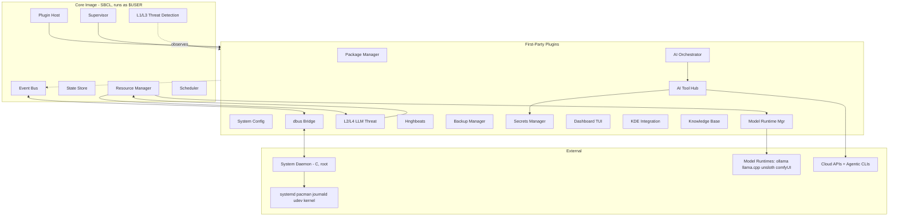

# Hngh — Design Specification

**Status**: Complete (Phases 1–5)
**Date**: 2026-06-21
**Scope**: v0.1 architecture + roadmap to v0.3

---

## 1. Executive Summary

Hngh is a system harness for CachyOS/Arch Linux that orchestrates configuration, package management, GPU/runtime management, and generative AI agents. It is designed for power-users and system administrators who want Emacs-like extensibility applied to the entire operating system — not just the editor, but the package manager, the desktop environment, the AI tools, the backup strategy, and the system configuration.

The core idea: **Hngh is a system harness that takes advantage of agentic coding tools for self-improvement, to suit its integration of agentic tooling, configuration, and control with nearly any systems and software feasible.** Hngh uses existing agentic tools (Opencode, oh-my-claudecode, oh-my-codex, Pi, Cecli, Claude Code, Codex, Gemini-CLI) as its execution substrate. It does not reimplement agentic harnesses — it coordinates between them, informs their behavior task-specifically, and manages the inter-tool boundary.

Two principles shape the architecture:

1. **Dogfooding Substrate**: The agentic tools Hngh uses at runtime are the same tools used to develop Hngh. The boundary between "Hngh using tools" and "Hngh being developed by tools" dissolves. If Opencode+OMC can orchestrate a multi-agent task to write a plugin, it can orchestrate a multi-agent task to fix a user's pacman breakage.

2. **Self-Improvement Loop**: Hngh can spawn an agentic tool session to improve its own code, because that's the same thing it does for users. When Hngh identifies a UX bottleneck (repetitive user action), it spawns an Opencode session with activity context; the session generates a plugin or shortcut; the plugin enters the review pipeline; if approved, it's integrated. This is not a future feature — it's the defining pattern of the architecture.

The system is built as a **microkernel-style image** (SBCL Common Lisp) with **an event bus**, **a supervisor**, and **a procedural-first threat detection system**. Everything else — package management, AI orchestration, theming, dashboards, backups, LLM-based threat detection — is a plugin. A small, stateless C daemon handles privileged operations, communicating via dbus. The AI never runs as root.

v0.1 ("The Harness") delivers the core architecture, system management, GPU/resource management, local model orchestration, backup with config/secrets separation, and minimal AI agent coordination. v0.2 ("The Companion") adds graphical buddies, passive user observation, cost optimization, and subagent time-travel. v0.3 ("The Network") adds remote instance coordination and knowledge-base sharing.

---

## 2. Glossary

| Term | Definition |
|---|---|
| **Image** | The SBCL Common Lisp process running Hngh's core. Analogous to an Emacs image. Contains the 7 core components. |
| **Bus** | The internal event bus (A2). Pub/sub nervous system for all intra-Hngh communication. |
| **Supervisor** | The component (A6) that manages plugin and agent lifecycles — restart policies, health checks, escalation. |
| **System Daemon** | The C process (`hngh-system.service`) running as root. Stateless, no AI, no plugins. Executes privileged operations via systemd template helpers. |
| **First-party plugin** | A plugin shipped with Hngh, loaded as tier-1 trust. The actual features. |
| **AI Tool Hub** | The component (B11) that invokes agentic CLIs and direct API calls. Unified interface for all cloud-based AI access. |
| **Model Runtime Manager** | The component (B4) that spawns and manages local model runtimes (ollama, llama.cpp, unsloth, comfyUI). |
| **Resource Manager** | The component (A4) that arbitrates constrained resources (GPU/VRAM, CPU, memory). The arbiter, not the user. |
| **Hnghbeats** | Condensed, human-readable journal of Hngh's activity (B6). Named after "heartbeats" — the pulse of the system. |
| **Knowledge Base (KB)** | Curated, git-versioned knowledge store (B12). Long-term meta-context for Hngh and its agents. |
| **Meta-context** | Hngh's view of what's happening, persisting across tool invocations and sessions. Assembled from Hnghbeats (medium-term) and KB (long-term). |
| **Context Package** | The assembled context passed to an agentic tool at invocation. Includes task spec, system state, user activity, KB articles, and intra-tool informing directives. |
| **Intra-tool informing** | Task-specific configuration (conventions, skills, sub-agent templates, MCP configs) that Hngh prepares for a tool. Shapes how the tool manages its own context without Hngh managing the tool's internals. |
| **Inter-tool coordination** | Hngh's management of context transfer between tools (handoffs), meta-context above all tools, and dogfooding context. |
| **L1 / L2 / L3 / L4** | Threat detection layers. L1: procedural pre-flight (static). L2: LLM semantic review (load-time, strategic). L3: runtime observation (continuous, procedural). L4: LLM behavioral review (on-flag + periodic, strategic). |
| **Trust tier** | Plugin trust classification: first-party, signed-community, user-written, ai-generated. Determines default privileges and review requirements. |
| **dbus Bridge** | The plugin (B13) that translates between Hngh's internal event bus and the systemd session/system bus. Single trust boundary crosser. |
| **Dogfooding** | Using Hngh's own agentic tool integration to develop Hngh itself. The runtime substrate is the development substrate. |
| **Self-improvement loop** | Hngh observes a pattern, spawns an agentic tool to generate a solution (plugin/shortcut), reviews it, and integrates it. The defining architectural pattern. |
| **Tier (agentic)** | The three-tier model for AI access: agentic CLIs (default), direct API (exception), local models (cost/privacy). |

---

## 3. Architecture Overview

### 3.1 Pattern: Image + Bus + Supervisor

A hybrid of microkernel + event bus + actor supervisor:

- **Image** (SBCL core, small): plugin host, event bus, state store, resource manager, scheduler, supervisor, procedural threat detection (L1/L3). Everything else is a plugin.
- **Bus** (custom internal event bus): all components communicate via pub/sub. A dbus bridge plugin connects to external systemd session bus. External events normalized through the bridge.
- **Supervisor** (single-level, actor discipline): every plugin and agent has a declared restart policy, health checks, and graceful shutdown contract.

The supervisor governs lifecycle, not isolation. First-class CL plugins run in the image (hot-patchable, package-level isolation). Python plugins run as subprocesses (crash-isolated). WASM plugins run in wasmtime (strong isolation, second-class).

Rationale: matches the Emacs model most directly (small core, modes do everything); the supervisor closes the lifecycle gap; the bus gives universal observation for free; the architecture is distribution-ready (remote instances = remote bus peers in v0.3).

Rejected alternatives: pure Hexagonal (weak extensibility), Layered (doesn't fit autonomous work or live redefinition), pure Actor/OTP (actors can't redefine each other live).

### 3.2 Locked Decisions (Summary)

Eleven architectural decisions are locked. Full rationale in `architecture-decision-record.md`.

| ID | Decision | Choice |
|---|---|---|
| D1 | Language stack | SBCL CL (core) + C (privileged) + Python (AI) + C/C++ (GPU) |
| D2 | Privileged execution | Split daemon: user daemon (CL) + system daemon (C, root, stateless) + systemd template helpers |
| D3 | Plugin safety | Procedural-first (L1+L3 always on), LLM-strategic (L2 on ambiguous/AI-gen, L4 on flag + periodic adaptive with 7-day max) |
| D4 | Trust tiers | First-party, signed-community, user-written, ai-generated (mandatory L2 review) |
| D5 | v0.1 scope | Harness + plumbing + minimal AI orchestration; companions/social/advanced deferred |
| D6 | Distribution | Split AUR packages; package-manager-mediated self-update |
| D7 | Extensibility | Declarative manifest, tiered trust, CL/Python/WASM, hot-reload for CL |
| D8 | Architecture pattern | Image + Bus + Supervisor |
| D9 | State authority | Hybrid file tree (git-versioned) + file-based locks for cross-plugin coordination |
| D10 | Event bus | Custom internal bus + dbus bridge plugin |
| D11 | CL plugin isolation | Package-level (own package, explicit imports, locked core) |

### 3.3 Three-Tier Agentic Model

| Tier | Examples | When to use | Owned by |
|---|---|---|---|
| **Agentic CLIs** (default) | Opencode, OMC, omx, Pi, Cecli, Claude Code, Codex, Gemini-CLI | Complex tasks: tool use, multi-step reasoning, file editing, system manipulation | AI Tool Hub (B11) |
| **Direct API** (exception) | Anthropic, Google, OpenAI HTTP APIs | Simple structured outputs (classify, extract, summarize), embeddings (v0.2+) | AI Tool Hub (B11) |
| **Local models** (cost/privacy) | ollama, llama.cpp, unsloth, comfyUI | Cost-sensitive, privacy-sensitive, offline, GPU-available | Model Runtime Manager (B4) |

The default is the agentic CLI. Direct API is the exception, not the baseline. Hngh uses existing agentic tooling rather than reinventing it.

---

## 4. Component Catalog

21 components across three layers. Full specifications in `components.md`.

### 4.1 Core Image (7 components)

| ID | Component | Purpose |
|---|---|---|
| A1 | Plugin Host | Load, unload, reload plugins (CL, Python, WASM) |
| A2 | Event Bus | Pub/sub nervous system for all intra-Hngh communication |
| A3 | State Store | Canonical source of truth — hybrid file tree + file-based locks |
| A4 | Resource Manager | Arbitrate GPU/VRAM, CPU, memory among requestors |
| A5 | Scheduler | Time-based triggers — timers, cron-like, systemd timer integration |
| A6 | Supervisor | Lifecycle management — restart policies, health checks, escalation |
| A7 | Procedural Threat Detection (L1+L3) | Always-on deterministic threat detection — static analysis + runtime observation |

### 4.2 First-Party Plugins (13 components)

| ID | Component | Purpose |
|---|---|---|
| B1 | Package Manager | pacman, yay, paru — install, remove, upgrade, search |
| B2 | System Config | Manage `/etc`, systemd units, btrfs snapshots, theming files |
| B3 | AI Orchestrator | Coordinator/delegator — assembles context, routes to AI Tool Hub or Model Runtime Mgr, manages inter-tool handoffs |
| B4 | Model Runtime Manager | Spawn and manage local model runtimes (ollama, llama.cpp, unsloth, comfyUI) |
| B5 | LLM Threat Detector (L2+L4) | LLM-based semantic review — at load time and on behavioral flag |
| B6 | Hnghbeats | Condense raw event journal into human-readable and LLM-optimized summaries |
| B7 | Backup Manager | Git-version the state tree, sync to remotes, restore |
| B8 | Secrets Manager | Manage API keys, SSH keys, passwords via password managers or local vault |
| B9 | Dashboard TUI | Primary user interface — text-based dashboard for all monitoring and control |
| B10 | KDE Integration (optional) | KDE Plasma theming, plasmoids, notifications, KRunner |
| B11 | AI Tool Hub | Unified interface for agentic CLIs + direct API. Tool registry, invocation, cost tracking |
| B12 | Knowledge Base | Curated, git-versioned knowledge store — long-term meta-context |
| B13 | dbus Bridge | Translate between internal event bus and systemd session/system bus |

### 4.3 External Process (1 component)

| ID | Component | Purpose |
|---|---|---|
| C1 | System Daemon | Privileged operations (root, C, stateless, ~500 LoC). No AI, no plugins, no state. |

### 4.4 Component Diagram



---

## 5. Data Model & State Authority

### 5.1 State Tree Layout

```
~/.hngh/
  state/
    locks/                    # file-based locks (one file per resource, with holder + TTL)
    hardware.lisp             # hardware inventory (audited at startup)
    plugins.lisp              # plugin registry
    components.lisp           # supervisor component registry
    patterns.lisp             # L1 known-bad pattern DB
    plugin-observations/      # L3 per-plugin observation logs
    plugins/ai-tool-hub/
      invocations/            # per-invocation logs
      costs.lisp              # unified cost log (append-only)
  journal/
    events/                   # raw event log (one file per day, append-only)
    hnghbeats/                # condensed summaries (derived)
  config/
    hngh.lisp                 # core config
    plugins/<name>/           # per-plugin config (git-versioned)
  knowledge-base/
    articles/                 # curated how-to, reference, architecture
    decisions/                # recorded design decisions
    learned-patterns/
      threats/                # from L2/L4 verdicts
      optimizations/          # from Cost Optimizer (v0.2+)
      workflows/              # from user activity analysis (v0.2+)
  agents/<id>/
    transcript.lisp           # append-only inter-tool transcript
    state.lisp                # current state, context summary, pending handoffs
  plugins/
    <name>/
      manifest.lisp           # declarative plugin manifest (Lisp plist format, D-008)
      review-verdict.lisp    # for AI-generated (L2 verdict)
      code/                   # plugin source (CL system, Python module, or WASM)
      state/                  # plugin-owned state
  secrets/
    vault.age                # age-encrypted local vault (NOT in git tree)
```

### 5.2 Authority Boundaries

| Data | Authority | Persisted? | Versioned? |
|---|---|---|---|
| Core config | State Store (A3) | Yes (files) | Git |
| Plugin config | State Store | Yes (files) | Git |
| Event journal | State Store | Yes (append-only files) | Git |
| Hnghbeats | Hnghbeats (B6) | Yes (derived files) | Git |
| Knowledge base | Knowledge Base (B12) | Yes (files) | Git |
| Agent transcripts | AI Orchestrator (B3) | Yes (append-only files) | Git |
| Plugin state | Each plugin | Yes (plugin-defined format) | Git |
| Cost log | AI Tool Hub (B11) | Yes (append-only file) | Git |
| Cross-plugin locks | State Store | Yes (file-based) | No (ephemeral) |
| Hardware inventory | Resource Manager (A4) | Yes (file) | Git (reference) |
| Secrets | Secrets Manager (B8) | Yes (backend or vault.age) | NOT in git tree |
| Runtime state (active agents, allocations, subscriptions) | Respective components | No (in-memory) | N/A (rebuilt on restart) |

### 5.3 Config vs. Secrets Separation (Critical)

The git-versioned tree (`~/.hngh/`) NEVER contains secrets. This is enforced at three levels:

1. **Convention**: secrets live in password manager backends or `~/.hngh/secrets/vault.age` (age-encrypted, excluded from git).
2. **Backup Manager enforcement**: `.gitignore` excludes `secrets/`, `state/locks/`, caches. Secrets Manager declares additional sensitive paths; Backup Manager respects them.
3. **State Store enforcement**: writes to declared secret paths are routed to Secrets Manager, not the file tree.

Secrets are retrieved at runtime via the Secrets Access Protocol (policy-checked, backend-retrieved, audit-logged, never cached). Unauthorized access attempts trigger L3 threat flags.

---

## 6. Integration Map

Full integration details in `integrations.md`. Summary:

### 6.1 System Integration

| Substrate | Component | Trust |
|---|---|---|
| systemd (user + system) | Core Image + System Daemon | User / Root |
| dbus (session + system) | dbus Bridge, KDE Integration | User / Root (policy-enforced) |
| pacman + AUR helpers | Package Manager via System Daemon | Root for ops, user for observation |
| btrfs snapshots | System Config via System Daemon | Root for create/restore |
| journald, udev | dbus Bridge subscriptions | User |
| X11/Wayland, KDE, GTK/Qt theming | KDE Integration, System Config | User |

### 6.2 AI Integration

| Substrate | Component | Trust |
|---|---|---|
| Agentic CLIs (Opencode, OMC, omx, Pi, Cecli, Claude Code, Codex, Gemini-CLI) | AI Tool Hub (B11) | User (subprocess) |
| Direct API (Anthropic, Google, OpenAI) | AI Tool Hub (B11) | User (HTTPS) |
| Local models (ollama, llama.cpp, unsloth, comfyUI) | Model Runtime Manager (B4) | User (VRAM-arbitrated) |

Key: Hngh never calls pacman directly — all privileged ops go through System Daemon. Hngh observes system events passively via dbus. Local model VRAM is always arbitrated by Resource Manager, even when tools (Pi, Cecli) manage their own model access.

### 6.3 Network (v0.1: Outbound Only)

No inbound listeners in v0.1. All integrations are outbound: cloud APIs, git remotes, syncthing, rsync, package repositories. Remote instance coordination is v0.3.

### 6.4 Event Schema

10 event namespaces: `system.*`, `plugin.*`, `agent.*`, `resource.*`, `threat.*`, `user.*`, `hnghbeats.*`, `config.*`, `dashboard.*`, `secret.*`. At-least-once delivery, persistent subscriptions, backpressure policies. Full schema in `integrations.md`.

### 6.5 Critical Flows

Eight critical flows are detailed with sequence diagrams in `integrations.md`:

1. **Self-improvement loop** (the defining flow): observe pattern → assemble context → invoke Opencode → review pipeline → load plugin → record in KB
2. **System upgrade**: Dashboard → Package Manager → System Daemon → pacman + btrfs snapshot → breakage check
3. **Local model subagent spawn**: AI Orchestrator → Resource Manager (grant) → Model Runtime Manager → ollama
4. **Threat detection L4 review**: L3 flag → LLM Threat Detector → Resource Manager → ollama → verdict → suspend
5. **Hngh self-improvement (dogfooding)**: user requests → AI Orchestrator → Opencode+OMC against Hngh repo → diff → user approves → git commit
6. **AI-generated plugin review pipeline**: L1 → L2 → user review (all branches)
7. **Backup to remote**: State Store event → Backup Manager → git commit → Secrets Manager (SSH key) → git push
8. **Secrets access by authorized plugin**: policy check → backend retrieval → audit log (or denial → L3 flag)

---

## 7. Security & Trust Model

### 7.1 Privilege Boundary

```
┌─────────────────────────────────────────────────────────────┐
│  User daemon (CL, runs as $USER)                            │
│  ┌──────────────────────────────┐                           │
│  │  Plugin host                 │  ← tier-3 plugins observed │
│  │  ├─ first-party (full)       │     by L3 (procedural)    │
│  │  ├─ community (cap-bound)   │                           │
│  │  └─ user/AI (observed +     │                           │
│  │     L2-reviewed)            │                           │
│  └──────────────────────────────┘                           │
│  ┌──────────────────────────────┐                           │
│  │  L1/L3 Procedural Threat     │  ← always on, cheap       │
│  │  L2/L4 LLM Threat (plugin)   │  ← strategic, on-demand  │
│  └──────────────────────────────┘                           │
│           │ dbus (system bus)                                │
└───────────┼─────────────────────────────────────────────────┘
            ▼
┌─────────────────────────────────────────────────────────────┐
│  System daemon (C, runs as root, ~500 LoC, no AI, no state) │
│  ├─ validates request against dbus policy                   │
│  ├─ runs hngh-helper@.service per operation                 │
│  ├─ subscribes to journald, udev, pacman hooks              │
│  └─ logs everything to journald                             │
└─────────────────────────────────────────────────────────────┘
```

**The AI never runs as root.** Not the threat detector, not the orchestrator, not the plugin evaluator. Root is dumb and small. This is the most important security property.

### 7.2 Plugin Threat Detection (Four Layers)

| Layer | When | What | Cost |
|---|---|---|---|
| L1 — Procedural pre-flight | Plugin load (always) | Static analysis, manifest validation, pattern DB, signature check, hash reputation | Milliseconds, no GPU |
| L2 — LLM semantic review | On L1 ambiguous OR all AI-generated | LLM reviews source, produces pass/fail verdict with concerns and suggested fixes | One LLM invocation, model loaded on-demand |
| L3 — Runtime observation | Continuous (always on) | Syscall/file/network/subprocess tracing, rules engine validates behavior against declared capabilities | Single-digit % CPU, no GPU |
| L4 — LLM behavioral review | On L3 flag + periodic (adaptive, 7-day max) | LLM reviews flagged behavior + periodic drift detection | LLM on-demand, scheduled during idle GPU time |

**Sandboxing** is not a tier default — applied case-by-case when review identifies residual risk that user accepts. AI-generated plugins get mandatory L2 review with pass/fail before loading.

### 7.3 Secrets Management

- Secrets never enter the git-versioned tree.
- Backends: 1Password (`op` CLI), KeePassXC (`keepassxc-cli`), or local age-encrypted vault.
- Access is policy-checked (which plugin may access which secret), backend-retrieved, audit-logged.
- Unauthorized access attempts trigger L3 threat flags.
- Secrets are passed as environment variables to subprocesses; never written to logs or transcripts.

### 7.4 Graceful Degradation

Even if you distrust every AI component, the system is still useful, just less assistive:
- Disable L2/L4 → L1/L3 still provide procedural threat detection.
- Disable cloud AI → local models and agentic CLIs still work.
- Disable all AI → system management (packages, config, backups) still works as a traditional harness.
- Disable threat detection entirely → first-party plugins still work; community/user plugins load at user's own risk (like classic Emacs).

---

## 8. Extensibility Contract

### 8.1 Plugin Manifest

Declarative, parsed by L1 before any code loads. Uses Lisp plist format (D-008 — natively parseable with `READ`, no external dependency):

```lisp
(:name "my-plugin"
 :version "0.1.0"
 :author "user"
 :trust-tier :ai-generated   ; first-party | signed-community | user | ai-generated
 :language :cl               ; cl | python | wasm

 :capabilities
 (:filesystem
  (:read  ("/etc/pacman.d/" "~/.config/hngh/")
   :write ("~/.config/hngh/my-plugin/"))
  :network
  (:hosts ("api.github.com" "registry.hngh.dev"))
  :subprocess
  (:allowed ("pacman" "git" "systemctl --user"))
  :dbus
  (:system ("org.hngh.System")
   :session ("org.kde.plasma.*"))
  :ai
  (:spawn-subagents t
   :query-models (:local-small :cloud-claude))
  :knowledge-base
  (:read t :write nil)
  :secrets
  (:read ("git-ssh-key")))   ; authorized via Secrets Manager policy

 :review                      ; populated for ai-generated tier
 (:source "ai-generated"
  :generator "opencode"
  :prompt-hash "sha256:...")

 :lifecycle
 (:load "hngh.my-plugin:init"
  :unload "hngh.my-plugin:cleanup"
  :reload "hngh.my-plugin:reload"))
```

### 8.2 Plugin Languages

| Language | Isolation | Hot-reload | Use case |
|---|---|---|---|
| Common Lisp | Package-level (own package, explicit imports, locked core) | Yes (redefine functions in own package) | First-class extensions, Emacs-style live editing |
| Python | Process boundary (subprocess) | No (full restart) | AI-heavy plugins, ecosystem access |
| WASM | wasmtime sandbox | No (reload module) | Community knowledge packs, limited API |

### 8.3 Plugin API Surface

| Capability | API | Available to |
|---|---|---|
| Subscribe to events | `hngh.events:subscribe` | All tiers |
| Request privileged op | `hngh.system:request` | All tiers (dbus policy validates) |
| Spawn AI subagent | `hngh.ai:delegate` | Tiers with `ai.spawn-subagents` |
| Query LLM | `hngh.ai:query` | Tiers with declared model access |
| Read/write KB | `hngh.kb:query`, `hngh.kb:write` | Per manifest |
| Register dashboard widget | `hngh.dashboard:register` | All tiers |
| Read system state | `hngh.state:read` | Per manifest scope |
| Hot-reload own code | `hngh.plugin:reload` | CL plugins only |
| Register new plugin | `hngh.plugin:register` | First-party only |

### 8.4 Tool Registry (AI Tool Hub)

Configurable and extensible — new agentic CLIs added via config, not code changes:

```lisp
(tool :id opencode
      :type :agentic-cli
      :command "opencode"
      :providers (:anthropic :google :openai :local)
      :context-format :opencode-prompt
      :event-capture :jsonl
      :cost-model :per-query
      :capabilities (:code-editing :system-manipulation :multi-step-reasoning)
      :session-management :internal
      :dogfooding t)
```

A new agentic CLI released next year is just a new entry in this registry.

### 8.5 Context Management: Inter-Tool Coordination with Intra-Tool Informing

**Inter-tool coordination** (Hngh owns): what context to pass, how to transfer between tools on handoff, meta-context above all tools, dogfooding context.

**Task-specific intra-tool informing** (Hngh prepares, tool consumes internally): conventions, skills, sub-agent templates, hooks, MCP configs, workspace setup — task-specific configuration that shapes how the tool manages its own context for this invocation, without Hngh managing the tool's session, compaction, or sub-agent loops.

---

## 9. Operational Concerns

### 9.1 Packaging

Split AUR packages from a single PKGBUILD:

| Package | Contents |
|---|---|
| `hngh-core` | SBCL image, user daemon, plugin host, TUI dashboard |
| `hngh-system` | Privileged C daemon, systemd units, dbus policy |
| `hngh-python` | Python bridge, AI orchestration modules |
| `hngh-kde` | KDE/Plasma integration (optional) |
| `hngh-dev` | Headers, plugin SDK, documentation |

AUR submission currently closed; ship via custom repo initially, transition to AUR when it reopens.

### 9.2 Self-Update

Package-manager-mediated (default): Hngh detects update via `checkupdates` or pacman database query → notifies user → on approval, calls System Daemon to run `pacman -Syu hngh-*` → systemd package install hooks restart services → user daemon saves state and signals shutdown → systemd restarts with new binary.

Notify-only mode (configurable fallback): Hngh tells user an update is available; user runs `pacman -Syu` manually.

### 9.3 Observability

- **Hnghbeats** (B6): condensed, human-readable journal of all activity. Daily files. Categories: system-changes, package-ops, agent-activity, costs, threat-events, user-activity, errors.
- **Dashboard TUI** (B9): real-time views of system, agents, resources, threats, logs, config, secrets, plugins.
- **Event journal** (raw): every event append-only journaled to `journal/events/`. Source of truth for hnghbeats condensation.
- **Cost log** (AI Tool Hub): every AI invocation tracked (tool, provider, model, tokens, cost, task-hash, success).
- **Secrets access log**: every secret access audit-logged (name, requester, timestamp; never the value).
- **Plugin observation logs**: L3 per-plugin behavior logs, rolled into hnghbeats.

### 9.4 Dependencies

Hard: `sbcl`, `systemd`, `dbus`, `pacman`, `python`
Recommended: `yay` or `paru`, `git`, `btrfs-progs`
Optional: `ollama`, `llama.cpp`, `unsloth`, `comfyui` (managed as runtimes, not package deps), agentic CLIs (Opencode, OMC, omx, Pi, Cecli, Claude Code, Codex, Gemini-CLI)

The PKGBUILD declares hard deps and `optdepends` for everything else. Hngh discovers available runtimes at startup — missing tools are reported in the dashboard with install shortcuts.

---

## 10. Phased Implementation Roadmap

### Milestone 0: Foundation (pre-v0.1)

**Goal**: get the core image running with minimal plugins for end-to-end validation.

| Deliverable | Components |
|---|---|
| SBCL image skeleton | Core image process, package structure |
| Event bus (A2) | Internal pub/sub, in-process delivery |
| State store (A3) | File tree read/write, file-based locks, journal append |
| Plugin host (A1) | CL plugin loading, manifest parsing, package-level isolation |
| Supervisor (A6) | Restart policies, health checks |
| Scheduler (A5) | Timers, basic scheduling |
| dbus Bridge (B13) | Basic systemd session bus subscription |
| Dashboard TUI (B9) | Minimal status display |
| System Daemon (C1) | Skeleton with one method (e.g., `InstallPackages`) |

**Exit criteria**: Hngh starts as a systemd user service, loads one first-party CL plugin, displays status in TUI, and can install a package via the System Daemon.

### Milestone 1: The Harness (v0.1)

**Goal**: the full v0.1 scope — a usable system harness with AI orchestration.

| Deliverable | Components |
|---|---|
| Procedural Threat Detection L1+L3 (A7) | Static analysis, runtime observation, rules engine |
| Resource Manager (A4) | VRAM/CPU/memory arbitration, preemption |
| Package Manager (B1) | pacman/yay/paru integration, breakage detection |
| System Config (B2) | `/etc` management, btrfs snapshots, theming files |
| Model Runtime Manager (B4) | ollama, llama.cpp, unsloth, comfyUI spawn/lifecycle |
| AI Tool Hub (B11) | Tool registry, Opencode/Pi/Cecli/Claude Code/Codex/Gemini-CLI + direct API |
| AI Orchestrator (B3) | Coordinator, context package assembly, inter-tool handoffs |
| LLM Threat Detector L2+L4 (B5) | On-demand LLM review, periodic drift detection |
| Hnghbeats (B6) | Event condensation, daily beats |
| Backup Manager (B7) | Git versioning, remote sync, restore |
| Secrets Manager (B8) | 1Password/KeePassXC/vault.age backends, policy |
| Knowledge Base (B12) | Article storage, keyword search, learned-pattern recording |
| KDE Integration (B10) | Theming, notifications (optional plugin) |
| PKGBUILD + split packages | All five packages, custom repo |

**Exit criteria**: a power-user can install Hngh on CachyOS, manage packages, configure their system, run local models, invoke cloud AI, back up their config, and have the threat detection system running — all from the TUI dashboard or programmatically.

### Milestone 2: The Companion (v0.2)

**Goal**: the system becomes interactive and intelligent.

| Deliverable | Notes |
|---|---|
| User Activity Observer | Passive observation of user shell/editor/system activity; periodic questioning; user-preference model in KB |
| Buddy Avatar | Graphically animated assistant widget (Wayland/X11); speech bubbles; conversation trees |
| Speech Bubble UI | Comic-strip-style dialogue renderer |
| TTS Voice | Local text-to-speech (Piper or similar) for buddy dialogue |
| Cost Optimizer | Procedural cost optimization; routes requests by cost/latency/user-pref; uses v0.1 cost log |
| Subagent Time-Travel | Conversation rewinding for agents; inject advice at earlier states; requires stable transcript format |
| KB Embeddings | Semantic search via local model embeddings (replaces keyword search) |
| Advanced Context Management | Procedural context compaction; automatic session backtracking after wrong turns; inter-sub-agent communication monitoring |

**Exit criteria**: the system proactively observes user behavior, suggests shortcuts, generates plugins to automate repetitive tasks, and presents a graphical companion that interacts with the user.

### Milestone 3: The Network (v0.3)

**Goal**: Hngh instances coordinate across machines.

| Deliverable | Notes |
|---|---|
| Social Network Manager | Peer-to-peer coordination with remote Hngh instances; knowledge-base sharing; SSH key coordination |
| Remote Instance Coordinator | Spawns/manages connections; bridges internal event bus to network transport |
| Procedural Portrait Generator | Image-gen-powered character portraits for buddies (comfyUI integration) |
| Multi-user Support | Multiple Hngh instances per machine; multi-tenant considerations |
| Inbound Network Listener | Authenticated inbound for remote coordination (first inbound listener) |

**Exit criteria**: users can connect Hngh instances across machines, share knowledge bases, delegate tasks to remote instances, and coordinate backups and configurations across a fleet.

---

## 11. Open Questions & Risk Register

### 11.1 Technical Risks

| Risk | Likelihood | Impact | Mitigation |
|---|---|---|---|
| **SBCL fringe-ness** — smaller contributor pool than Python/Rust | Medium | Medium | Python bridge means most contributors can work on AI side; CL side is core, kept small; comprehensive docs |
| **Polyglot complexity** — cross-language FFI, packaging, debugging across boundaries | High | Medium | Accept cost (matches Emacs, game engines, pro audio); clear interface contracts; good logging |
| **Custom event bus design burden** — pub/sub with persistent subscriptions, backpressure | Medium | Medium | Bounded by bridge-as-plugin pattern; well-understood semantics; fail-open gracefully |
| **Tool versioning fragility** — agentic CLIs update frequently, event schemas may break | High | Medium | Tool registry includes `:schema-version`; degrade to raw stdout on mismatch; registry updates ship as plugin updates |
| **Multi-service update coordination** — user daemon + system daemon must update together | Medium | High | Single PKGBUILD with split packages; pacman handles atomic install; version skew detected at startup |
| **Threat detection false positives** — L3 rules engine may flag benign behavior | Medium | Low | User can dismiss flags; L4 LLM review provides semantic judgment; flags feed back to improve rules |
| **GPU resource contention** — user workloads (comfyUI, gaming) vs. Hngh model loading | High | Medium | Resource Manager preempts Hngh grants for user-interactive workloads; Hngh models unload on pressure |
| **pacman hook observation** — no clean dbus interface for pacman transactions | Medium | Low | File watch on `pacman.log` for v0.1; custom libalpm hook for v0.2 if needed |
| **Concurrent state access** — multiple plugins writing to State Store | Medium | Medium | File-based locks for cross-plugin coordination; per-path single-writer enforced by State Store |
| **Large context packages** — assembled context may exceed tool input limits | Medium | Medium | KB compaction summarizes older context; AI Orchestrator splits tasks if too large |

### 11.2 Design Risks

| Risk | Likelihood | Impact | Mitigation |
|---|---|---|---|
| **Scope creep** — feature list is ambitious; v0.1 may grow | High | High | Strict milestone boundaries; deferred features are explicit; each milestone has exit criteria |
| **Self-improvement loop safety** — AI-generated plugins could introduce vulnerabilities | Medium | High | Mandatory L2 review for AI-generated; L3 continuous observation; L4 periodic drift detection; user approval required |
| **Plugin trust model UX** — too many prompts → users approve everything; too few → unsafe | Medium | Medium | Tiered trust reduces prompts (first-party = none, AI-generated = one-time review); L3 observes silently |
| **Dogfooding circularity** — Hngh improving itself with tools that Hngh manages could create feedback loops | Low | Medium | User is always in the loop for self-improvement (reviews diffs); generated code goes through standard review pipeline |
| **Emacs-likeness vs. safety tension** — power-users want full trust; security wants sandboxing | Medium | Medium | Package-level isolation preserves 95% of Emacs experience; sandboxing is opt-in per plugin, not default |

### 11.3 Open Design Questions

| Question | Target Resolution |
|---|---|
| ~~Exact plugin manifest schema (YAML vs. Lisp data)~~ | **Resolved (D-008)**: Lisp plist format — natively parseable, no external dependency |
| Event bus delivery guarantees (at-least-once confirmed; exactly-once needed?) | Milestone 0 (test with real workloads) |
| Tool result normalization schema (`ToolResult` struct) | Milestone 1 (define when first handoff is implemented) |
| KB search: keyword (v0.1) → embeddings (v0.2) transition path | Milestone 1 (keyword search interface stable; embeddings added behind same interface) |
| Remote instance protocol (v0.3) — gRPC? custom? HTTP? | Milestone 2 (research during v0.2; implement in v0.3) |
| Buddy avatar rendering technology (Qt/QML vs. GTK vs. custom) | Milestone 2 (prototype during v0.2) |
| Cost optimization algorithm (v0.2) — rules-based? ML-based? hybrid? | Milestone 2 (start rules-based; add ML if data warrants) |

---

## 12. References

This specification is the single source of truth. Detailed artifacts:

| Artifact | Content |
|---|---|
| `architecture-decision-record.md` | 11 locked decisions (D1–D11) with full rationale, rejected alternatives, consequences |
| `components.md` | 21 components with full specifications: purpose, inputs/outputs, owned state, failure modes, lifecycle |
| `integrations.md` | Integration map, event schema, integration contracts, 8 sequence diagrams, open integration questions |

---

## Appendix A: Tool Registry (Initial)

The AI Tool Hub ships with these tools registered by default. All are configurable; new tools added via `config/plugins/ai-tool-hub/tools.lisp`.

| Tool | Type | Providers | Key Integration Interface | Dogfooding |
|---|---|---|---|---|
| Opencode | Agentic CLI | Multi-provider | Subprocess + task events; multi-agent orchestration; skills; MCP servers | Yes (primary) |
| oh-my-claudecode (OMC) | Orchestration layer | Anthropic | Subprocess (wraps Claude Code); skills; team mode; ralph loops; wiki; project memory | Yes |
| oh-my-codex (omx) | Orchestration layer | OpenAI | Subprocess (wraps Codex); same patterns as OMC | Yes |
| Pi | Agentic CLI | Multi-provider | Subprocess + JSON Event Stream (stdin/stdout JSONL) + RPC mode; SDK; sessions; compaction; skills; extensions; custom models/providers | Yes |
| Cecli | Agentic CLI | Multi-provider (15+) | Subprocess + Python scripting; sub-agents; skills; hooks; MCP servers; agent mode; git integration; workspaces; Ollama support | Yes |
| Claude Code | Agentic CLI | Anthropic | Subprocess | No (use OMC instead) |
| Codex | Agentic CLI | OpenAI | Subprocess | No (use omx instead) |
| Gemini-CLI | Agentic CLI | Google | Subprocess | No |
| Direct API (Anthropic) | Direct API | Anthropic | HTTPS | No |
| Direct API (Google) | Direct API | Google | HTTPS | No |
| Direct API (OpenAI) | Direct API | OpenAI | HTTPS | No |

---

## Appendix B: File Tree (Complete)

```
<project-root>/
  architecture-decision-record.md   # Phase 1+2 — 11 locked decisions
  components.md                      # Phase 3 — 21 component specifications
  integrations.md                    # Phase 4 — integration map + sequence diagrams
  hngh-design-spec.md                # Phase 5 — this document (single source of truth)
```

---

**End of Design Specification**

This document, together with the three supporting artifacts, constitutes the complete design for Hngh v0.1 through v0.3. The next step is implementation: Milestone 0 (Foundation) begins the core image skeleton.