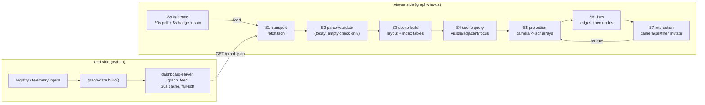
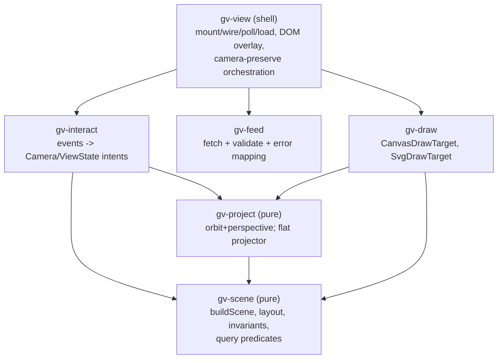

# Graph viz pipeline stage map: data -> scene graph -> canvas draw

Status: DRAFT design synthesis input -- describes the pipeline that exists
today (working tree, 2026-09-15) and proposes stage interfaces, transforms,
and module boundaries for the viz synthesis. Nothing here changes behavior;
where a seam is named, the doc says what would move and what would stay.

Companions: `patrol-payload-schema.md` (feed-side synthesis input).
Register: `docs/design/display-register-spec.md` -- the graph viewer is a
spatial register; everything drawn is a projection of registry state, never
a caption source of record.

Sources (evidence):

| Source | What it pins | Ref |
| --- | --- | --- |
| `automation/jobs/graph-data.py:370-375,530-531` | emitted Node/Edge shapes, top-level `{generated_at, nodes, edges}` | R |
| `automation/dashboard-server.py:315-342,402-406` | `/graph.json` route, 30s dual cache, pass-through | R |
| `automation/dashboard/graph-view.js:63-73` | `fetchJson` transport (10s abort, no-store) | V |
| `automation/dashboard/graph-view.js:75-84` | `parseDetail` k=v split (12-pair cap) | V |
| `automation/dashboard/graph-view.js:170-196` | `layout()` fibonacci two-shell scene build | V |
| `automation/dashboard/graph-view.js:198-218` | `layout.checkInvariants` headless scene invariants | V |
| `automation/dashboard/graph-view.js:257-276` | `setData` index tables + preallocated buffers | V |
| `automation/dashboard/graph-view.js:413-429` | `project()` orbit + perspective transform | V |
| `automation/dashboard/graph-view.js:431-441` | `resize()` DPR backing store | V |
| `automation/dashboard/graph-view.js:446-449` | `redraw()` dispatch | V |
| `automation/dashboard/graph-view.js:451-520` | `draw3d()` edge + node passes | V |
| `automation/dashboard/graph-view.js:543-595` | pointer orbit/wheel + `pickAt` nearest-first | V |
| `automation/dashboard/graph-view.js:720-799` | `load()` orchestration + camera preserve + error path | V |
| `automation/dashboard/graph-view.js:815-868` | SVG fallback `render2d`/`bindSvg` (second projector) | V |
| `automation/dashboard/graph-view.js:801-811` | public surface `{init, refresh}` | V |

R = feed runtime, V = viewer runtime. Line refs are the working tree the
viz-data-shape and viz-render-loop nodes documented; both files carry
uncommitted modifications, so re-check anchors before relying on them.

---

## 1. Pipeline at a glance



Key architectural fact: this is a demand-driven immediate-mode pipeline, not
a scene-graph-retained renderer. There is no persistent draw list; every
state change replays S5+S6 synchronously, and the only retained state is
(S3) index tables + positions and the projected scratch arrays from the
last frame. Picking (S7) deliberately reuses the last frame's projection.

## 2. Stage map

| # | Stage | Input | Output (typed below in §3) | Transform | Today's home |
| --- | --- | --- | --- | --- | --- |
| S1 | Transport | URL `/graph.json` | `RawGraph` (parsed JSON) | HTTP GET, 10s abort, no-store | `fetchJson` graph-view.js:63-73; server cache dashboard-server.py:315-342 |
| S2 | Parse+validate | `RawGraph` | `Graph` (validated) | shape checks; today only `nodes.length` non-empty (graph-view.js:741); kinds/states trusted from the builder | inside `load()` 740-741 |
| S3 | Scene build | `Graph` | `Scene` | deterministic fibonacci-sphere, two shells (kernel at origin; inner R=190; outer R2=190+34*(n-1)^0.42); id->index map; edge endpoint Int32 encoding with -1 for danglers; grow-only scratch alloc | `layout` 170-196 + `setData` 257-276 |
| S4 | Scene query | `Scene` + view state | booleans / id sets | pure predicates: `visible`, `adjacent`, `focusSet`, `byId` | 386-412 |
| S5 | Projection | `Scene` + `Camera` + viewport | projected `scr.{x,y,s,d}` | Y-orbit `th`, X-orbit `ph`, `z = cam.r - depth`, perspective `s = FOCAL*(H/2)/max(20,z)` (50deg vfov), zero allocation | `project` 413-429; DPR via `ctx.setTransform` in `resize` 431-441 |
| S6 | Draw | projected buffers + `Scene` + view state | pixels / SVG DOM | pass 1 edges (depth-tinted alpha, focus highlighting), pass 2 nodes painter's far->near, rings/gloss/labels | `draw3d` 451-520; fallback `render2d` 815-847 |
| S7 | Interaction | DOM events | `Camera` + selection/hover/filter mutations | drag orbit 0.006 rad/px (ph clamp +-1.35), wheel zoom clamp [480,4800], nearest-first pick on last frame's projection, chips/search/history-hash | `bindPointer` 543-579, `pickAt` 583-595, `select`/`jumpTo` 630-681, `wire` 331+ |
| S8 | Cadence | timers | reload / badge / spin | 60s `autoLoad` (skipped when `#p-graph` hidden), 5s badge, optional rAF spin 0.12 rad/s (pauses on pointer/down/hidden), `snapshotView`/`restoreView` camera preserve across reloads (camera/selection/spin only: hover and the `pendSel` hash target are deliberately not preserved -- `pendSel` wins only if it arrives before the fetch resolves, 788-790; see §7.6) | 224, 238-248, 382-383, 522-541, 682-718, 720-799 |

## 3. Proposed stage interfaces

Shapes in TypeScript-ish notation; ownership column says who may mutate.

```text
// S1/S2 output -- the wire contract (graph-data.py:370-375,530-531)
interface Graph {
  generated_at: string;            // '%Y-%m-%dT%H:%M:%SZ', UTC
  nodes: Node[];                   // id unique across the array
  edges: Edge[];
}
interface Node {
  id: string;                      // '<kind-prefix>:<name>' or 'kernel'
  kind: Kind;                      // 13-kind vocabulary, viewer KINDS :52-54
  label: string;
  state: 'healthy'|'stale'|'alerting'|'neutral';
  detail: string;                  // 'k=v k=v ... free text'; parsed by viewer
}
interface Edge { src: string; dst: string; rel: string; }

// S3 output -- retained scene state; rebuilt whole on every load
interface Scene {
  graph: Graph;
  pos: Map<nodeId, [x,y,z]>;       // world units; kernel pinned at [0,0,0]
  shellRadius: number;             // outer shell, drives camera fit
  idxOf: Map<nodeId, number>;      // node index into graph.nodes
  eSrc: Int32Array; eDst: Int32Array; // edge -> node index, -1 = dangling
  scr: {x,y,s,d: Float32Array; n}; // preallocated projection scratch (grow-only)
  order: number[];                 // draw order, re-sorted far->near per frame
}

// S5 input -- the only state interactions may mutate between loads
interface Camera { th: number; ph: number; r: number; }  // orbit + distance
interface ViewState {
  selId: string|null; hoverId: string|null; matches: Set<nodeId>|null;
  kindOff: Record<Kind, boolean>; stateOff: Record<State, boolean>;
}
interface Viewport { W: number; H: number; dpr: number; }

// S5 output (written into Scene.scr by convention)
//   x,y: screen px (CSS units; dpr handled by ctx transform)
//   s:   perspective scale;  d: depth for sort/tint

// S6 target -- one interface, two implementations
interface DrawTarget {
  beginFrame(): void;              // canvas: clearRect; svg: reset buffer
  edgePass(edges, Scene, scr, focus): void;
  nodePass(nodes, Scene, scr, view): void;
  endFrame(): void;
}
//   CanvasDrawTarget (2d ctx, 451-520) | SvgDrawTarget (string build, 815-847)
```

Stage contract rules the synthesis should preserve:

1. **S3 output is the only coupling between data and rendering.** Draw and
   interact stages never read `Graph` directly except through scene query
   (S4) and index tables. This is what makes the SVG fallback possible at
   all today, and it should survive any refactor.
2. **S5 is pure and allocation-free.** It writes only into preallocated
   scratch. Picking correctness depends on this frame-latest convention.
3. **S7 never draws.** It mutates Camera/ViewState then calls `redraw()`
   (446-449), which dispatches S5+S6. Keeping mutation and painting
   separated is what makes the camera-preserve snapshot (238-248) trivial.
4. **S2 must fail closed.** A malformed feed shows the error banner
   (791-798) and keeps the last good scene; nothing partial is rendered.
   Today's validation is too thin for that promise (see §6).

## 4. Data flow invariants

Checked today by headless hook `layout.checkInvariants` (198-218) and by
construction in `setData`:

- Every node id is unique and gets a position; positions are finite.
- `kernel` sits exactly at the origin; non-kernel nodes sit on their shell
  radius (inner 190 or outer `layout.shellRadius`) within 1e-6.
- Every edge endpoint maps to a node index or -1; -1 edges are skipped at
  draw time (they are never silently dropped from the arrays).
- `scr.n >= nodes.length` always (grow-only resize, 263-267).
- `order` is a permutation of node indices, re-sorted far->near each frame
  (painter's algorithm for the node pass).
- Unknown `kind`/`state` values fall back to neutral color and default
  size (`KIND_SIZE[kind] * ...` would be NaN for an unknown kind today --
  a latent sharp edge if the feed ever adds a 14th kind; see §6).

## 5. Proposed module boundaries

Today everything lives in one 870-line IIFE. The natural split follows the
stages; the constraint that shapes it is testability: scene and projection
must stay DOM-free so they remain headless-testable under plain `node`
(the repo already uses this trick: `layout.checkInvariants` 198-218 and the
pure `snapshotView` helpers 234-249 exist for the contract test).



| Module | Owns | Reads | Never touches |
| --- | --- | --- | --- |
| `gv-feed` | transport, S2 validation, error classification | URL config | DOM, camera |
| `gv-scene` | `buildScene(Graph)->Scene`, layout fns, invariants, S4 predicates | Graph | DOM, canvas |
| `gv-project` | camera math, screen mapping, DPR matrix values, flat (orthographic) projector for SVG | Scene, Camera, Viewport | DOM, drawing calls |
| `gv-draw` | DrawTarget impls: edge/node passes, rings, labels, colors/sizes tables | Scene, scr, ViewState | event listeners |
| `gv-interact` | pointer/keyboard/hash -> intent; owns Camera+ViewState between loads | Scene (for pick/jump) | pixel output |
| `gv-view` | mount, wire, HnghPoll cadence, load() orchestration, overlay DOM (tip/panel/chips/badge/legend/err), public `{init, refresh}` | all of the above | none |

Extraction order if this lands incrementally: `gv-feed` (smallest, makes S2
testable), then `gv-scene` (already has a headless hook to migrate), then
`gv-project`+`gv-draw` together (they share the color/size tables), and
`gv-interact` last (most coupled to the shell). The public surface
`window.GraphView = {init, refresh}` (801-811) and the `gv-` CSS prefix
(86-142) stay as the compatibility boundary; app.js and the headless
contract tests keep working unchanged.

## 6. Failure paths and sharp edges the map must keep visible

- **Feed unavailable / non-OK / empty**: error banner + `feed error` badge,
  last good scene stays on screen (740-741, 791-798). Server side: cold
  start fails closed, warm failures serve last good graph
  (dashboard-server.py:315-342).
- **Validation gap (proposed fix target)**: S2 today checks only
  `nodes.length`. A feed with a missing `detail` or a 14th kind would
  still render (`KIND_SIZE[kind] * scr.s` yields NaN radius; `||` fallback
  in some paths would mask it as radius NaN in canvas and a `NaN` attribute
  in SVG). The proposed `gv-feed` validate step should enforce: nodes is a
  non-empty array of objects with string id/kind/label/state/detail, every
  edge src/dst is a string, and unknown kinds are tolerated by clamping to
  a default size rather than producing NaN.
- **Dangling edges**: encoded as -1, skipped at draw (272-275). Never an
  error; the builder already drops self-loops/danglers, -1 is belt.
- **Malformed detail tokens**: `parseDetail` puts non-`k=v` tokens into
  tail text shown as prose (75-84, 150-159). Free text is escaped; only
  leading pairs become table rows.
- **Malformed jcode session files**: surfaced upstream as alerting nodes
  with collision-safe ids, never filtered (graph-data.py:148-178, 275-299).
- **Pick miss**: `pickAt` returns null, hover ring just disappears; no
  error path.

## 7. Open questions for the synthesis

RESOLVED 2026-09-15 (node docs-viz-open-questions): each question below
carries a one-line Resolution so synthesis inherits decisions, not
dangling questions. Line pins are the same working tree as the source
table above.

1. rAF-coalescing of drag/wheel redraws: current per-event synchronous
   redraw is fine at ~350-535 nodes; the stage map makes the fix local
   (queue intents in `gv-interact`, run S5+S6 in one rAF) if node count
   grows (render-loop node raised the same).
   Resolution: **keep per-event redraw**; revisit with rAF-coalescing
   in `gv-interact` when feed size exceeds 1000 nodes (live feed now
   548 nodes default / 565 all-sessions, measured 2026-09-15 via
   `graph-data.build()` with server-identical args,
   dashboard-server.py:330-337).
2. Edges always underdraw nodes (no depth interleaving). Wireframe style;
   confirm intent before anyone "fixes" it.
   Resolution: **intended wireframe style, confirmed** -- edges are a
   depth-tinted underlay pass and nodes are painter's far->near on top
   (draw3d 451-520, edge pass precedes node pass); any interleaving
   change opens a new design node, it is not part of viz synthesis.
3. `spinLoop` reschedules rAF before the pause check (531-538); swap the
   guard order when `gv-interact` is extracted.
   Resolution: **swap the guard order** (early-return `if (!spinning)`
   after the pause test, before `requestAnimationFrame(spinLoop)`) at
   `gv-interact` extraction time; not a bug today (rAF stops firing for
   hidden tabs and `setSpin(false)` already zeroes `spinning`, 524-530),
   it just keeps a paused-but-registered callback alive one extra frame
   (graph-view.js:531-538).
4. `restoreView` grow-only clamp recomputes `Math.max(snap.r, minFit)` on
   every refresh even when the shell did not grow; intentional per the v5
   header but worth an operator eyeball.
   Resolution: **intentional per the v5 header, keep** -- the recompute
   is the documented grow-only semantics ("grow-only distance so a
   bigger shell never clips", header v5, graph-view.js:31-35; clamp
   re-derived each load at 241-248); one `Math.max` per 60s refresh is
   unmeasurable, no fix scoped.
5. The SVG fallback re-implements the projection transform inline
   (819-820) instead of sharing `gv-project`; the proposed flat projector
   in `gv-project` is where that dedup lands.
   Resolution: **cross-referenced, out of scope here** -- dedup is owned
   by the `gv-project` extraction in the §5 module plan (flat projector
   row, table at 184-191 and extraction order 193-199); `render2d` /
   `bindSvg` stay dual-implemented until that extraction lands
   (graph-view.js:815-868).
6. Camera-preserve snapshot does not include hover or the `pendSel` hash
   target across reload; probably fine, but it is a behavior the synthesis
   should state explicitly rather than leave implicit.
   Resolution: **stated S8 behavior, accepted as-is** -- `snapshotView`
   captures `{th, ph, r, sel, spin}` only (238-248); `hoverId` is
   transient pointer state and is never restored (declared 222); a
   pending hash target wins if it arrived before the fetch resolved and
   is otherwise lost, by explicit ordering in `load()` (pendSel branch
   precedes snapshot re-select, 788-790; `pendSel` is set from the
   location hash in `wire`, 806). See the S8 row (§2) for the normative
   statement.
7. The server exposes `?all-sessions=1` (second cache slot, forwarded to
   `build(all_sessions=1)`, dashboard-server.py:315-342, 402-406) with
   passing tests (test-graph-feed-refresh.py:166-190), but the viewer has
   no UI toggle for it.
   Resolution: **out of scope for viz synthesis** -- no toggle is added
   in the current synthesis; if one is ever wanted it belongs to
   `gv-feed` (S1 transport owns the request URL, §5 module table), to be
   opened as its own design node at that time.
