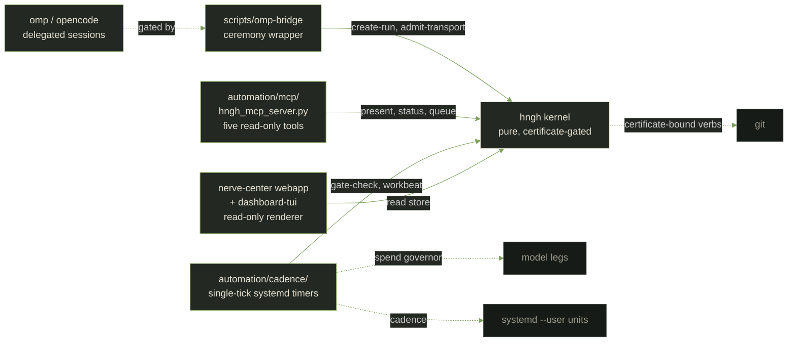
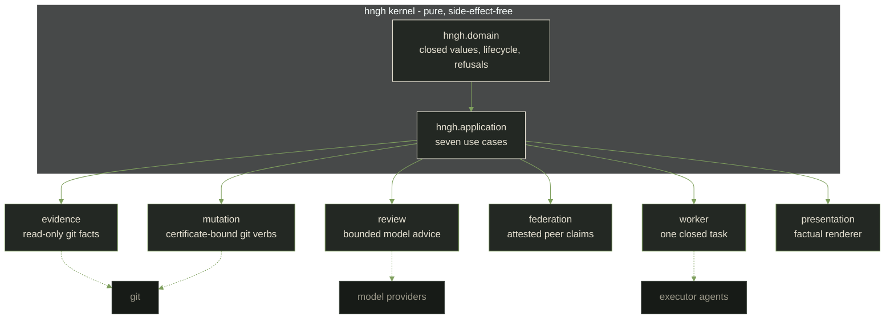

# The Hngh memoir (assembled)


The record in one file: the intent, the architecture, the decisions, and the queue that runs itself.


## The intent

# Hngh intent

## What Hngh is

Hngh turns development into short, bounded cycles — plan, check, record, close — that an
automated agent can run while a human keeps the final say. Each cycle leaves a paper trail
of evidence. Nothing changes the system without passing a check and being recorded. The
kernel itself is side-effect-free: it does nothing on its own, owns no background process,
and refuses anything unknown or unverified (fail-closed).

## Why this exists

Automation grows more capable every year, and that is exactly when trust gets harder. Most
agentic and developer tools act without a record and without clear boundaries. They change
files, run commands, or call models, and afterward there is little to show for how or why.
When something goes wrong, you cannot reconstruct what happened, and you have no clean place
to say "no."

That is the problem Hngh is built for. Trustworthy automation needs two things ordinary tools
skip: a paper trail, and a human who has the final say. Every decision here is designed to
keep those two things true — every action is recorded, and nothing is treated as approved
until a checked, ruled-on decision says so. When the machine suggests, plans, and asks, and
the human confirms, automation stays useful without becoming an uncontrolled actor.

## How work happens

Work in Hngh happens as a run: one bounded attempt at one objective, with a clear start, a
clear end, and checkpoints in between. A run is not a general "session" that people open and
leave running. It is a small, finite loop, and each loop is complete on its own.

A person sees a run pass through a simple life:

- **Created.** A run exists as an idea with a mission, a role, and limits. Nothing has
  happened yet.
- **Armed.** The run asks for permission and gathers evidence. It is only allowed to start
  when its request is confirmed.
- **Running.** The run does its work, under the limits it was given.
- **Checkpointed.** Verified progress is recorded. A person can see what is done and what
  evidence backs it.
- **Closed.** The run ends in one of a few definite ways — cancelled, evacuated, or dead.
  A closed run stays closed. If you want another attempt, you start a new run; nothing
  retries or continues silently on its own.

Each run is a complete loop. The work repeats — that is the point — but every repetition
starts fresh, with its own evidence and its own checks. Nothing carries over by accident,
and nothing is assumed from a previous try.

## The roguelike idea

The design borrows discipline from roguelike games — deliberately, and as a metaphor only.
It is a proven way to keep progress honest, not a game to be won.

In a roguelike, a run is finite: it has a start, checkpoints, and an end, and when it ends it
is over. "Permadeath" there means the run does not quietly continue or auto-retry; you begin
a new run instead. In Hngh, that same discipline is containment, not punishment. When time or
budget runs out, a check fails, a request is unsafe, or a run expires, the run ends. There is
no automatic retry and no silent continuation. The good ending is "evacuation": named
deliverables and verification evidence are handed over, and what was learned is preserved.
Even a dead run keeps its last verified checkpoint and a bounded salvage record.

The other borrowed idea is the "camp": one tiny, behavior-sized change, then a pause where
evidence, cleanup, and the next move are recorded. Small verified steps, each one leaving a
trace — never a long stretch of unrecorded work.

This is a metaphor for discipline, not a game. Hngh uses "run," "checkpoint," and
"evacuation" as plain working words (defined below); the game flavor is only a reminder that
dead ends stay dead and progress has to be earned.

## What the kernel guarantees

The kernel is the quiet center of Hngh, and it promises five things:

- **Side-effect-free.** The kernel reads no clock, no files, no network, and no process. On
  its own it changes nothing on the machine. All the messy real-world activity lives outside
  it, at the edges, where the rules still apply.
- **Fail-closed.** Unknown, malformed, duplicate, or unverified input is refused. The kernel
  never guesses and never skips a check. If it cannot say "yes" for certain, the answer is
  "no."
- **Evidence, not authority.** A record of what happened — a receipt — describes or justifies
  what went on. By itself it grants no power. Recording that something happened never makes
  it approved.
- **One action per certificate.** A certificate is permission for exactly one action
  (prepare, stage, commit, or push), bound to specific files and specific evidence, and
  re-checked immediately before that action runs. There is no blank permission slip.
- **No hidden execution.** Nothing runs in the background, no daemon watches, no work starts
  without a started run. If you are not looking, nothing is doing.

## Clean architecture, briefly

Hngh keeps its rules in a pure core that depends on nothing external. The core decides what
is valid — which states a run may be in, which evidence is admissible, which verdict a
proposal earns. It knows nothing about Git, model providers, terminals, or files.

The messy outside world plugs in later, at the edges, through explicit ports (formal entry
points) and adapters (the plug-in pieces that talk to real things such as Git or a model).
The important rule is one-way: the core never knows about the outside, and the "is this
valid?" decision never lives in an adapter. That means the rules stay small, testable, and
safe to reason about, no matter what real-world machinery gets attached later.

## Agents: Pi and beyond

Long-term, Hngh is meant to orchestrate an automated worker — likely one called Pi — that
actually carries out runs. Today the bounded read-only worker task (`run-worker`, rung 18)
and the one-shot `scripts/worker-driver` cycle are installed behind a port; the durable
Pi RPC compiler agent remains a survey and a plan.
Since 2026-09-09 the direction is full omp integration — hngh exposes itself to omp
sessions (plan-file propose surface, planned MCP server and plugin) and omp becomes the
operator's UI/UX for hngh (orientation, context-seeding, research feed, work requests;
see project/plans/2026-09-09-omp-hngh-integration.plan.md and
records/2026-09-09-operator-flexibility-doctrine.md).

When a worker arrives, it will sit behind a port: a replaceable outer layer that Hngh can
swap out. The worker is read-only by default. Hngh keeps authority, holds the evidence,
and holds the power to end any run. The worker may only act on the one action its current
certificate names, verified at the moment of action. The agent harness that sits on
top is "oh-my-pi," installed and live: its omp-bridge gates
delegated runs through create-run and admit-transport
(`2026-08-26-omp-bridge`), and the watchdog watches it work.

The standing rule: a worker is a tool, never the source of truth. The truth lives in the
evidence and the checked decisions, and the final say stays with the human.

## Cost discipline

Automation can spend real money — tokens, compute, time. Hngh plans to make that spending
deliberate with a simple ladder:

- Try the cheapest adequate route first.
- Use an expensive route only when it is named and evidenced — you say why it is needed, and
  there is a record of the reasoning.
- When the cost is unknown, refuse. No unbounded or unestimated spending.

The rule of thumb for a person: cheaper is the default, expensive is a decision, and unknown
is a "no" until known.

## Words we use

| Term | Plain meaning |
|---|---|
| Kernel (`hngh.domain` + `hngh.application`) | The pure core that decides what is valid; it reads no clock, files, network, or process. |
| Run | One bounded work cycle with a definite start, checkpoints, and end. |
| Evidence | A record of what happened; it can describe or justify but never grants power by itself. |
| Receipt | A specific evidence record written when something happens. |
| Policy verdict | A deterministic pass-or-refuse decision computed from evidence; it admits only when every principle passes, and refuses anything missing, unknown, stale, or conflicting. |
| Certificate | Permission for exactly one action, bound to specific files and evidence, re-checked right before the action. |
| Fail-closed | Refusing unknown, malformed, duplicate, or unverified input — never guessing, never skipping. |
| Port | A formal entry point where the outside world plugs into the core. |
| Adapter | A plug-in piece at the edge that talks to real things (Git, models, terminals). |
| Checkpoint | A verified point in a run where progress is recorded. |
| Evacuation | The good end of a run: named deliverables and verification evidence handed over. |
| Permadeath (analogy) | Ending a run for good when a check fails or limits run out; no auto-retry — containment, not punishment. |
| Ledger | The running record of proposals and their evidence that policy rules over. |

## Today and next

Today Hngh is a self-watching control system: a pure kernel with closed run lifecycles,
governance policy, nineteen operator verbs, a cadence of single-tick timers that drive and
correct the machine on every tier from one minute to daily, a nerve-center webapp
(Schedule, Sessions, System, Research, Logs) with a session observatory that reads live
agent transcripts, and a time ledger that measures every operation so delays are noticed
procedurally. There is no daemon; every timer is an operator-installed single tick. The
direction ahead — seven named stages with exit criteria — is set out in the
[consolidated route](../project/roadmap.md); read it for what gets built next and in what
order.

The long horizon is a mesh, not a bigger machine. Each Hngh node guards its own small
boundary — a machine on a shelf, a hand-held that mostly sleeps, a laptop whose network card
is older than the person using it — and each runs the same narrow rulebook: evidence first,
then a place. What one node learns (this bridge drops at three in the morning, this tunnel
has held for a year, this load draws this power, this device woke when asked and stayed quiet
otherwise) is written down as a fact a neighbor can cite, not buried in a ledger only one
wall will ever read. A node wakes a neighbor before it is needed, keeps the corridors open
without a watching process, and admits a new low-powered peer the only way anything is ever
admitted here: through a proposal, a check, and a record. One machine learns only what its
own wall taught it; a lattice of small ledgered machines is how a city crosses a lawn, then
the next lawn, then the planet — and no wall stands that does not say who raised it. None of
that exists yet. It is the direction, and the direction is admitted one verified stretch at a
time, the same as everything else.

---

Back to the [documentation index](../README.md).


## The architecture

# Architecture

Hngh begins as a compact, side-effect-free kernel.

It stays small on purpose: the quiet center holds the rules while the
lattice of small ledgered machines does the moving.

## Current kernel

`hngh.domain` is an active Common Lisp-only library. It validates ordered
profile modes and creates pure mission, role, loadout, run, receipt, score, and
afterlife values. It does not read a clock, environment, path, provider payload,
or subprocess value.

A run always starts in `created`. Its closed lifecycle is:

```text
created -> armed -> running -> checkpointed
created -> cancelled | dead
armed -> cancelled | dead
running -> cancelled | evacuated | dead
checkpointed -> running | cancelled | evacuated | dead
cancelled | evacuated | dead -> afterlife -> scored -> archived
```

Every other transition refuses. Receipts, score records, and afterlife records
hold evidence only; they cannot change state or grant authority.

`hngh:validate-profile` remains a compatibility facade over the domain policy.
`hngh.application` currently contains the pure `create-run`, `admit-transport`,
`arm-run`, `start-run`, `checkpoint`, `close-run`, and `select-course` use cases with
their inward port contracts; `admit-transport` and `close-run` are policy-gated.
`checkpoint` admits only closed verification and manifest evidence through a
run-only request value. It has no persistence root, clock,
environment, provider payload, subprocess, service, or background process.

`hngh.adapters.evidence` is the first outer boundary: a read-only evidence
adapter with a fixed command set (repository revision, working-tree status,
file content hashing) and an injected process transport. It never decides
policy and cannot mutate anything.

`hngh.adapters.review` is a bounded model-review boundary: it turns a closed
review request into one fixed prompt, sends it through an injected reviewer
transport, and maps the structured output into sanitized findings and one
deterministic review evidence fact. Reviewers advise, never decide, and no
default provider transport exists.

`hngh.presentation` is the operator-visible renderer boundary: it turns
application results, domain runs and governance values, and adapter results
into plain factual strings, keeps refusals literal, and never mutates a
canonical value. The optional reference lexicon supplies display copy only
at a named surface; it cannot carry canonical control. Presentation imports
no adapter.

`hngh.main` is the composition root. `make-run-harness` composes the six
use cases into one run harness over injected or fail-closed default port
adapters (an in-memory record store, a per-harness identifier source, and a
clock), the coordinator functions wire the installed evidence, mutation, and
review adapters through injected transports, and `display` renders any
result through `hngh.presentation`. It starts no background work by import.

The installed outer boundaries beyond evidence and review are: the mutation
executor (rung 5), the filesystem record store (rung 8), the bounded `:model`
and `:terminal` transports behind loadout admission (rung 10), the federation
and attestation adapter (rungs 11-12, 14-15), and the bounded `:worker`
transport (rung 18). None of them runs by default: every one sits behind an
injected transport or an explicit admission receipt.

## Planned outer boundaries

```text
hngh.main -> hngh.presentation / hngh.adapters.*
          -> hngh.application
          -> hngh.domain
```

The dependency direction, promotion ladder, and composition rule live in the
[Clean Architecture charter](../core/clean-architecture-charter.md). The public
responsibilities and allowed dependencies live in the
[component map](../core/component-map.md). Tests and presentation data follow the
[test boundary](../core/test-boundary.md) and
[presentation boundary](../design/presentation-boundary.md). Real model and
terminal transports are admitted only under a separately approved run
loadout (rung 10), and the operator reviewer transport (rung 13) is
admitted by an explicit operator reviewer file.


Beyond these in-repo kernel boundaries, the live machine runs from
`automation/` (cadence tiers, watchdog, fail-first spend governor, model
fallback chain) and the `scripts/omp-bridge` adapter - outer adapters
that call the kernel CLI inward. The omp-hngh integration plan
(project/plans/2026-09-09-omp-hngh-integration.plan.md) adds the
operator-facing surfaces (MCP server, omp plugin) on the same
direction: outer code calls inward; the kernel stays side-effect-free.

## Integration surfaces

One diagram, then one block per surface: what it is, how it touches
hngh, what stays outside. The kernel calls none of these inward;
every contact is an injected transport or an admitted run.



### Git

The mutation executor executes only certificate-bound fixed Git verbs,
rechecked against fresh evidence at the moment of action
(`src/adapter/mutation.lisp`; component map). Commits that predate the
loop are recorded as history, never rewritten as governance.

### Model and quota legs

One fail-closed fallback chain in `automation/lib/model.sh`: unsloth
(local) -> remote (budget-gated openrouter) -> ollama -> deck -> kimi
(quota leg) -> ocgo (OpenCode Go quota leg, 5h-window paced) ->
archive-only. Pins route low-stakes calls local and research volume
onto quota legs; a pinned leg that misses falls through to the local
chain. The lobehub leg was dropped 2026-09-11 (operator decision,
commit `5b2ab55`). Session spend is governed separately by the session
caps in `automation/cadence-params.tsv`; a model failure degrades one
beat's content, never the control flow.

### systemd timers

Every cadence tier is an operator-installed single-tick unit under
`automation/systemd/` (install: `make enable` in `automation/`). No
daemon, no ambient state: a timer fires, one script runs once, exits.
The no-daemon boundary is a standing amendment target, not an
accident - anything ambient will be admitted the same way everything
else is: proposal, check, record.

### Dashboard and TUI

The nerve-center webapp (Schedule / Sessions / System / Research /
Logs) and `scripts/dashboard-tui` are read-only observability plus
certificate-gated action, fed from the operator store through the same
read-only renderer (`dashboard-readout`) the MCP tools use. Window
spawn and tiling happen from the browser; the kernel renders facts.

### MCP server

`automation/mcp/hngh_mcp_server.py` exposes five read-only tools
(present, status, queue-report, dashboard-readout, research-lines) to
any MCP-speaking client - landed 2026-09-11 with the omp integration
([record](../records/2026-09-11-omp-integration.md)). Read-only verbs
are the CLI's own commands; the server adds no authority.

### omp / opencode executors

Delegated agent sessions are governed, not ambient: `scripts/omp-bridge`
gates an executor session through `create-run` and `admit-transport`
([2026-08-26 record](../records/2026-08-26-omp-bridge.md)), and the
watchdog watches it work. Since 2026-09-11 the `session-executor` row
is armed to `opencode` (commit `be32b8a`), with a spend attribution
emitter turning opencode session telemetry into ledger rows
([executor record](../records/2026-09-11-opencode-executor.md)). Secrets
stay operator-side; the executor never carries a mutation certificate.


---

Back to the [documentation spine](../../README.md).


## The roadmap

# Roadmap

## Direction

Hngh is a small, predictable core that decides what is valid, with the
messy outside world — files, Git, models, terminals, packages, desktops —
plugged in at the edges. Evidence comes before claims, so nothing is
believed without a record; permission is re-checked at the moment of
action, so a certificate is never a free pass; reviewers advise but never
decide. The kernel is built. The governance loop is built. The machine
now watches itself: a time ledger measures every level, a self-review
inspects its own dashboard hourly, and the oversight path flags drift
before a human would. What remains is expansion — more system harnessed,
more delegation governed, more surface polished — each expansion riding
the same gates. For the vision in full, read [the intent
document](../intent.md).

## The consolidated route

Seven stages, each with exit criteria; a stage is done when its exit
criteria hold under the standing gates, not when its code merely exists.
Stages 5 and 6 run in alternation (grow beats and research/design beats per
[master-plan.md](../project/master-plan.md) §4) rather than strictly in sequence.

| Stage | Scope | Exit criteria | State |
|---|---|---|---|
| **0 — Kernel & governance** | pure spine, seven use cases (the six original fake-backed use cases plus queue-ranking select-course, 2026-08-27), governance C0–C3, evidence/mutation/review adapters, 19 CLI verbs, certificate loop, cadence continuum | `make test` green; every commit certificate-bound; loop-history guard silent | **done** |
| **1 — Self-watch** | time ledger at every level; dashboard self-review (hourly, two-tier findings); oversight alerts (flap-suppressed); watchdog; transcript supervision pattern proven | self-review runs silent when healthy and catches a seeded fault within one tick; delays noticed procedurally | **done** |
| **2 — One interface** | nerve center: formal tabs (Schedule default, Sessions, System, Research, Logs); session transcript observatory; unified schedule with system backdrop; window tiling + spawn; operator-item lifecycle | every tab renders at desktop + mobile widths; cold deep-links mount; operator items flow open→handled→dismissed | **landing** |
| **3 — Roguelike delegation live** | every delegated session wrapped: `omp-bridge --run-start` (budget loadout) → observatory `working` → `--run-end` disposition; self-supervision tick (transcript phase detection, stall flags, auto-replace); gantt renders actual bars beside estimates; per-lane medians | one full delegation cycle witnessed live end-to-end; a seeded stall is flagged and replaced without human intervention | **landing** |
| **4 — System harness D/E** | config-manager (declared config lanes, governed updates), package-manager integration (updates inventory → certificate-gated upgrades), maintenance routines (orphans, caches, journal vacuum) — CachyOS first, per-host orientation generalizes — first managed service: local Unsloth/llama-server (service-ctl allowlist, 2026-09-03 operator grant) | a governed package upgrade runs start-to-finish through the certificate loop on this host; config lanes declaratively listed and backed up on cadence | **queued** |
| **5 — Research alternation institutionalized** | research view drives the alternation: research beats scheduled on cadence, lessons→records pipeline, research telemetry register (time/cost/models/references/searches per subject, per [ledger-and-records-spec.md](../design/ledger-and-records-spec.md)), R&D view grows into the alternation driver with a tech-tree presentation | a research beat lands a parseable artifact through the standard gates without a human demanding it | **queued** |
| **6 — QoL & graphic evolution** | widget grid (GridStack), uPlot charts, Winamp-skin-parser themes, procedural/WebGL/music-reactive effects — all behind the QoL cadence and the display register | one graded QoL change per cycle, revertible, before/after evidence attached | **queued** |
| **7 — Federation & fleet** | multi-host lattice, wake, pooled resources (system-harness rungs A/B) | a second host orients, admits, and backs up through the same gates | **later** |

Sequencing rules: every stage feeds stage 1's ledger (timed, flagged,
optimized); nothing skips the gates; research/design beats (stage 5
output) gate the next grow stage when a grow run cannot proceed without
a missing design — grow cannot outrun its designs, and designs do not
exist without grow demanding them.

## Now

the bounded read-only worker task (rung 18) — rungs 14–18 all landed 2026-08-25.

The Descent cycle ([design/descent.md](../design/descent.md)) now
governs the stage 5/6 alternation: research lines gain a review
transition between crystallization and adoption, and failure causes
route into research demands per the bestiary
([design/bestiary.md](../design/bestiary.md)) instead of piling up in
the alert ledger. The cycle's five weekly checks are the route's
honesty gate; the adoption gate and the Audit station are specified
there and not yet wired.

Two operator-directed design docs are admitted as design pressure
(2026-09-07): the operator-coherence layer
([design/operator-mirror.md](../design/operator-mirror.md)) and the
credential-rotation harness ([design/keyring.md](../design/keyring.md)).
Both extend existing doctrine — registers, the Bestiary cause routing,
the browser-relay transport, the 1Password seam — rather than adding new
machinery, and both are research-ready. Implementation rides the normal
rung path: backlog rows, proposal, gates, certificate — no shortcut.

Staging design pressure (2026-09-11): the operator's long-horizon
operating-system harness vision
([records/2026-09-11-operating-system-harness-vision.md](../records/2026-09-11-operating-system-harness-vision.md))
is admitted as operator-directed design pressure, per the same precedent
as the operator-mirror and keyring admissions — the distro ambition is
explicitly back-burnered behind named triggers, and the near-term ladder
(installer skeleton -> environment contract -> package registry ->
cross-platform abstraction) routes through existing backlog rows and the
stage 5 research alternation. Companion policies the same turn: social
surfaces ([records/2026-09-11-social-surfaces-policy.md](../records/2026-09-11-social-surfaces-policy.md))
and OSS contribution
([records/2026-09-11-oss-contribution-policy.md](../records/2026-09-11-oss-contribution-policy.md)).

### Completed

- Sealed the retirement boundary: the archived prior system is external and
  no longer verified (`make check-archive` retired 2026-08-19); the obsolete
  Mission Control desktop launcher was retired, its bytes preserved in a
  supplemental archive receipt.
- Published the Clean Architecture charter, component map, test boundary, and presentation boundary; added fixture guards for inward dependency direction and renderer-only reference lexicons.
- Specified and tested the pure run domain: closed lifecycle, typed refusal, validated mission/role/loadout values, and non-authoritative evidence values.
- Added the read-only reader guard to the fast gate (`make test` runs 8 reader-guard checks plus the domain suite).
- Added the five fake-backed application use cases, each recording one atomic run-and-receipt pair and refusing anything outside its closed contract:
  - `create-run` with capability-specific fake ports and closed callback refusals;
  - `arm-run` with four closed admission facts, so only full confirmation can create an armed replacement run;
  - `start-run`, so only the application boundary can make an armed run running;
  - `checkpoint`, so only passed verification and complete manifest evidence can advance a running run;
  - `close-run`, policy-gated, so a run reaches a terminal state (`:cancelled`, `:evacuated`, or `:dead`) only under an `:admitted` policy verdict, with closed transition refusals and no certificate for run-state transitions.
- Added a read-only candidate evidence bundle (`make verify-candidate`): explicit manifest admission, candidate-local policy scans, fixed local evidence commands, and closed status output; it observes whole-tree state without inferring scope or mutating Git.
- Added governance C0–C3:
  - the proposal-evidence ledger;
  - deterministic principle evaluation — one `policy-verdict` per proposal with ten matrix-ordered principle results and closed refusals for missing, stale, malformed, conflicting, or unverifiable evidence;
  - the closed failure-disposition policy — one deterministic disposition per failure category, refusing unknown categories;
  - a non-mutating candidate authorization certificate binding one closed action to the admitting verdict and facts, issued by a mechanical pure issuer (action-admission policy deferred to the executor).
- Published source-grounded autonomous development policy, the closed principle and certificate vocabulary, and a human-approval deployment profile — documentation only, no execution added.
- Added the read-only evidence adapter (promotion rung 4): a fixed, enumerable set of read-only local evidence commands — repository revision, whole-tree working-tree status, and file content hashing — gathered through an injected process transport and mapped to domain evidence facts and source manifest entries with closed states. Unknown commands, malformed output, escaping or option-like paths, and duplicate evidence fail closed; the kernel stays pure and the adapter never decides policy.
- Added the mutation executor (promotion rung 5): `hngh.adapters.mutation` accepts a current certificate and fresh evidence, rechecks repository identity, base revision, candidate paths, content and evidence hashes, principle verdicts, source manifest, review findings, policy profile, and expiry, then issues only the certificate-bound fixed Git action through an injected transport. `:none`, action escalation, stale facts, malformed evidence, command failures, and transport faults refuse without a mutation.
- Added the bounded model-review adapter (promotion rung 6): `hngh.adapters.review` turns a closed review request — candidate paths, content hash, and policy-context labels — into one fixed prompt, sends it through an injected reviewer transport, and maps the structured output into immutable finding labels and citations plus one deterministic domain evidence fact. Missing, malformed, unsafe, duplicate, or oversized output refuses closed; a failed review call becomes an `:unverifiable` fact; reviewers advise and never decide, and no default provider transport exists.
- Added the composition root and operator-visible presentation (promotion rung 7): `hngh.presentation` renders application results, runs, receipts, evidence facts, policy verdicts, candidate certificates, and adapter results into plain factual strings without mutating canonical state or importing any adapter; the optional reference lexicon supplies display copy only at a named surface and can never carry canonical control. `hngh.main` composes the five use cases into one `run-harness` with injected or fail-closed default port adapters, wires the installed evidence, mutation, and review adapters through injected transports, keeps an operator-visible in-memory record root, and renders every result through presentation. No daemon, provider, watcher, or background execution.
- Added the operator-facing command surface and transport admission (promotion rung 8, 2026-08-24): `hngh.application:admit-transport` admits closed transport kinds (`:filesystem`) under mission/loadout authorization; `hngh.adapters.filesystem` records canonical run-and-receipt lines under an explicit root path; `hngh.main:dispatch-command` and `scripts/hngh` expose the 7 CLI operations (`create-run`, `admit-transport`, `arm-run`, `start-run`, `checkpoint`, `close-run`, `present`) with a strict exit code protocol (0 accepted, 1 refusal/conflict, 2 malformed, 3 fault). Persistence occurs only under an explicit `--store=PATH`.
- Completed the dogfood development loop (promotion rung 9, 2026-08-24): the operator governance surface (`propose`, `issue-cert`, `mutation-check` in `scripts/hngh`) forms closed policy proposals, binds candidate certificates under admitted verdicts, and executes the certificate-bound mutation against real repository evidence including live base revision, per-file content hashes, and the installed verify-candidate script. Two self-governed commits were produced, reviewed, and committed by Hngh under its own certificates and pushed to origin: the documentation change that completed this rung (`2a16a69`) and the two adapter bug fixes the first governance loop surfaced (`33b8d94`).
- Completed the bounded agent worker transports (promotion rung 10, 2026-08-24): `hngh.adapters.model:make-model-transports` supplies the transport `complete` callback shape so the existing bounded review adapter can drive a real provider (advisory only, no default provider, closed route admission), and `hngh.adapters.terminal` captures one bounded operator statement as a `:terminal` evidence fact (advisory only, in-process SHA-256 fingerprint, no subprocess, no default input). `hngh.application:admit-transport` reuses the run loadout for the two new kinds — `:model` needs a non-`local` route plus the `model-review` network label, `:terminal` needs the `terminal-input` tool label — with the closed `loadout-refuses-transport` refusal. `hngh.main:dispatch-command` exposes the `review` and `terminal` operations, both fail-closed without injected ports (no-review-transport / no-terminal-transport) and both served only to a run holding the matching admission receipt; `hngh.presentation` stays outward-only with the added `render-operator-result`.
- Completed the distributed attestation & evidence federation slice (promotion rung 11, 2026-08-24): `hngh.domain` adds the pure `remote-attestation` value and `verify-attestation-shape` checker in `src/domain/attestation.lisp`; `hngh.adapters.federation` gathers carrier-bundle claims into evidence facts (`fetch-remote` port; `:current`/`:unverifiable`/`:malformed`/`:missing`/`:conflicting` states) and verifies attestation envelopes through `resolve-pinned-key` + `verify-signature` ports with the closed refusal taxonomy; `:federation` joins `+admitted-transports+` under the `remote-evidence` network label or `carrier-bundle` tool label; `hngh.main` threads `fetch-evidence` / `verify-attestation` behind `:federation-ports` / `:attestation-ports` with no default transport, so plain `scripts/hngh` still never touches a wire.
- Added the operator pinned-key registry and signature-verification
  transport (promotion rung 12, 2026-08-25): `hngh.domain` adds the pure
  `key-pin` value and immutable `key-pin-registry`
  (`src/domain/attestation.lisp`); `hngh.adapters.federation` adds the
  strict `parse-pinned-keys` line parser, the pure `hex-decode` signature
  codec, and `make-pinned-attestation-ports`, which resolves keys from the
  operator's registry and verifies one envelope signature through a single
  bounded `openssl dgst -sha256 -verify` invocation on the injected
  process transport — no default transport, nothing pinned refuses
  `unknown-peer-key`. `verify-attestation RUN FILE [pins=PATH]` admits the
  operator pins file as the trust anchor and `list-pins PATH` renders the
  registry; both refuse malformed pins closed. Verified live with a real
  RSA-2048/SHA-256 keypair (`:verified` / `bad-signature` /
  `unknown-peer-key`) and through three self-governed validation commits.
- Added the operator reviewer transport (promotion rung 13, 2026-08-25):
  `review ... reviewer=PATH` admits an operator reviewer-transport file as
  the real model-review transport (strict five-key parsing, closed
  refusals, token confined to the one curl Authorization header);
  `hngh.adapters.model` gained the real-path fixes the first live call
  surfaced (string-stream stdin, chat envelope with `enable_thinking`
  disabled, completion-document extraction from the provider envelope via
  its own minimal JSON scanner) and the rung-6 fixed review prompt became
  self-sufficient for real reviewers. Verified live against the operator's
  local Unsloth server (Ornith-1.0-35B): `status=complete` with the closed
  findings document and a `:current` review fact.
- Completed the Ed25519 signature-transport hardening (promotion rung 14,
  2026-08-25): the pins file gains an optional closed ALGORITHM column
  (`rsa-sha256` default, `ed25519` admitted); verification routes per pin —
  digest signatures via `openssl dgst -sha256 -verify`, raw Ed25519
  signatures via `openssl pkeyutl -verify -rawin -in`; `list-pins` renders
  each pin's algorithm. Verified live end to end with a real Ed25519
  keypair (`status=verified key=ed-key` exit 0; tampered payload refuses
  `bad-signature`) and bound through the self-governed validation loop.
- Completed the network claim method (promotion rung 15, 2026-08-25):
  `:http-claim` joins `:carrier-bundle` in the closed federation method
  set; `fetch-evidence` accepts `method=carrier-bundle|http-claim`
  (default carrier-bundle) and the method reaches the injected
  transport on the request. The peer stays a plain identifier and
  endpoint resolution stays transport-owned — no default wire. Verified
  live over a real local HTTP server through an injected transport and
  bound through the self-governed validation loop.
- Completed the operator policy profiles (promotion rung 16,
  2026-08-25): the pure `evidence-profile` value narrows which
  requirement kinds a listed principle may carry, the requirement-kind
  vocabulary admits `:review`, and `propose` accepts `profile=PATH`
  (strict `PRINCIPLE<TAB>KIND` lines). A profile only narrows, never
  broadens. Committed through the self-governed validation loop.
- Completed the wake-on-demand slice (promotion rung 17, 2026-08-25):
  `wake-peer RUN PINS-FILE PEER` issues one explicit wake request for a
  pinned lattice peer behind an injected transport — admission
  evidence is the pins registry, the run needs a `:federation` receipt,
  and there is no default transport or daemon. Unpinned peers refuse
  `unknown-peer-key`. Committed through the self-governed validation loop.
- Completed the bounded read-only worker task (promotion rung 18,
  2026-08-25): the worker-rung first slice. `run-worker RUN task=LABEL
  [payload=TEXT]` runs one closed worker task through an injected
  transport; `:worker` is admitted behind the `worker-task` tool label,
  and a completed task binds a `:worker` evidence fact (a worker
  self-report is evidence, never acceptance). Committed through the
  self-governed validation loop.
- No daemon, provider, watcher, scheduler, dashboard, or unbounded mutation is admitted by this roadmap step.

## Next

The route table above supersedes the enumerated Next list (history: the
autonomy-continuum directives live in the queue ledger and
[architecture index](../architecture-index.md); the worker-driver E2E and
node-lattice amendments roll into stage 3 and stage 7 respectively).

Working order, per the route:

1. **Land stage 2** (nerve-center consolidation is in final
   verification); the config-backup lanes are scheduled on the 30m tier
   (landed: `hngh-cadence-30m.timer`, hngh-automation `34cd275`) — the
   gbd subsumption is complete and retired
   (`2026-08-27-dashboard-evolution-gbd-retirement`). The self-improvement cadence
   is routine: the day tier prunes the ledger, checks the kernel gate,
   runs the fresh-eyes review and a daylight research beat, with
   telemetry store v0 and the 30m schedule/research feeds wired
   (hngh-automation `232c5fe`).
   The automation-advancement review
   (`2026-08-28-automation-advancement`) tracks how much of this loop
   the machine now runs itself.
2. **Open stage 3** with the first live wrapped delegation: run-start →
   observatory `working` → run-end, watched in the dashboard the
   operator just shaped. Then the self-supervision tick.
3. **Stage 4 spikes** in parallel once stage 3 is witnessed: CachyOS
   package inventory feed (landed as system-ops v1) grows governed
   update lanes; config-backup generalizes into the config-manager.
4. **Stage 5 beats** alternate with stage 3/4 grow work per the
   alternation rule; the research view makes the state visible.
5. **Fold the third-evening intake** (eight observations, session-notes
   §9) per the two new design docs: telemetry/records split + research
   and session-cost capture ([ledger-and-records-spec.md](../design/ledger-and-records-spec.md)),
   knowledge-base viewer/publisher posture
   ([knowledge-base-spec.md](../design/knowledge-base-spec.md)), the
   Schedule text-legibility floor in the display register's grade hooks,
   and structured session identity (category, hierarchy, model, cost —
   display side rides the SessionsTitles wave).

Operator goals as design pressure (2026-08-28): the self-funding
runway rides the publications pipeline — `scripts/generate-publication
--ebook/--site` consuming the crystallized `docs/research/` lines, with
the ebook-longform, public-surface, royalty-pipeline, and funding-rails
backlog rows as the admission path. The Steam Deck is paired and
hardened (hngh-automation REMOTE-ACCESS.md); deck-as-node federation
stays in the device-fleet and node-lattice backlog rows. The remaining
remote step is operator-side (`sudo tailscale serve --bg 8890`,
documented in hngh-automation REMOTE-ACCESS.md; never from automation).

No daemon, provider, watcher, scheduler, dashboard, or unbounded mutation is admitted by this roadmap stage.

---

Back to the [documentation spine](../../README.md).


## The decisions

# Decisions

Each entry is a promise the machine made in public, kept where the
operator can check it.

## 2026-08-24 — Bounded model & terminal transports are loadout-admitted advisors only

`hngh.adapters.model` and `hngh.adapters.terminal` are input/advisor
transports, never executors: a model review result is bound only as a
`review` evidence fact and a captured operator statement only as a
`:terminal` evidence fact, and neither can issue a certificate, advance a
run, or mutate a repository. Both are admitted per-run through
`admit-transport` reusing the existing loadout — `:model` needs a
non-`local` route label plus the `model-review` network label, `:terminal`
needs the `terminal-input` tool label — and both refuse closed
(`loadout-refuses-transport`) otherwise. There is no default provider and
no ambient input: the `review` and `terminal` CLI operations refuse
`no-review-transport`/`no-terminal-transport` unless ports are injected at
the composition root, so plain `scripts/hngh` never touches a model
provider or reads a terminal. This keeps the reviewers-advise rule at the
transport boundary: claims from these adapters are evidence, not
attestations, and can never create authority.

## 2026-08-24 — License: AGPL-3.0-or-later affirmed

`CONTRIBUTING.md` already binds contributions to AGPL-3.0-or-later. Reviewed
during public-face planning, the binding is affirmed as deliberate rather than
defaulted: strong copyleft fits the project's posture, because the governance
kernel's value is its fail-closed authority and AGPL requires disclosure when
the kernel is offered as a network service. The repository is single-author
today; affirming now closes the license question before any external
contribution would make re-licensing impractical.

## 2026-08-24 — Governance documents are the first dogfood-loop mutation

`GOVERNANCE.md`, `SECURITY.md`, and the `CONTRIBUTING.md` amendment are
sequenced as the first change governed end-to-end by Hngh itself (proposal,
evidence, verdict, certificate, commit) under the dogfood development loop
rung. The mutation is documentation-only, so it exercises the full pipeline
with zero kernel risk, and the documents have no external deadline, so waiting
for the dogfood machinery costs nothing.

## 2026-08-24 — Budget ledger starts as an outer CSV script

Cost and quota tracking for delegated sessions begins as a Stage-1
stdlib-only CSV ledger script outside the repository core (procedural tooling
design synthesis, operator wiki). A `budget-ledger` domain value is deferred
until real usage stabilizes the schema; promotion follows the normal
proposal-and-evidence path. The Pi delegation spike's cost/loadout-policy
dependency is satisfied by a paper policy plus CSV receipts.

## 2026-08-24 — Public intake submissions are claims, not attestations

The future public intake lane (issue tracker, email, web form) receives
E0-level candidate records: claims to be investigated, never authoritative
evidence. Promoting an intake submission means the operator's machine
re-verifies locally — recomputed hashes, reproduced runs. Public intake
therefore does not trigger the 2026-08-24 no-PKI revisit; that trigger is
reserved for honoring remote certificates or attestations at face value,
which stays gated on the distributed-attestation rung.

## 2026-08-24 — No PKI; hash self-certification is a single-machine decision

Hngh certificates use hash self-certification instead of a public key
infrastructure: content-addressed hashes bind the certificate; there is no
external key hierarchy. This is one of the four deliberate divergences from
the in-toto/SLSA/DSSE attestation stack Hngh's certificate grammar
otherwise mirrors (see `docs/records/2026-08-24-prior-art-landscape.md`).

This is a single-machine decision, not a universal stance. The revisit
trigger is multi-machine evidence sharing: if evidence must be accepted
from or shared with another machine, the no-PKI divergence is reopened and
the key hierarchy question is decided then. Hash content-addressing stays
the substrate regardless (git provides most of it).

## 2026-08-11 — Clean-slate kernel

The former daemon, plugin, watcher, dashboard, and mission-control system is
retired. The active product begins with a compact, side-effect-free kernel.

## 2026-08-11 — Archive is evidence, not a dependency

The retirement archive lives outside the repository, in the operator's local
archive. Active source must not import, launch, or configure archived
components. The archive is not consulted by any active gate, provider, or
runtime.

## 2026-08-19 — Archive gate retired

The `make check-archive` verifier and its `HNGH_ARCHIVE_ROOT` contract are
retired. The prior state is fully represented by the refactor records; the
archive itself remains operator-preserved outside the repository but is no
longer verified, referenced, or needed by the active project. Meaningful
material from it is harvested into the operator's separate llm-wiki
knowledge base for reference.

## 2026-08-11 — Fail closed by default

Unknown or malformed profile modes and duplicate entries refuse validation.
Future lifecycle and adapter work keeps the same rule.

## 2026-08-11 — Dependency direction precedes details

The domain depends on Common Lisp only. Application code depends inward on the
domain and reaches details through ports. Adapters and presentation remain outer
components. `hngh.main` is the only future composition root.

## 2026-08-11 — Run lifecycle is closed and evidence is non-authoritative

`hngh.domain` owns pure run policy and values. A new run is `created`; only the
following transitions are legal:

| From | To |
|---|---|
| `created` | `armed`, `cancelled`, `dead` |
| `armed` | `running`, `cancelled`, `dead` |
| `running` | `checkpointed`, `cancelled`, `evacuated`, `dead` |
| `checkpointed` | `running`, `cancelled`, `evacuated`, `dead` |
| `cancelled`, `evacuated`, `dead` | `afterlife` |
| `afterlife` | `scored` |
| `scored` | `archived` |

Every other pair refuses. Receipt, score, and afterlife values are evidence;
they do not receive a run, state, actor, capability, or transition operation and
cannot create authority. The domain accepts no path, environment, clock,
subprocess, or provider payload.

## 2026-08-12 — Autonomous policy certificate

Routine feature, scope, capability, failure-disposition, review, staging,
commit, and push decisions are policy-driven. Operators guide policy, select
deployment profiles, and receive evidence; their perception is not the routine
approval mechanism. Each proposal is evaluated against closed principles and a
source manifest. Missing, conflicting, malformed, stale, or unverifiable
evidence refuses.

A current certificate binds one action class to its repository identity, base
revision, ordered candidate manifest, content hash, evidence hashes, principle
verdicts, reviewer findings, source manifest, policy profile, and expiry. It
must be rechecked immediately before the named action. A commit certificate does
not authorize a push. A human-approval profile remains available for deployments
that need it, while policy-authorized self-approval is Hngh's intended routine
path.

Deterministic policy evidence is authoritative for structural facts. Local and
alternate-provider model reviewers may issue closed, source-cited challenges;
they cannot override deterministic refusal, mint a certificate, or mutate a
repository.

## 2026-08-12 — Deterministic proposal evidence ledger

The pure evaluator receives one immutable `policy-proposal`, not an untyped bag
of evidence labels. A proposal records its closed class; problem; smallest
useful outcome; named purpose, caller, input, output, and failure contract;
declared capability set and capability diff; source manifest; risk note;
dependency; evidence trigger; and an ordered ledger of evidence requirements.

Each immutable `evidence-requirement` binds one closed principle to one closed
requirement kind, its required fingerprints, and supplied immutable evidence
facts. The requirement-kind vocabulary, rather than the intentionally open
evidence-fact kind, defines evaluator meaning. A requirement is complete only
when every required fingerprint is supplied exactly once by a current fact.
Missing, duplicate, stale, malformed, conflicting, or unverifiable facts
refuse. A reviewer result remains a fact that cannot pass a principle unless a
later policy explicitly admits its requirement kind.

This ledger is policy data only. It contains no certificate action, repository
authority, provider execution detail, port, callback, filesystem, Git, process,
clock, environment, or network field. External verification produces facts in a
later adapter; the evaluator only consumes immutable values.

## 2026-08-17 — Deterministic principle evaluation

`evaluate-policy-proposal` consumes one immutable `policy-proposal` and returns
a `policy-verdict` with exactly ten principle results in matrix order, one per
closed principle: `closed-authority`, `least-authority`,
`dependency-direction`, `fail-closed`, `evidence-before-claim`,
`atomic-mutation`, `reversibility`, `no-hidden-execution`,
`cost-and-route-discipline`, and `source-grounding`. The order is fixed by the
matrix, never by requirement order in the proposal.

A principle with no evidence requirement is a refusal: a `:refused` principle
result with no fingerprints and the reason label `missing-principle-result`; a
missing principle result is a refusal. A single evidence requirement passes
only when every required fingerprint is supplied exactly once by a `:current`
fact. Missing, stale, malformed, conflicting, or unverifiable facts refuse
with the labels `missing-evidence`, `stale-evidence`, `malformed-evidence`,
`conflicting-evidence`, and `unverifiable-evidence`. A fact supplied under one
principle never satisfies a requirement of another principle. The verdict is
`:admitted` only when every principle result is `:passed`; otherwise
`:refused` with the deduplicated union of refusal labels in matrix order.

Evaluation is deterministic, side-effect-free, and independent of requirement
order. The pure evaluator never emits `:needs-escalation`; that state remains
reserved for later reviewer and failure-disposition policy. Extra `:current`
facts beyond a requirement's required fingerprints do not refuse: the closed
refusal vocabulary names only missing, duplicate, stale, malformed,
conflicting, and unverifiable facts.

## 2026-08-17 — Closed failure-disposition policy

`evaluate-failure-disposition` maps each of the eight closed failure categories
to exactly one closed disposition. Domain and application invariants propagate
to the test gate; port-callback faults and malformed returns normalize to a
refusal at that callback only; atomic recording conflicts normalize to conflict
without retry; insufficient or stale evidence refuses; tool and environment
faults refuse; review disagreement escalates; and mutation precondition
mismatches stop and record evidence.

The two conditionally worded table rows resolve to their primary default in
the pure policy: a domain-policy-or-invariant failure propagates to the test
gate (a typed domain refusal refines this at a later layer), and a tool or
environment fault refuses (named evidence-policy escalation is a later
refinement). An unknown category refuses. The policy is pure and
deterministic; a use case never decides a disposition by catch-all condition
handling.

## 2026-08-17 — Non-mutating candidate authorization certificate

`issue-candidate-certificate` mints an immutable `candidate-certificate` from
an `:admitted` policy verdict. The certificate authorizes one action only
(`:none`, `:prepare-candidate`, `:stage`, `:commit`, or `:push`) and records
repository identity, base revision, ordered candidate paths, content hash,
evidence hashes, the admitting principle verdict, review findings, source
manifest, policy profile, and expiry.

The pure issuer is mechanical: it binds one closed action and the supplied
facts into the immutable value. Action-admission policy (for example a commit
certificate never authorizing a push) is enforced later by the executor, not
by the domain issuer. Missing, unknown, malformed, or duplicate facts refuse.
The certificate contains no action, callback, port, filesystem, Git, process,
clock, or network execution.

## 2026-08-17 — Policy-gated run close

`close-run` advances a run to a terminal state (`:cancelled`, `:evacuated`, or
`:dead`) only under the admitted policy proposal and evidence process. The
request carries the run, a closed terminal target, and a policy proposal; the
use case evaluates the proposal deterministically and refuses the close with
the verdict reason labels unless the verdict is `:admitted`. An illegal target
for the run's state refuses with the closed `invalid-transition` label, and
recording stays one atomic run-and-receipt callback.

`close-run` issues no certificate: the hash-bound certificate vocabulary
serves the future mutation executor, not run-state transitions. Action-admission
policy (such as a commit certificate never authorizing a push) remains with
that executor.

## 2026-08-18 — Read-only evidence adapter

`hngh.adapters.evidence` gathers fixed read-only local evidence through an
injected process transport (composition supplies the real `process-run`
callback) and maps the results to domain evidence facts and source manifest
entries with closed states. The command set is fixed and enumerable:
repository revision, whole-tree working-tree status, and file content
hashing. A request names one command plus relative, duplicate-free targets
and a source role; no caller-supplied command string is ever built.

The adapter fails closed on unknown commands, malformed or unparseable
command output, escaping, absolute, home-relative, or option-like targets,
duplicate evidence, and thrown or malformed transport returns. Command
failures are recorded as evidence with closed states: a missing file is
`:missing`, an unreadable or unverifiable command result is
`:unverifiable`, and a successful fixed command yields `:current` facts.
The adapter never decides policy, never reads a requirement ledger, and
never mutates anything; all subprocess and filesystem access stays behind
its transport callback so tests use fixture responses. The mutation
executor remains its first consumer.

## 2026-08-18 — Composition root and operator-visible presentation

`hngh.presentation` is a renderer-only component. It renders application
results, domain runs and governance values, and installed adapter results
into plain factual strings, keeps refusals literal, and never mutates a
canonical value. It imports no adapter. The optional reference lexicon is
display copy at a named surface only: a pack is accepted only as a flat
plist carrying exactly a `:render` list of four-field
(`:surface`, `:original`, `:reference`, `:provenance`) entries, cannot carry
canonical control fields, and removing it leaves the original term in
place.

`hngh.main` is the composition root. `make-run-harness` composes the five
use cases over injected port callbacks; defaults fail closed — an
in-memory record store, a per-harness identifier source, a clock, and
`unknown` admission, verification, and manifest evidence — so no authority
is invented at composition. The installed evidence, mutation, and review
adapters compose through coordinator functions behind injected transports;
only the read-only evidence transport has a real default, and no default
provider transport exists. `display` renders every result through
`hngh.presentation`. `hngh.main` starts no background work by import; a
real model or terminal transport stays disabled until a separately approved
run loadout admits it.

## 2026-08-12 — Recover partial delegated lanes before retrying

A delegated lane that stops after writing code, including on a syntax or
compilation failure, leaves a recovery candidate rather than disposable state.
The next worker first reads the brief, inspects the actual worktree, and
identifies the smallest canonical repair. It preserves valid fixtures and
coverage, reconciles overlapping partial definitions, and does not reset,
stash, or replace the lane without an explicit decision.

Recovery ends only after the whole affected gate passes again and a fresh
reviewer checks the frozen candidate. A clean compilation alone is not
recovery: missing refusal cases, defensive-copy proofs, or scope boundaries
remain failures. This keeps a failed delegation from becoming either silent
data loss or an unreviewed reimplementation.

## 2026-08-12 — Application callback and outcome boundary

`hngh.application` use cases handle a callback error or malformed callback
return only at that callback invocation. Domain and application failures remain
visible to the test gate. A successful application result contains the exact
run-and-receipt pair passed to the single atomic `record-run` callback; refused,
invalid, and conflict results contain neither. Recording is never retried unless
a later use-case contract explicitly admits it. `arm-run` advances only a
created run after authority, ledger, loadout, and exclusive-write facts are all
`:confirmed`; every other fact status refuses without recording. `start-run`
advances only an armed run to `:running` through its one-slot atomic
recording port; an invalid transition refuses without recording. `checkpoint`
advances only a running run to `:checkpointed` after the tool executor returns
`:passed` verification and the repository inspector returns a `:complete`
manifest. Both callbacks receive only a closed request containing the domain
run. Any failed, unknown, incomplete, malformed, or callback-faulted evidence
refuses without recording. A checkpoint record conflict does not retry.

Canonical states, receipts, CLI flags, configuration, and use-case outcomes use
plain technical terms. Optional reference lexicons provide display copy with an
original fallback and provenance; they cannot carry control fields or change
behavior.

## 2026-08-24 — Distributed attestation design forks

Resolves the open questions in
`docs/records/2026-08-24-design-distributed-attestation.md`:

1. **Key rotation: immediate refusal plus operator re-pin.** A rotated or
   unknown peer key lands on the `unknown-peer-key` refusal; there is no grace
   window. Revocation is removing the pin. No time-dependent authority.
2. **Evidence-first.** Remote capability admits evidence claims only — remote
   facts enter the proposal ledger as claims verified via signature, pin, and
   expiry. Remote re-verification (fresh remote runs) is not admitted.
3. **Envelope format: JSON** parsed by the adapter's own strict reader. The
   kernel never parses; it sees domain values only.
4. **Requirement kinds: extend `+evidence-requirement-kinds+`.** Remote
   evidence requirements join the existing closed set; the evaluator's shape
   is unchanged.
5. **Pull direction: carrier-bundle only.** v1 admits no network fetch
   methods; bundles move between machines by operator action. Network claim
   methods may be added later behind the same federation port without kernel
   change.

Multi-hop chains remain out of scope (two-party only), as the record states.

## 2026-08-25 — The rule-based carve-out is a recorded decision, machine-checked

The root README restates self-governance as: "a change the loop can
bind, the loop binds; a change it cannot, it declares." This entry pins
the two parts of that sentence so the exception is a rule, not a mood:

1. **Export-only / no-behavior changes are excluded from the cert
   manifest by the dependency guard**, and land as plain commits labeled
   `(excluded from cert manifest by dependency guard)`. The label is the
   rule's visible signature; an unlabeled code-surface commit is a
   violation. The label is whitelisted to `src/packages.lisp` only — a
   labeled commit touching any other code-surface file is caught by the
   guard's diff inspection.
2. **Every code-surface commit (src/, tests/, scripts/, Makefile, asd)
   is machine-checked** by `tests/scripts/test-loop-history-guard.py`
   from the restatement commit `1915713` onward: each must be a
   `hngh: candidate <hash>` commit or carry the exemption label. The
   guard runs in `make test`.

Known pre-guard violation, named rather than rewritten: `915e0e3`
(comment-only alignment of composition-root references, committed as a
plain docs commit after the restatement). It is exempted by name in the
guard and stands as history, proving the guard is not a whitewash of the
past.

## 2026-09-06 — A post-guard miss is declared, cured through the loop, never rewritten

The portfolio lane landed `526cd3f` ("docs: portfolio surface — ebook
build, README pointer, journal mission lines") directly on `origin/main`:
a docs-shaped commit that also modified the kernel script
`scripts/generate-publication`. The loop-history guard caught it; the
gate went red, as designed.

The cure honors the constraint that pushed history is never rewritten:

1. **The miss is declared by name**, exactly as `915e0e3` was: the guard
   lists `526cd3f` in its named-exemption table with the reason, and
   this entry records it. The declaration exempts one past commit and
   nothing else; the rule for future commits is untouched.
2. **The change itself is cured through the loop**: the script is
   reverted to its pre-miss content and re-applied as two
   certificate-bound candidates, so the final script content is bound
   by a real propose -> verdict -> certificate -> commit ceremony and
   every new script-touching commit carries a candidate label.

The guard stays intact and unweakened: same scan range, same subject
rule, same diff inspection. One blemish declared, as the README
sentence requires.

## 2026-09-07 — Standing service-management grant

The operator grants Hngh standing authority to manage and configure
system services, billion-context included. Discipline (unchanged): every
service action is a recorded disposition with cause and evidence;
`scripts/service-ctl.sh` remains the single path; failures are alerts,
never retries-in-the-dark; credential-bearing or payment-bearing
configuration still requires per-action operator instruction or
certificate (the Keyring law).

Precedents: unsloth service recovery (2026-09-04 corrective slice,
`docs/research/2026-09-04-unsloth-launch-config-lane.md`) and the deck
llama-server user service (2026-09-07, `hngh-automation
docs/DECK-NODE.md`). The managed-service registry (expected-state rows
in the gate inventory) is the next increment, not built tonight.

## 2026-09-07 — Repo topology: merge automation tier into hngh (P0)

Decision: hngh-automation merges into the hngh repo as `hngh/automation/`
via git subtree `--squash` (clean import, no operational-data history
bloat). Machine data (STATE.md, dashboard/, digest/, logs/, archive/,
snapshots/, stats/, prompts/, deck-facts/, telemetry.db) is QUARANTINED
out of git entirely (P1: gitignore + sweep retirement) before the
subtree import (P2, queued) so the imported tree is clean.

Rationale: clean-architecture core/edge doctrine (the automation is the
harness around the kernel, not a different project); portfolio coherence
(one repo, one URL, one narrative); the hourly kernel-ledger sync
already merged the narratives; the sweep-churn debt (170 commits/7d,
committed binary telemetry.db) dies under quarantine regardless of
topology. Phases: P0 this record, P1 quarantine (landed in this commit),
P2 subtree import (queued), P3 env seam collapse, P4 systemd cutover, P5
doc/path sweep. The old hngh-automation remote will be archived
read-only after P5.

## 2026-09-11 — Two omp-bridge misses declared, cured through the loop

The 2026-09-09 integration plan landed `--propose`/`--plan-status` and
its bare-slug fix directly (`a2f4d0e`, `31768d2`, 2026-09-10): real
code-surface commits to `scripts/omp-bridge` with no candidate label.
The loop-history guard caught both; the gate (`make test`) went red for
two days and blocked plan acceptance and origin push, as designed.

The cure follows the 2026-09-06 precedent, minimized:

1. **Declared, not rewritten.** The guard's named-exemption table lists
   both commits with the reason, as `915e0e3` and `526cd3f` were. The
   declaration exempts two past commits and nothing else.
2. **Cured through the loop.** This candidate binds the final
   `scripts/omp-bridge` content (the whole bridge, including the
   unbound --propose/--plan-status surfaces) by per-file sha256
   evidence, together with this entry, the cure record
   (docs/records/2026-09-11-omp-bridge-post-hoc-certification.md), and
   the guard declaration. One ceremony, one candidate — the precedent's
   revert-then-reapply dance is not needed because the feature content
   is bound by this certificate without a gate-red window.

   **Superseded 2026-09-11 (post-purge re-keying; no governance change).**
   The 10:57 secret-scrub `git filter-branch` purge rewrote the hashes of
   every descendant of the redacted doc commit, orphaning the declared
   hashes: `a2f4d0e` -> `572d3e2` and `31768d2` -> `adb0307` (same
   subjects, same author dates, identical patch-ids). This declaration
   stands; the exemption register was re-keyed to the post-purge hashes
   through a fresh ceremony (docs/records/
   2026-09-11-kernel-gate-recertified.md). The guard now records each
   entry's patch-id — which survived the rewrite unchanged — as a
   purge-proof fallback key, and fails loudly when a registered hash is
   unreachable, so a future purge turns into an immediate self-naming
   failure instead of a silent red.

   **Declared post-hoc 2026-09-11 (same class, same ceremony):**
   `41f646a` (auto-unpark blocker cooldown + README daily dispatch
   frame) touched repo-root `scripts/generate-publication` under the
   automation free-commit rule without the candidate label. Declared
   here with the operator's approval in the same ceremony batch: the
   change was operator-approved, the full automation suite was green at
   commit time, and the batch ceremony is the cheaper landing.
   AGENTS.md now states the boundary: repo-root `scripts/` is kernel
   code surface — machine-session commits there require the ceremony
   label; the automation free-commit rule covers `automation/` only.

   **Declared post-hoc 2026-09-12 (same class, same ceremony):**
   `226de1d` (narrative daily ledger + public dispatch edition) touched
   repo-root `scripts/generate-publication` under the automation
   free-commit rule without the candidate label -- the same class as the
   `41f646a` declaration. Declared post-hoc 2026-09-12 with the
   operator's direction: narrative daily ledger + public dispatch
   edition (machine worker, operator-directed beat; automation suite
   green at commit time). Cure is declaration, not rewrite -- the commit
   contains only the narrative feature and is already pushed. The gate
   lesson is unchanged: repo-root `scripts/` is ceremony surface for
   machine commits.


## The backlog

# Backlog

No runtime feature is admitted before its policy proposal and required run-domain
or application contracts are fixture-backed. A proposal must name its problem,
smallest useful outcome, source manifest, principle matrix, risk note,
dependency, and evidence trigger.

Potential future work belongs here only with a problem statement, smallest
useful outcome, source or evidence, risk note, dependency, and review trigger.

## Pi read-only delegation spike

- **Problem:** Hngh has no admitted disposable agent worker, while future
  source-grounded reconnaissance and independent review need a bounded worker
  substrate.
- **Smallest useful outcome:** a manually launched Pi RPC worker in a disposable
  directory can run one fixture-backed, read-only scout or reviewer task with
  an explicit route, no session persistence, no ambient discovery, no mutation
  tools, and a bounded receipt.
- **Evidence:** `docs/records/2026-08-13-pi-worker-and-delegation-survey.md`.
- **Risk:** third-party extensions execute in the Pi worker process and Pi tool
  policy is not OS-level isolation; provider and search credentials, session
  state, child processes, and recursive delegation must remain unavailable by
  default.
- **Dependencies:** a Pi adapter proposal; a process/environment isolation
  design; fixture fakes for the application ports; a cost/loadout policy; and
  the eight fixture gates named by the Pi survey.
- **Review trigger:** an independent reviewer accepts the fixture results,
  child-process cleanup proof, route/cost receipt, and unchanged fixture
  repository manifest. A successful worker self-report is not acceptance.

## Node lattice rung (megastructure mesh)

- **Problem:** a single Hngh node can only learn from its own wall. The
  operator's planned fleet — an old Android phone, a Steam Deck, a slow
  laptop with a tired NIC — has no admission path today, and the two
  capabilities that make a fleet useful (waking a machine on demand,
  keeping tunnels open without a watching daemon) both touch the outside
  world in ways the current boundary explicitly does not admit: ambient
  execution and network side effects.
- **Smallest useful outcome:** one operator command that admits a second
  node as a pinned federation peer, exchanges bounded learned facts in
  both directions (each fact a citable `:remote-attestation` claim), and
  issues a single wake-on-demand request through the same one-action
  certificate machinery — still no daemon, no scheduler, no ambient
  execution; every request is an explicit, recorded, human-closable step.
- **Source or evidence:** the root README `Where this is going` section
  (node-lattice vision, 2026-08-25); the federation port, pinned-key
  registry, and signature-verification transport (promotion rungs
  11–12) as the admitted substrate; this entry.
- **Risk:** the network surface grows again — federation fetch is the
  watch-item the 2026-08-25 external sanity check named for exactly this
  moment; wake-on-LAN is an external side effect that must ride the
  mutation lane with real evidence (MAC, current lease, last-seen fact);
  low-powered peers are unattended, so key rotation and evidence
  freshness need closed handling before any ambient trust; and the
  no-daemon boundary is a kernel invariant — any future "keep the tunnels
  open" mechanism must first amend that boundary through its own policy
  proposal, not smuggle a watcher in through an adapter.
- **Dependencies:** the federation surface (rungs 11–15) and policy
  profiles (rung 16) are in place; the pending pieces are the
  certificate-bound wake chain and a boundary-amendment proposal that
  names exactly which ambient operation (if any) is admitted and under
  what evidence.
- **Review trigger:** an independent reviewer accepts the admission and
  wake flows against fixtures (pinned peer identity, stale or missing
  last-seen refuses, one-request-one-certificate, no ambient process
  after the request completes) and sees no watcher, scheduler, or
  background process in the diff.

## Certificate-bound wake mutation lane (boundary amendment)

- **Problem:** rung 17's `wake-peer` issues an explicit request through
  an injected transport, but the request itself is not certificate-
  bound — a wake is an external side effect and ought to ride the same
  one-action certificate machinery as a commit, with real evidence
  (MAC, current lease, last-seen fact) rechecked immediately before the
  action, exactly as the node-lattice entry's risk section demands.
- **Smallest useful outcome:** a `:wake-mutation` action in the
  mutation vocabulary: one certificate for one wake of one pinned
  peer, rechecked against fresh evidence, executed behind the mutation
  executor port, refused on stale or missing facts.
- **Source or evidence:** `docs/records/2026-08-25-r17-wake-peer.md`;
  the mutation executor (rung 5) and the candidate certificate.
- **Risk:** a wake must never be a blanket "wake anything" — the
  certificate binds peer, method, and evidence; the evidence-first and
  atomic-mutation principles apply unchanged.
- **Dependencies:** the rung-17 wake surface and the mutation vocabulary
  (the policy-profile rung is complete and available for the new
  action's requirement map).
- **Review trigger:** an independent reviewer accepts that a stale,
  missing, or extra-evidence wake certificate refuses; only the
  certificate-bound single wake executes.

## Ambient-free tunnel keepalive (boundary amendment)

- **Problem:** "keeping the tunnels open without a watching daemon"
  touches ambient execution, which the no-daemon boundary does not
  admit; the node-lattice vision needs a mechanism that keeps a
  persistent tunnel (Tailscale) alive without a watcher, scheduler, or
  background process.
- **Smallest useful outcome:** a bounded, explicit, operator-invoked
  keepalive policy file that names which tunnel endpoints may be
  refreshed, and a single `keepalive` command that checks the tunnel
  state, refreshes only if the certificate binds the exact endpoint,
  and records the receipt — no process runs after the command exits
  (the operator's own scheduler/tee runs the periodic invocation).
- **Evidence:** the intent doc's "keep the corridors open without a
  watching process"; the wake-on-demand precedent (rung 17).
- **Risk:** any ambient process would violate the boundary; the command
  stays explicit and process-local, the periodic invocation lives
  outside Hngh (the operator's scheduler), never inside it.
- **Dependencies:** the tunnel tooling (Tailscale), the mutation lane
  once it exists, the network admission surface.
- **Review trigger:** an independent reviewer accepts that no daemon,
  watcher, or scheduler is installed by Hngh; keepalive is a plain
  one-shot invocation with a receipt, and the policy names endpoints
  exactly.

## Governance property tests — COMPLETED (2026-08-24)

- **Problem:** the principle matrix must be total over the closed kinds and
  monotone with respect to evidence, but neither property is explicitly
  tested today.
- **Smallest useful outcome:** property tests asserting (a) every closed
  proposal class and principle kind yields a verdict (totality over closed
  kinds) and (b) dropping evidence can never flip a verdict DENY to ALLOW
  (monotonicity: ignoring evidence never flips DENY -> ALLOW).
- **Evidence:** `docs/records/2026-08-24-prior-art-landscape.md` — the
  in-toto monotonic principle adopted as an invariant.
- **Risk:** property tests are only as good as their generators; the closed
  vocabularies must stay in sync with the domain definitions.
- **Dependencies:** the deterministic principle evaluator and its closed
  vocabularies (already in place).
- **Review trigger:** an independent reviewer accepts the property suite and
  sees it fail on a deliberately introduced totality or monotonicity break.

## DSSE envelope export serializer

- **Problem:** Hngh certificates are structurally in-toto-like today, but
  nothing exports them in an interoperable grammar, so external tooling
  cannot consume them.
- **Smallest useful outcome:** a serializer that renders certificates and
  their evidence into a DSSE (or in-toto) envelope for external consumption.
- **Evidence:** `docs/records/2026-08-24-prior-art-landscape.md` — DSSE
  named as the future export grammar.
- **Risk:** none while gated; building the wrong envelope shape before an
  interop partner exists would be speculative.
- **Dependencies:** YAGNI-gated: only admitted once an interop consumer (or
  a partner requirement) exists.
- **Review trigger:** an interop need is named; an independent reviewer
  accepts the envelope against the DSSE/in-toto spec.

## Governance-benchmark research lane

- **Definition:** a public, runnable benchmark that scores governance
  properties (tamper-evidence, approved=executed,
  reconstruction-from-record, refusal-accounting) of any change-governance
  system — Hngh, CI pipelines, agent-harness guardrails, voting
  procedures — so governance claims become comparable evidence, not
  marketing.
- **Spec-first order:** the artifact is built only after a reviewer
  accepts the metric definitions and scenario corpus; the review trigger
  below stays.
- **Subjects, near-term (S1–S6):**
  - **S1** — what GitHub CI/CD actually proves, including the
    unattested-runner gap (a green check from a runner nobody attested).
  - **S2** — a Copilot-class weak-validation baseline scored on the same
    scenarios: the floor every governance system must beat.
  - **S3** — quorum, BFT, and approval-voting literature as approved=executed
    prior art.
  - **S4** — metric definitions v1, with refusal-accounting as the fourth
    property beside tamper-evidence, approved=executed, and
    reconstruction-from-record.
  - **S5** — the scenario corpus: the ten attacks every governance system
    must survive — tampered record, unapproved execution, record deletion,
    replay, stale evidence, verifier collusion, and their variants.
  - **S6** — the conformance-harness adapter contract over the four
    integration shapes from
    [integrations-marketplace.md](../project/integrations-marketplace.md).
- **Subjects, parked (S7–S8):**
  - **S7** — cross-instance reconstruction under federation, including
    Sybil resistance and ActivityPub as a transport.
  - **S8** — signed scorecard publication and a leaderboard.
- **Dogfood order:** the first scored system is hngh-automation itself.
  Its plan ledger is currently unversioned and invisible to its own
  tree-skew monitor — `hngh-automation/jobs/oversight-tick.sh`
  whitelists `docs/project/plans/` out of the skew check, and
  `hngh-automation/jobs/sweep-artifacts.sh` stages only STATE.md,
  dashboard, digest, logs, stats, systemd, and Makefile, never the plan
  ledger. No external system is scored before the loop scores itself.
- **Evidence:** `docs/records/2026-08-24-prior-art-landscape.md` — the
  governance-benchmark gap; AgentDojo/InjecAgent/R-Judge named as prior
  art.
- **Review trigger:** an independent reviewer accepts the metric
  definitions (S4) and the scenario corpus (S5) as a sound basis for the
  benchmark artifact.

## Dogfood loop — COMPLETED (promotion rung 9, 2026-08-24; hardened by the loop-history guard 2026-08-25)

- **Problem:** Hngh has never governed a real change to its own repository
  end to end, so the evidence -> review -> certification -> mutation cycle
  is untested against itself.
- **Smallest useful outcome:** Hngh proposes, evaluates, and commits changes
  to itself via its own harness ("the phoenix's egg"; zero new machinery;
  exercises evidence, review, certification, and mutation against its own
  repo).
- **Evidence:** `docs/records/2026-08-24-prior-art-landscape.md` —
  strategy sequencing step two, after the operator-facing command surface.
- **Risk:** the dogfood loop must remain optional; it cannot become the
  mechanism by which Hngh approves its own roadmap.
- **Dependencies:** the operator-facing command surface (roadmap Next) and
  real transport admission come first.
- **Review trigger:** an independent reviewer accepts the self-committed
  change and its certificate chain.

## Operator policy profiles — COMPLETED (promotion rung 16, 2026-08-25)

- **Problem:** rungs 6/11/12/13 added verified, real transports (model
  review, attestation envelopes, pinned keys, operator reviewer files)
  but no shipped policy profile *consumes* their fingerprints. The
  dogfood proposal profile is still the fixture-grade "one requirement
  per matrix principle"; review facts and `:remote-attestation` facts are
  recorded evidence with no requirement kind that can demand them.
- **Smallest useful outcome:** an operator-tunable policy profile — a
  named, parsable, fail-closed spec that maps requirement kinds
  (`:claim-proof`, `:review`, `:remote-attestation`, `:purpose`,
  `:caller`) to matrix principles, admitted via the existing `propose`
  surface (profile=FILE, mirroring the verdict/pins/reviewer file
  precedents), with the closed evaluator unchanged.
- **Evidence:** `docs/records/2026-08-25-r13-operator-reviewer-transport.md`
  (reviewer transport live); `docs/records/2026-08-24-design-distributed-attestation.md`.
- **Risk:** a profile must never *broaden* admission beyond the matrix;
  it only *narrows* which requirement kinds a proposal must satisfy.
- **Dependencies:** the deterministic principle evaluator and its closed
  vocabularies (present); rung-13 reviewer transport (present).
- **Review trigger:** an independent reviewer accepts (a) a profile
  file that demands `:review` evidence fails a proposal lacking review
  facts, and (b) the same profile admits a proposal carrying them.

## Bridge-backed continual worker (worker-rung candidate)

- **Problem:** the intent document names a worker behind a port — "likely
  one called Pi" — and the bridge now surfaces the worker lane
  (`hngh_run_worker`, `worker-driver`), but no agent thread yet drives
  the full governance loop through the bridge end to end, and the only
  continual workers are the shell jobs in hngh-automation.
- **Smallest useful outcome:** a disposable, read-only worker omp session
  (local Ornith/Qwen via the automation's own model chain) that can
  open one run, gather read-only candidate evidence, run one `review`
  through the operator reviewer transport, and close the run — driven
  through the hngh-omp bridge tools, with the run ledger as the record.
- **Evidence:** `docs/records/2026-08-13-pi-worker-and-delegation-survey.md`
  (Pi survey); hngh-omp plugin scaffold; rung-13 reviewer transport.
- **Risk:** the worker is read-only by default and never carries a
  mutation certificate; a worker self-report is not acceptance.
- **Dependencies:** the bridge plugin (present); rung-13 operator
  reviewer file (present); a loadout that admits `:model` transport.
- **Review trigger:** an independent reviewer accepts the disposable
  worker's run receipt, its review evidence, and an unchanged fixture
  manifest — the same gates the Pi survey named.

## Node-lattice admission rung (implementation) — queued 2026-08-25

- **Problem:** a single Hngh node learns only from its own wall; the
  operator's planned fleet (an old Android phone, a Steam Deck, a
  tired-NIC laptop) has no admission path, and the two capabilities
  that make a fleet useful (waking a peer, keeping tunnels open
  without a watcher) both touch the outside world in ways the current
  boundary does not admit.
- **Smallest useful outcome:** one operator command admits a second
  node as a pinned federation peer with an offline fingerprint;
  bounded remote-attestation facts flow both ways (each a citable
  claim); the first wake-on-demand rides the certificate machinery; no
  daemon, no scheduler — every request is a single explicit, recorded,
  human-closable step.
- **Evidence:** README `Where this is going` node-lattice vision
  (2026-08-25); intent.md; the federation port, pinned-key registry,
  and signature-verification transport (rungs 11–12); http-claim
  (r15); wake-peer (r17).
- **Risk:** the network surface grows again — federation fetch is the
  watch-item the 2026-08-25 external re-review named; low-powered
  peers are unattended, so key rotation and evidence freshness need
  closed handling; the no-daemon boundary stays a kernel invariant.
- **Dependencies:** the certificate-bound wake lane (so a wake rides
  the certificate); a boundary amendment naming exactly which ambient
  operation (if any) is admitted; the policy-profile map for admission
  requirement kinds.
- **Review trigger:** an independent reviewer accepts the two-node
  admission and wake flow against fixtures (pinned identity,
  stale/missing last-seen refuses, one-request-one-certificate) and
  sees no watcher, scheduler, or background process in the diff.

## Documentation-sync loop — queued 2026-08-25

- **Problem:** the check count and command/rung lists in README and
  the roadmap drifted three separate times across 2026-08-25 and were
  hand-corrected; the loop-history guard watches commits, not the
  docs' numbers.
- **Smallest useful outcome:** a `make numbers` target that recomputes
  the live check count, rung prose, and CLI command list from the
  committed suite and surface, plus a small guard test asserting the
  README/roadmap numbers match ground truth — drift is caught by
  `make test` instead of by a human.
- **Evidence:** the 2026-08-25 consistency pass (README count and
  command surface hand-corrected across the day); the records-index
  gap fixed the same day.
  2026-08-30 update: the README-count half landed
  (`tests/scripts/test-doc-numbers.py`, wired in `make test`); the
  roadmap rung prose drifted again (the Now paragraph stopped at
  promotion rung 13) and was corrected by the 2026-08-30 fold-back —
  the row stays open for rung-prose and CLI-verb-list coverage.
- **Risk:** the guard must only verify, never auto-rewrite; docs stay
  human-folded, the guard fails loudly on divergence.
- **Dependencies:** the existing `make test` suite (whose count is an
  input) and the surface the numbers describe.
- **Review trigger:** an independent reviewer sees a deliberately
  desynced README number fail the guard, and a synced one pass.

## Night-agent plan authoring (plan-supply) — queued 2026-08-30

- **Problem:** plans are operator-authored (suite doc 08 R2); when the
  plan queue emptied after the 2026-08-28 evening-selfdev plan
  executed, the machine idled for 40h+ — zero kernel commits after
  `667a36b` (2026-08-28T19:46Z) through 2026-08-30T12:30Z, the hourly
  workbeat re-announcing the same lane with no plan to feed it
  (reports.md rows `f27e3532`, `9b362832`), and overnight budget
  digests at sessions=0.
- **Smallest useful outcome:** the overnight loop gains a
  plan-authoring leg that drafts one normal-risk plan per night from
  open backlog rows, deduplicated alert rows, and crystallized
  research lines, filing it under `docs/project/plans/` as
  `status=drafted`; the operator accepts or rejects each morning and
  the existing accepted→executed machinery runs unchanged.
- **Evidence:** docs/project/plans/ (last plan 2026-08-28);
  docs/records/2026-08-30-lessons-and-foldback.md §1–§2; the 2026-08-28
  evening-selfdev plan as the proof that one good plan converts to a
  full night of verified work.
- **Risk:** an authored plan is a proposal, never authority —
  acceptance stays operator-owned; the standing rule forbidding
  machine sessions from kernel src/tests/Makefile stays.
- **Dependencies:** the plan ledger and dashboard (`dashboard/plans.json`,
  landed 2026-08-28); the backlog lane parser.
- **Review trigger:** an operator accepts one machine-drafted plan and
  its execution passes both repos' gates unattended.

## Alert → plan-candidate routing — done 2026-09-01

- **Problem:** honest alerts route nowhere (suite doc 08 R6): every
  repair that landed in the 2026-08-28→30 window (stale-store,
  unparsable readout.json, tree-skew, agent-stall eviction, doc-suite
  checker bug) originated in a plan step or an operator session, never
  from the alert row itself; the observation loop is open-ended.
- **Smallest useful outcome:** a routing step that converts a
  deduplicated alert row into a draft plan step (problem, evidence
  link, smallest fix) appended to the next drafted plan — never
  auto-executed, dedup/escalation caps unchanged.
- **Evidence:** reports.md alert rows 2026-08-28T20:10Z–2026-08-30T12:03Z;
  docs/records/2026-08-30-lessons-and-foldback.md §1, lesson 2.
- **Risk:** low — produces draft text only; the existing hourly
  escalation caps bound volume.
- **Dependencies:** the night-agent plan-authoring row above.
- **Review trigger:** one real alert converts to a drafted step the
  operator accepts unchanged.
- **Status (2026-09-01):** delivered, loop closed end-to-end. The
  routing tick (hngh-automation scripts/router-tick.py, commit
  87e6bc3) plus its production caller (cadence/hour/10-router-feed.sh,
  commit 7992f78: hourly, unread-alert-only, capped 3/tick,
  self/critical/charset classes never fed) converted the first real
  alerts to plan candidates unattended: slow-unit:dropin:20-workbeat.sh
  → 2026-09-01-routed-slow-unit-dropin-20-workbeat.sh (reports.md
  bffc89a6) and ui-audit:name-completeness →
  2026-09-01-routed-ui-audit-name-completeness (reports.md ffa1d58e),
  both auto-accepted by the accept-plans gate (f4c7e12e, 9993c29d);
  the next hourly feed re-observed both as already-routed and skipped
  them (STATE.md 02:00:45Z). Review trigger satisfied in its machine
  form: a real alert converted to a drafted plan candidate accepted
  unchanged by the operator's standing accept-plans rule; the
  personal-operator form remains open until the operator accepts one
  routed candidate by hand. No auto-execution — routed candidates
  are plans the cycle schedules, never steps the router runs.

## Bridge-as-operator-host — queued 2026-08-25

- **Problem:** the bridge has the full 10-tool surface (including
  `hngh_run_worker`) and its own repo, but no thread drives the whole
  governance loop from it — the disposable lane named in the session record
  (run → worker → review → certify) is still unlaunched on the bridge.
- **Smallest useful outcome:** an operator in the bridge drives the
  full step-set — open a run, admit the worker, run the worker, bind
  the review, certify one mutation — with the ledger as the sole
  receipt; the session stays disposable (nothing persists beyond the
  ledger).
- **Evidence:** the hngh-omp bridge README; the 2026-08-25 live
  worker lifecycle; r13 operator reviewer file.
- **Risk:** a host surface is not free flexibility — the bridge is a
  trusted operator seat; each certificate still binds one action, and
  no daemon or ambient automation sits behind the tools.
- **Dependencies:** the bridge (present); the worker-driver
  no-transport refusal (present); the r13 reviewer file (present); a
  loadout admitting `:model` for the review step.
- **Review trigger:** an independent reviewer accepts a run receipt
  that flowed run → worker → review → certify, and a repeat step
  refuses minimally when an admission is missing.

## Evidence-freshness + key-rotation rung — queued 2026-08-25

- **Problem:** the lattice peers are unattended, and the node-lattice
  risk names key rotation and evidence freshness as closed concerns —
  today the pinned registry supports changing keys but nothing rotates
  them atomically or marks a peer stale by last-seen age.
- **Smallest useful outcome:** closed key rotation on the pinned
  registry (one key per peer replaced, never reduced to zero, refused
  if the resulting set is unrecognizable) plus a stale-evidence rule
  on remote-attestation facts — a peer whose last-seen fact is older
  than an operator-set bound flips `:stale` and refuses wake,
  fail-closed.
- **Evidence:** the node-lattice and the two boundary proposals (key
  rotation, evidence freshness); `parse-pinned-keys` (r12) as the
  rotation substrate.
- **Risk:** rotation is a state-mutating operator action — ride the
  mutation lane, one certificate per rotation; a stale peer must not
  cascade into refusing healthy-peer wake.
- **Dependencies:** the mutation lane (or the existing candidate
  certificate for a pure registry rotation); the pinned registry and
  remote-attestation values.
- **Review trigger:** a test suite proves an old peer refuses wake,
  a rotation that would empty the registry refuses, and a healthy,
  fresh, rotated peer passes.

## Gantt ports (gantt-ports) — interface-expansion rung

- **Problem:** one dashboard readout is a fine start, but the operator
  wants gantts like they want weather: all kinds. Axial and circular
  clock-face rings, animated spirals, wobbling, dancing, "crazy" —
  the whole instrument panel should be portable to any gantt dialect
  the operator fancies, each reading the same committed timeline
  spine.
- **Smallest useful outcome:** the readout gains a `--style` switch
  with (at least) `linear`, `circular` (clock-face rings), and
  `spiral` (already exists) renderers, all over the same spine; each
  renderer smoke-tested like `--spiral` is today.
- **Evidence:** `scripts/dashboard-readout` (linear + spiral both
  live); the timeline spine (`docs/project/timeline.md`) + ETA
  windows as the shared data.
- **Risk:** rendering options multiply — keep each style a tiny pure
  function over the same rows; don't let styling infect data.
- **Dependencies:** the dashboard-readout spine (present); each new
  style is check-in-scale.
- **Review trigger:** an independent run of each style renders the
  same rows/ETAs, and the smoke test covers every style (fails on a
  missing/renamed renderer).

## Dancing interfaces (dancing-ui) — the music runs the room

- **Problem (deliberately weird):** interfaces are static; the
  operator wants the whole system to *dance in time to music playing
  on the machine*, intensity varying with the track — a UI that
  breathes, pulses, and glides with the beat. Pure delight; it must
  never obscure the data.
- **Smallest useful outcome:** one probe reads the system's audio
  signal (pulse audio/pipewire intensity, or when unavailable a
  constant BPM/no-op) and maps it to an intensity value; the
  dashboard applies it as a set of `--dance` amplitude classes
  (subtle pulse on the ETA bars). A human can toggle it off; it never
  changes a decision.
- **Why probe first:** feasibility (reading system music, mapping to a
  UI amplitude) before committing the full dance to all interfaces.
- **Risk:** music-driven motion must not become motion-sickness or
  performance drag; it is a display-only layer under the pass-thru
  data, no daemon.
- **Dependencies:** the dashboard-readout; the audio source probe.
- **Review trigger:** an independent reviewer accepts that the `--dance`
  mode pulses to an injected fake intensity, is disabled by default,
  and renders the data identically when off.

## Project journal + daily narrative (journal-daily)

- **Problem:** the project should be publicly observable day by day, but
  the raw record (records, check-ins, timeline) is not consumable prose.
- **Smallest useful outcome:** one automation renders each day's
  committed record/check-in/timeline into a dated narrative post
  (`docs/journal/YYYY-MM-DD.md`), the "accompanying the project"
  long-form description that a blog can publish.
- **Evidence:** `docs/records/2026-08-25-session.md`, checkin.md,
  timeline.md — the raw spine that becomes the story.
- **Risk:** narration must stay honest to the ledger — the automation
  only re-orders verified facts, never invents.
- **Dependencies:** the timeline events stream; a template over it.
- **Review trigger:** an independent read of a rendered journal entry
  matches the underlying record with no added claims.

## Long-form ebook: the megastructure memoir (ebook longform)

- **Problem:** the operator wants one long-form ebook documenting
  Hngh's development, self-bootstrapping, and the expansion into a
  megastructure, produced reproducibly.
- **Smallest useful outcome:** a `make journal` pipeline that
  assembles the day-by-day journal + the key records + the vision into
  one long-form document (Markdown → epub/mobi via pandoc or a script),
  versioned like any candidate.
- **Evidence:** the journal-daily piece; the session record; the
  intent/vision docs; `docs/records/*` as chapter seams.
- **Risk:** scope creep — the memoir must auto-assemble from existing
  prose, not demand new writing each run.
- **Dependencies:** journal-daily; a pandoc/asciidoc step.
- **Review acceptance:** `make journal-ebook` produces a deterministic
  document whose TOC maps the records.

## Self-hosted public surface (public-surface rung)

- **Problem:** the operator wants a public web on their own cloud
  (budget-scaled) — blog posting, comment collection/moderation,
  organization of practical interfaces to remote Hngh instances,
  leaderboards, and interaction between Hngh users/instances.
- **Smallest useful outcome:** one static+tiny-server site — journal
  posts (from journal-daily), a comment intake (moderated), a public
  readout of the Hngh queue (the dashboard), and a
  leaderboard-like "instances" page — self-hosted on a cheap VPS.
- **Evidence:** dashboard-readout (has the data), journal-daily, the
  self-funding scan.
- **Risk:** a public surface is a responsibility — moderation and
  rate-limits first; never expose secrets/stores.
- **Dependencies:** journal-daily, dashboard-readout, a hosting plan
  (budget-scaled).
- **Review acceptance:** the site serves the journal + readout from
  committed data, has a moderated intake, and no Hngh store is
  exposed.

## Device fleet bring-up (device-fleet)

- **Problem:** old hardware (an Android phone, a Steam Deck, a tired
  laptop with a slow NIC) can become local helper peers for Hngh's
  network and hardware-resource work.
- **Smallest useful outcome:** each device joins the local tailnet +
  an Hngh node (wake-peer ready), contributing bounded facts (uptime,
  load, network state) as evidence, with the same admission rules as
  the node lattice.
- **Evidence:** the node-lattice rung; wake-on-demand; the fleet
  vision.
- **Risk:** unattended low-power peers need the evidence-freshness /
  key-rotation story first.
- **Dependency:** node-lattice admission, key-rotation-freshness.
- **Review acceptance:** a device's facts appear in a ledger and it
  can be wake-peer'd under a certificate.

## Self-publishing / royalties pipeline (royalty-pipeline)

- **Problem:** income is a prerogative; automation should produce
  marketable fiction and nonfiction ebooks for royalties.
- **Smallest useful outcome:** a repeatable "book machine": prose
  pipelines (outline → draft → edit → cover → metadata) driving
  PDF/epub builds for Amazon KDP + direct sale, run the same way we
  run rotation slices.
- **Evidence:** the journal + the science-fiction worldbuilding for
  Hngh's megastructure; the world the operator wants to see built.
- **Risk:** royalties are speculative — the pipeline must produce
  *good* books, not just books; writer-reviewer separation applies.
- **Dependency:** the longform assembler; a build toolchain.
- **Review acceptance:** a produced book passes an independent read;
  the build reproduces from committed sources.

## Funding rails (funding-rails) — bootstrap income

- **Problem:** income is the prerogative; the scan names the cheapest
  immediate rails.
- **Smallest useful outcome:** stand up Shieldz (zero-fee crypto
  intake) + asterpay (x402→EUR/SEPA) for donations/royalty routes;
  a `pricing` page stub; the rails documented in the site.
- **Evidence:** self-funding-scan-2026-08-25.md.
- **Risk:** compliance — use the free complia screening before
  accepting counterparties; keep rails non-custodial until volume.
- **Dependency:** the public-site rung; an x402 receiving wallet.
- **Review trigger:** an independent reviewer accepts a test x402/
  crypto payment flows to the operator wallet end to end.

## Royalty catalog APIs (royalty-apis)

- **Problem:** the scan's abundance/listing pattern shows cheap
  pay-per-query AP
  easily monetized; a Hngh-derived small catalog can bring recurring
  royalties.
- **Smallest useful outcome:** 2-4 tiny, boring utility APIs (e.g.
  a policy-gate checker demo, a check-count, a timeline rendering)
  published as pay-per-query x402 on abundance / RapidAPI-style, each
  smoke-tested and priced.
- **Evidence:** self-funding-scan; the dashboard-readout / timeline
  functions are ready leaf-APIs.
- **Risk:** keep the public catalog read-only and sandboxed — the real
  ledger never leaves Hngh; the catalog is a *surface*, not an
  export.
- **Dependency:** funding-rail receipts; a stateless micro-API.
- **Review trigger:** an independent consumer calls the catalog API,
  pays, and gets a correct public result.

## Interface mocks (interface-mocks) — the mock matrix lane

- **Problem:** the operative layer is an interface *family* (panels,
  TUI, overlay, web, Emacs-style surface, voice), but only the TUI is
  real; the others are unproven concepts. We need cheap, graded mocks
  to pick which surfaces earn a build.
- **Smallest useful outcome:** one compact llm-trim-style panel mock
  (menubar/card popover), then the KDE overlay operative — each run
  through the automated interface grading loop before the next.
- **Dependencies:** the `grade-interface` loop (landed); the family
  matrix in `docs/design/assistant-interface.md`.
- **Review trigger:** an independent reviewer accepts the graded mock
  screenshots and ledger rows, not just the code.

## Operative overlay (operative-overlay) — qml6 floating operative

- **Problem:** the operative should float above the desktop — sprites,
  speech, buttons, scrolling text — not live only in a terminal. A
  plasmoid draws *under* windows; a standalone qml6 window is the
  correct X11 recipe.
- **Smallest useful outcome:** a frameless always-on-top transparent
  qml6 window showing the operative as an `AnimatedSprite` sprite
  sheet with speech, graded by the loop.
- **Dependencies:** the sprite-sheet assets (`pixel-agent-assets`);
  qt6-declarative (present); a research record exists.
- **Review trigger:** an independent reviewer accepts a captured
  overlay frame with a ledger grade and no daemon.

## Operative voice (operative-voice) — local character voices

- **Problem:** the operative is silent; speech should be a local,
  character-driven *rendering* of the textual record, never a gate.
- **Smallest useful outcome:** 3–5 distinct local neural TTS voices
  (piper / kokoro-82m) plus STT (whisper.cpp / sherpa-onnx) with
  push-to-talk, each operative persona voiced; record stays textual.
- **Dependencies:** a chosen TTS engine; the tts-research record.
- **Review trigger:** an independent reviewer accepts a rendered
  speech sample matching the persona, with the textual record
  unchanged.

## Pixel-agent assets (pixel-agent-assets) — the sprite sheet lane

- **Problem:** the operative's block-char figure is Atari-adjacent; the
  goal is a stick-figure-plus humanoid (head, neck, torso, arms, legs)
  with subtle motion — idle breathe, blink, coat sway — past that floor
  toward sprite animations.
- **Smallest useful outcome:** frame art for the operative's animation
  set, consumable by both the TUI and the overlay
  (`AnimatedSprite`); a comfyui image-gen practice lane refines the
  look.
- **Dependencies:** the family matrix; `interface-mocks` for where the
  frames render first.
- **Review trigger:** an independent reviewer accepts an animated
  frame sequence (idle/breathe/blink/sway) graded by the loop.

## CI governance gate (ci-governance-gate)

- **Problem:** CI failures surface as unstructured logs; nothing
  parses or resolves them, ceremonies do not auto-complete, and a
  pending commit can sit unevaluated. The operator wants any CI
  failure parsed and resolved through the governance loop, no pending commit
  left un-evaluated.
- **Smallest useful outcome:** a GitHub Actions adapter consumes an
  exported failure log as downstream evidence, runs the dogfood
  governance loop to complete or reject the pending commit, and refuses to
  re-run until the event is governance-resolved.
- **Evidence:** the ceremony-drive script and the promotion rung 18
  worker evidence fact; this entry.
- **Risk:** CI logs are untrusted input; parsing must refuse closed
  on malformed or oversized logs; the gate must not become an ambient
  watcher (operator-owned cron and state, no daemon).
- **Dependencies:** the governance loop (rung 9); a Gitea/Forgejo
  Actions second adapter once a pinned peer really runs Forgejo.
- **Review trigger:** an independent reviewer accepts a fixture where
  a failure log maps to one certificate-bound completion or rejection
  and a re-run refuses without a new event.

## Resource pool view (resource-pool-view)

- **Problem:** the fleet (local plus wide-area machines) is not yet a
  single pool; per-node status, duty, health, and capabilities are not
  surfaced together.
- **Smallest useful outcome:** one on-demand dashboard panel listing
  each admitted node as a row with status, duty, health, and
  capabilities; no ambient collector — the operator-owned heartbeat
  tick refreshes it.
- **Evidence:** the node-lattice groundwork (pinned peers, wake-peer,
  attestation); `dashboard-readouts`; this entry.
- **Risk:** rows must trace only pinned, evidence-backed claims; a
  node stays untrusted until pinned through the existing governance loop.
- **Dependencies:** node-lattice admission (`node-lattice-admission`),
  `pooled-hardware`, the dashboard panel machinery.
- **Review trigger:** a reviewer accepts a rendered pool page whose
  rows all trace to pinned, evidence-backed claims.

## Config manager (config-manager)

- **Problem:** system configuration is edited in place; rollouts are
  not evidence-backed or reversible.
- **Smallest useful outcome:** a per-node declared-config bundle whose
  intended state after apply is read back into evidence, a
  certificate-bound apply, and reversibility by reverting the
  declaration.
- **Evidence:** the mutation executor (`:commit` action); the worker
  substrate; this entry.
- **Risk:** configuration changes are high-band actions — the apply
  must recheck every evidence fact at the moment of mutation, and the
  revert path must exist without an untracked daemon.
- **Dependencies:** the mutation executor, the per-node worker,
  optional model patterns (NixOS, home-manager, apt-adjacent).
- **Review trigger:** an independent reviewer accepts a fixture where
  an applied and reverted config binds to evidence facts and a drift
  from the declared bundle refuses.

## Security manager (security-manager)

- **Problem:** key rotation freshness, secret hygiene, patch-state
  evidence, and incident-response evidence chains are not surfaced
  across nodes.
- **Smallest useful outcome:** per-node patch-state and key-freshness
  evidence rows (vintage of the secret scan, date of last rotate,
  patch delta) as machine-checkable facts; incident response is a
  transparent event-to-record-to-certify chain.
- **Evidence:** the `key-rotation-freshness` workload;
  `secret-scan-report`; this entry.
- **Risk:** patch and rotate metadata is perishable and must carry its
  own evidence; freshness attestations are easy to fake if the chain
  is not pinned.
- **Dependencies:** the resource pool view; the key-pin registry
  (rung 12).
- **Review trigger:** a reviewer accepts a freshness or secret finding
  that, alone or in a chain, refuses to certify a stale key.

## Notify agent (notify-agent)

- **Problem:** mail and job-search signals sit in inboxes; nothing
  reacts. The preparatory agentic work (draft a reply, first evidence,
  governance proposal) is manual.
- **Smallest useful outcome:** a KDE notification reaction agent —
  via `org.freedesktop.Notifications` and the probed notification
  daemon — receives an event and prepares a draft reply, evidence, and
  a governance proposal.
- **Evidence:** the desktop overlay and notification-daemon research;
  the tts/voice `omp say` note; this entry.
- **Risk:** notification payloads are untrusted UI content; the agent
  must treat them as hints, never as authorization, and stay
  operator-confirmed before any external side effect.
- **Dependencies:** a bounded reaction worker (Pi survey and the
  rung-18 worker); push via ntfy / Apprise as a follow-on.
- **Review trigger:** a reviewer accepts a fixture where a
  notification maps to a prepared, non-mutating artifact and never
  fires an ambient action.

## Push self-sufficiency (autonomy continuum 2026-08-26)

- **Problem:** verified commits stop at the local repo — pushing is an
  operator step, so origin lags the governance loop.
- **Smallest useful outcome:** hngh-automation's sweep pushes its own
  artifact commits once an origin remote exists; hngh's verified
  candidate commits push on governance completion (post-validation step,
  never a hook that could push a half-validated commit).
- **Evidence:** operator directive 2026-08-26; sweep governance record
  (`sweep: 2026-08-26 0946` commits in hngh-automation).
- **Risk:** pushing unpublished or credential-bearing material; the
  sweep surface already excludes code dirs, and hngh pushes only
  certificate-bound commits.
- **Dependencies:** an origin remote for hngh-automation (operator
  account action once); nothing new in hngh.
- **Review trigger:** a push receipt in the sweep breadcrumb and a
  governance record whose commit is visible on origin without operator
  action.

## Credential rotation automation (autonomy continuum 2026-08-26)

- **Problem:** single-use refresh tokens and pinned keys decay; today a
  decayed token surfaces as a 401 in STATE.md that only an operator
  resolves (2026-08-26 13:00Z token-refresh FAILED).
- **Smallest useful outcome:** a rotation/health job probes every
  credential the jobs use, refreshes or re-derives what it can
  unattended, files an `alert` report via report-queue for what it
  cannot, and never widens a trust boundary to work around a failure.
- **Evidence:** operator directive 2026-08-26; STATE.md 401 entry;
  existing `key-rotation-freshness` backlog entry (this folds into it).
- **Risk:** automated rotation failing open (new credential accepted
  without verification) — must fail closed and alert instead.
- **Dependencies:** key-rotation-freshness rung; the reviewer-transport
  file format (strict five-key parsing).
- **Review trigger:** a decayed-token fixture rotates unattended and a
  second fixture (unverifiable refresh) produces an alert report with
  no trust-boundary change.

## Cadence continuum (autonomy continuum 2026-08-26)

- **Problem:** periodicity exists only at the hourly/daily/night tiers;
  the continuum (month/week/day/hour/10m/5m/1m + ad-hoc) has no
  mounted surface.
- **Smallest useful outcome:** a tier router script + systemd units for
  each tier, each invocation exactly one tick, `make adhoc TIER=...`
  for manual firing; tiers with no mounted work exit 0 immediately.
- **Evidence:** operator directive 2026-08-26; existing unit pattern
  (hngh-automation/systemd).
- **Risk:** timer sprawl and overlapping ticks; single-tick + flock
  keeps each tier serial.
- **Dependencies:** hngh-automation job conventions; flock or
  equivalent single-instance guard.
- **Review trigger:** each tier fires its tick exactly once per period
  in a fixture, and an empty tier exits 0 with a breadcrumb only.

## Activity cadence (autonomy continuum 2026-08-26)

- **Problem:** routine project activities (roadmap review, planning,
  design, expansion, implementation, review, refactor, cleanup,
  inward/outward communication) run only when remembered, not on a
  continual schedule.
- **Smallest useful outcome:** an activity matrix mapping each activity
  to a cadence-continuum tier and an existing artifact
  (roadmap.md, queue.md, active-work.md, reports.md), with a
  single-tick runner that performs or files the next increment of each
  due activity; fleet-aware (fleet-manager peers can adopt rows).
- **Evidence:** operator directive 2026-08-26; queue.md Scheduling
  section; fleet-manager.
- **Risk:** busywork generation — each activity's smallest increment
  must be defined or the tick files a report instead of acting.
- **Dependencies:** cadence-continuum; report-queue; rotate-queue.
- **Review trigger:** one full week of the matrix running produces at
  least one real increment per activity and zero empty governance
  writes.

## Governance vocabulary (autonomy continuum 2026-08-26)

- **Problem:** "ritual"/"ceremony" are fussy and over-fixed for a
  governance vocabulary that should be flexible about governance,
  validation, and acceptance terms.
- **Smallest useful outcome:** docs use the flexible vocabulary
  (governance, validation, acceptance, admission) in prose; code
  symbols and CLI verbs stay stable until a check-in-scale candidate
  renames one surface deliberately.
- **Evidence:** operator directive 2026-08-26.
- **Risk:** symbol renames breaking scripts/tests — prose-only first.
- **Dependencies:** none.
- **Review trigger:** a terminology inventory shows no prose-only uses
  of the fixed terms without a deliberate governance meaning.

## Agent live view (autonomy continuum 2026-08-26)

- **Problem:** subagent work is visible only through the disjoint `hub`
  surface, not the dashboard, and the dashboard itself is insufficient
  for continual oversight.
- **Smallest useful outcome:** the dashboard reads a live agent/session
  roster (from the hngh store sessions plus any mounted agent
  transcripts) and renders working/idle/parked agents alongside the
  existing lanes; the roster refresh rides the existing watch/live
  loop.
- **Evidence:** operator directive 2026-08-26; dashboard-readout
  --live/--watch; `scripts/hngh present` store rendering.
- **Risk:** reading live transcripts as authoritative — display only,
  never governance input.
- **Dependencies:** ux-hardening; dashboard-readout spine.
- **Review trigger:** a running worker session appears in the live
  dashboard within one refresh period and disappears on close.

## Surface evolution loop (autonomy continuum 2026-08-26)

- **Problem:** operator-facing surfaces and megastructure parts evolve
  only by hand; there is no evolutionary design/development pressure.
- **Smallest useful outcome:** one evolution loop for one surface
  (dashboard style): candidate variants are generated, graded by the
  existing grade machinery, the fittest is promoted through a
  check-in-scale candidate; loop parameters live in a heartbeat card so
  the cadence drives generations.
- **Evidence:** operator directive 2026-08-26; dancing-ui probe,
  grade-interface, evolve-operative, ui-grades.md.
- **Risk:** runaway generation cost — bounded generations per tick via
  the card.
- **Dependencies:** cadence-continuum; grade-interface.
- **Review trigger:** N generations produce a measurably higher-graded
  variant promoted through the normal gates.

## Machine-steered backlog (autonomy continuum 2026-08-26)

- **Problem:** the next course is picked by fixed rules (queue Next +
  lane counts); Hngh does not determine its own best course on a
  continual basis.
- **Smallest useful outcome:** a course-selection step in the
  autonomous tick that reads the queue, lanes, reports, and roadmap as
  evidence, ranks next actions by a written policy, and mounts the
  chosen card — still behind the existing certificate gates for any
  mutation; its choice and reasons land in a report row.
- **Evidence:** operator directive 2026-08-26; run-autonomous tick;
  rotate-queue; backlog-lanes.
- **Risk:** self-steering circumventing policy — the selector may only
  mount work, never bypass a gate; every mutation still needs its own
  certificate.
- **Dependencies:** run-autonomous; report-queue; the activity cadence
  matrix as its input.
- **Review trigger:** a fixture where the selector's ranking differs
  from the static queue Next produces a justified choice report, and
  the mounted slice still passes the full certificate gate.

## Webapp dashboard (operator directive 2026-08-26)

- **Problem:** the current terminal dashboard is an eyesore and pops up
  automatically; the operator wants a browser-window webapp dashboard
  only when requested, handled deliberately, not a periodic popup.
- **Smallest useful outcome:** a webapp dashboard (browser window) that
  consolidates the hngh dashboard surfaces (lanes, reports, live
  agents, cadence) behind the existing hngh-automation
  dashboard service (or a successor), never auto-launching; opening it
  is an explicit operator action or an explicit timer-wired trigger.
- **Evidence:** operator directive 2026-08-26; hngh-automation
  dashboard.json + index.html; hngh scripts/dashboard-readout /
  dashboard-tui.
- **Risk:** duplicating the existing readout; reuse the --json spine as
  the only data source.
- **Dependencies:** agent-live-view roster; cadence-continuum.
- **Review trigger:** an operator opens the dashboard in a browser by
  intent; nothing auto-pops it; data matches the readout spine.

## Self-optimization continuum (operator directive 2026-08-26)

- **Problem:** the evolution/grading/steering loops target operator-facing
  surfaces and work slices, but Hngh's own operations (cadence placement,
  probe costs, timer hygiene, credential rotation, drop-in design) only get
  optimized reactively when a failure surfaces.
- **Smallest useful outcome:** a standing principle + mechanism where Hngh
  self-optimizes every part of its operations continually: the oversight
  tick's agentic leg gains a self-review mode that evaluates its own
  ticking costs/placement (which probes fit which windows, what fired
  on-change vs by-poll, what new cheap event hooks exist) and emits
  `optimize: <suggestion>` breadcrumbs; a 10m cadence drop-in collects
  them into a self-optimization ledger (`docs/project/self-optimize.md`)
  whose accepted suggestions ride the normal queue→card→ceremony path;
  nothing changes its own timer/unit definitions without a ceremony.
- **Evidence:** operator directive 2026-08-26; oversight-tick (agentic
  leg); cadence-continuum; surface-evolution-loop pattern.
- **Risk:** self-modification runaway — every change to Hngh's own
  operation still clears the same gates (proposal→verdict→certificate→
  mutation); suggestions are advisory until then.
- **Dependencies:** oversight-tick agentic leg; cadence tiers; queue/card
  ceremony path.
- **Review trigger:** a suggestion raised by the self-review mode is
  recorded, ranked with the queue, and only lands as a mutation through
  the certificate gate; the ledger shows a continual series.

## Hosted agentic interface (operator directive 2026-08-26 — "Hngh as an application")

- **Problem:** Hngh is a sidecar (kernel + timers + dashboard), not yet
  an application in its own right: a user cannot sit down with Hngh
  directly and have it fire up sessions and host its own instanced
  oh-my-pi / pi surface for interfacing with agentic Hngh.
- **Smallest useful outcome:** Hngh visibly firing up new sessions
  itself and hosting its own oh-my-pi/pi instance — an agentic
  interface where requests and steers reach the running Hngh as its
  own interactive session, not only through ceremony/timer paths.
- **Evidence:** operator directive 2026-08-26; r18 worker transport +
  worker-driver (bounded read-only worker lane exists); the omp/pi
  bridge concept; the nervous-system control-plane precept (#7).
- **Risk:** an agentic interface is an ambient process — the biggest
  departure from "no daemon." Mitigate: the interface itself stays an
  on-demand session host (fired by an explicit start / a steered
  event), never a background service; every action it takes still
  flows through the certificate gates.
- **Dependencies:** worker-driver/bridge-hosted end-to-end session
  (roadmap Next), the pi/oh-my-pi host surface, the dashboard webapp
  as the read side.
- **Review trigger:** a user opens the hosted interface, watches Hngh
  fire up a new worker session from it, and the session's actions land
  only with their certificates; nothing ambient runs without an
  explicit start.

## Hosted agentic interface — navigable + auto-tiling sessions (operator refinement 2026-08-26)

- **Problem (extends `hosted agentic interface`):** beyond firing sessions,
  the operator wants *readouts for all scheduled agent runs* (a navigable
  gantt) and *navigable, auto-tiling sessions* for the agentic interface —
  short-term and long-term views of Hngh runs, so Hngh visibly builds and
  uses itself rather than relying on oh-my-pi as the builder.
- **Smallest useful outcome:** the webapp gains the navigable gantt
  (scheduled runs readout — the ASAP slice); the hosted interface
  (backlog `hosted agentic interface`) then gains navigable sessions
  with auto-tiling (tmux-like tiles per run), gantt-adjoining the
  schedule, both driven by the same evidence/spine (never fabricate
  dates; timeline events anchor, queue items are planned ghosts).
- **Evidence:** operator directive 2026-08-26; `queue-eta` widget;
  `timeline-events`; the webapp (a2ae5fc) + spine; `hosted agentic
  interface` entry.
- **Risk:** fabricating dates/claims — the gantt renders only real
  timeline events + planned (ghost, ETA tooltip) queue rows; the
  tiling sessions are read-only views of runs, never governance input.
- **Dependencies:** gantt panel (dispatch in flight); hosted agentic
  interface (bridge/worker-driver rung); webapp panels.
- **Review trigger:** an operator-browser gantt shows today's real
  rotation events + future queued ghosts with ETA tooltips, and a
  session host tiles all open Hngh runs (navigable, live).

## OMP↔Hngh bridge plugin (operator directive 2026-08-26 — Hngh improves Hngh)

- **Problem:** Hngh is bootstrapped by OMP ad-hoc (launch an omp instance
  in the project dir, ask agents to orient); we're not taking advantage
  of Hngh itself to improve Hngh. The operator is OK using a plugin that
  directly interfaces oh-my-pi with Hngh while Hngh grows toward hosting
  its own sessions.
- **Smallest useful outcome:** an omp plugin that connects oh-my-pi
  sessions to Hngh's governance surfaces directly — so work ON Hngh
  runs through Hngh's own rules (ceremony-gated commits, roguelike
  watchdog visibility, wired-state lens, oversight alerts) rather than
  as a parallel ad-hoc lane. Reuse oh-my-pi's existing session/tool
  structure; add a thin Hngh-facing adapter, not a rewrite.
- **Evidence:** operator directive 2026-08-26; precept 11 (Hngh improves
  Hngh); worker-driver r18; `hosted agentic interface` + `bridge-operator
  -host` backlog entries; the roguelike watchdog + agent-handoffs ledger.
- **Risk:** coupling omp to hngh too early — the plugin must be a sided
  adapter (omp keeps its structure; hngh kernel stays side-effect-free),
  failures fail closed, no new daemon.
- **Dependencies:** `bridge-operator-host` rung; worker-driver; the
  watchdog/handoff surfaces.
- **Review trigger:** a session invoked through the plugin lands its
  commit through Hngh's certificate gate and its session is visible in
  the watchdog/handoff ledger; the same rules apply whether the agent
  is working in Hngh or on Hngh.

## Command center — CLI + GUI operator surfaces (operator directive 2026-08-26)

- **Problem:** there's no real "command center": no flexible ever-
  expanding agentic interface for a system harness; we use oh-my-pi
  ad-hoc. The operator needs BOTH a command-line and a GUI Hngh
  interface, each with flexible readouts and simple controls for
  summoning and scheduling agents for various purposes.
- **Smallest useful outcome (needs-first):**
  - CLI: `scripts/hngh` grows a `schedule` / `summon` surface (see
    agentic-interface rung) — operator types an ask, sees it considered
    + contrasted with existing features, sees it slotted into the
    active schedule.
  - GUI: the webapp becomes the command center (see webapp rungs +
    agentic-interface) — same surfaces, clickable.
  - **Expedite visibility:** a user can ask for an expedite and SEE the
    impact (what it accelerates, any cascading delay to other scheduled
    work/maintenance) at any degree of expedite.
  - **Subagent view+control:** subagent views accessible alongside any
    main Hngh instance / attached session; users can identify and PAUSE
    a misbehaving subagent, highlight/name the unwanted behavior for
    Hngh's correction.
- **Evidence:** operator directive 2026-08-26; webapp (live :8890);
  roguelike watchdog + agent-handoffs; `hosted agentic interface`,
  `OMP↔Hngh bridge plugin`, `machine-steered-backlog` backlog entries.
- **Risk:** scope creep — needs-first: build what the operator must SEE
  first (awareness: runs/schedule/subagents/system), then what's nice;
  no daemon until the bridge rung proves it needs one.
- **Dependencies:** machine-steered-backlog (scheduling+completing own
  development), hosted agentic interface + OMP↔Hngh bridge (summon/
  schedule controls), system awareness rung (harnessing hardware/
  software/network), watchdog pause/highlight surface.
- **Review trigger:** an operator opens either interface, types an ask
  about Hngh's development, sees it considered, expedited with visible
  ripple impact, and can pause+label a misbehaving subagent from the
  subagent view — all without leaving the interface.

## System awareness rung (operator directive 2026-08-26)

- **Problem:** Hngh should maintain steady awareness of its surrounding
  system, using hardware/software/network resources to suit its own
  development and expansion — currently it only sees its stores/timers.
- **Smallest useful outcome:** the oversight tick + dashboard surface
  live system health (CPU/mem/disk/net, tailscale/fleet peers, model
  server health, resource headroom) as read-only awareness
  (fleet-manager already probes some); the agentic leg can name
  resource-based steers (e.g. "network down — pause network-labeled
  jobs").
- **Evidence:** operator directive; fleet-manager --discover;
  probe-model-route; credentialed network probes.
- **Risk:** awareness becoming ambient control — keep it read-only
  awareness feeding steer suggestions, never implicit mutation.
- **Dependencies:** cadence-continuum + oversight tick; fleet-manager.
- **Review trigger:** the dashboard shows live system-resource state,
  and a resource change (e.g. network loss) produces a steer/alert
  without any hidden action.

## Time ledger & delay flagging (self-optimization telemetry)

- **Problem:** Hngh aims to be self-optimizing, but operation wall-times
  live in scattered places (ceremony-drive `[ceremony-timing]` lines,
  systemd journal, suite walls, agent-wave reports) and get reviewed
  only when a human notices slowness. Excessive delays — like the
  2026-08-27 autonomy-tick wedge that sat failed for hours — should be
  noticed procedurally.
- **Smallest useful outcome:** one rolling time-ledger artifact
  (per-unit last/p50/max wall seconds, per-ceremony-step milliseconds)
  plus one oversight check that flags any operation exceeding
  max(2× its trailing median, floor) as a flap-suppressed alert row
  feeding the existing steer path.
- **Evidence:** the 2026-08-27 delay-ledger review
  (`records/2026-08-27-operator-items-closeout.md`,
  `records/2026-08-27-acceleration-wave.md`); measured wins already
  banked (untracked-artifact tax 6312→25 rows; ceremonies 40s→~3s).
- **Risk:** measurement load; alert noise; thresholds tuned to hide
  real drift — flap suppression and a small fixed floor keep it honest.
- **Dependencies:** oversight-tick alert path; systemd unit metadata;
  ceremony-timing lines; the report ledger.
- **Review trigger:** a seeded synthetic delay in a fixture run is
  flagged once, flap-suppressed after, and the ledger round-trips
  real unit timings.

## Session observatory (live subagent runs page)

- **Problem:** delegated agent runs are invisible while they run: the
  watchdog sees deaths, the roster shows counts, and neither offers an
  operator a navigable view of live sessions with their output.
- **Smallest useful outcome:** a read-only webapp page listing every
  session with state filters and a per-session detail pane (fields +
  bounded, redacted transcript tail), syntax highlighting, two themes,
  auto-refresh with honest staleness stamps.
- **Evidence:** operator directive 2026-08-27 (dedicated browser window
  welcome; multiple pages/styles/purposes intended); interface-plan
  S4/M6; master plan P4 navigable sessions.
- **Risk:** transcript surfaces touch operator home directories —
  read-only, bounded tails, secret-redaction at the feed boundary; the
  page must never render, let alone feed, governance input.
- **Dependencies:** `readout.json` roster spine; omp session surfaces;
  the refresh-dashboard feed pattern; browser relay for operator view.
- **Review trigger:** the page renders fixture sessions byte-identical
  to store records, redaction provably fires, and no canonical field
  is consumed for any decision.

## Browser notification surface

- **Problem:** attention-worthy events (alert rows, verdict flips)
  reach the operator only when a dashboard pane is being watched.
- **Smallest useful outcome:** opt-in browser notifications via the
  relay page for alert-class rows and verdict flips — digest-level,
  one-shot, flap-suppressed, zero default-on.
- **Evidence:** operator directive 2026-08-27 (browser notifications
  welcome alongside other channels).
- **Risk:** nagging; notification permission creep — the buddy rule
  (summoned, never nagging) applies: one notification per flap window.
- **Dependencies:** session observatory page host; report ledger
  cursor.
- **Review trigger:** a fixture alert produces exactly one
  notification and the toggle defaults off.

## Emacs-style surface configurability

- **Problem:** surface behavior (themes, refresh intervals, panel
  toggles, thresholds) is hard-coded per script; the operator wants
  declarative, layered configuration across all Hngh interfaces.
- **Smallest useful outcome:** one user config file
  (`~/.config/hngh/ui-config.*`) read at render/feed time, layering
  operator overrides over built-in defaults for display preferences —
  theme, refresh interval, visible panels, alert thresholds.
- **Evidence:** operator directive 2026-08-27 ("emacs-style
  configurability intended").
- **Risk:** config becoming a second authority — config is
  display/ops-preference only and can never carry governance fields
  (presentation-boundary law applies to configuration too).
- **Dependencies:** the dashboard/observatory surfaces it configures.
- **Review trigger:** the first config key ships with a fixture test
  proving governance fields in the config file are refused.

## Model-tier refresh cadence

- **Problem:** route and cost assumptions drift as providers change
  pricing and capability (the GLM 5.3 Flash workhorse window ends
  2026-09-09); BENCH_MODELS rot was already observed (MiniMax-H3 0/5).
- **Smallest useful outcome:** a quarterly re-bench + route review
  that lands a `route:` report row naming the current workhorse,
  runner-ups, and any model dropped from BENCH_MODELS.
- **Evidence:** `7a4041e` (MiniMax-H3 drop); the 2026-08-27 workhorse
  directive (GLM 5.3 Flash through Sept 9).
- **Risk:** benchmark churn; over-fitting to single-run scores —
  keep 0/5-twice as the drop rule.
- **Dependencies:** model-bench job; probe-model-route.
- **Review trigger:** the next quarterly bench lands a route report
  row even when nothing changes.

## Host orientation pass (new-system situating)

- **Problem:** on any system Hngh gets installed on, it must investigate
  what is present — packages and install sources (pacman, AUR/yay,
  npm/bun/bunx/uv), agent tools and their config surfaces — before it
  can interface with that system and help its operator.
- **Smallest useful outcome:** one orientation pass producing a
  host-inventory artifact plus a redacted config archive
  (`~/.local/state/hngh-automation/config-archive/`) and lane
  declarations for `config-backup.sh`, so config governance starts from
  day one on every host.
- **Evidence:** the 2026-08-27 CachyOS config archive (18 entries,
  six agent tools) and the git-back-dots subsumption inventory.
- **Risk:** inventories that leak secrets — scan classes only, values
  never rendered; archives stay local unless a lane declares a remote.
- **Dependencies:** config-backup lanes; system-awareness probe.
- **Review trigger:** a fixture host (container/chroot) yields a
  complete inventory + archive through the standard gates.

## Report-ledger retention policy

- **Problem:** the report ledger grows unboundedly (6,920 rows in two
  days of cadence output); `--prune` exists but nothing schedules it.
- **Smallest useful outcome:** a weekly ceremony-bound prune drop-in
  that archives alert/scheduled rows older than 30 days and lands the
  rotation as a check-in-scale commit, keeping the dashboard unread
  signal meaningful.
- **Evidence:** `report-queue --prune --archive` (this change set).
- **Risk:** pruning evidence prematurely — the archive preserves every
  pruned row verbatim; kinds are explicit.
- **Dependencies:** `report-queue --prune`; the autonomy ceremony slice.
- **Review trigger:** first prune runs inside a certificate loop with
  the archive attached to the candidate manifest.
- **Path convention (2026-08-27):** ledger rows carry repo-relative or
  `~/` paths, never absolute local paths — the public-content scan
  refuses candidates containing any absolute home directory prefix, so
  producers strip `$HOME` at emission (oversight-tick tree-skew was the
  last offender; 58 uncommitted rows normalized in place).

## Widget grid + QoL evolution cadence (dashboard surfaces)

- **Problem:** dashboard panes are fixed-position; quality-of-life
  improvements happen only when the operator demands them. The operator
  wants moveable, flexible widgets (terminalfeed.io as the reference
  example) and a scheduled, cyclical QoL research/development loop.
- **Smallest useful outcome:** a draggable, persisting widget layout for
  the dashboard pages (position/size per pane, per operator, layered
  with the ui-config layer), plus a scheduled surface-evolution beat
  that lands one graded QoL improvement per cycle without human
  intervention.
- **Evidence:** operator directive 2026-08-27 (terminalfeed.io named as
  the example; "regular, cyclical research and development concern").
- **Risk:** layout state becoming canonical — layout is display
  preference only; the evolution beat may propose but never auto-mutate
  cadence or governance surfaces.
- **Dependencies:** ui-config layer (emacs-style configurability rung);
  grade-interface; the observatory and gantt pages.
- **Review trigger:** one cycle lands a graded, revertible QoL change
  with before/after screenshots attached to the candidate.

## Cascading gantt: run estimates + parallel cascade

- **Problem:** the gantt rendered per-day granularity only; runs had no
  duration estimates and parallelizable overlap was invisible.
- **Smallest useful outcome:** first slice LANDED 2026-08-27
  (`dashboard/gantt.html`: ESTIMATE-labelled bars from time-ledger p50
  -> loadout time-limit -> 30m default, dependency connectors, zoom and
  drag pan, relative projected starts). Remaining: per-lane medians once
  wrapped sessions name lanes in their missions; live-run bars beside
  projected ones; expedite-ripple projection (M5) drawn as an alternate
  cascade.
- **Evidence:** hngh-automation `f67f972`; adversarial review caught and
  fixed an off-canvas connector artifact (double ms-conversion).
- **Risk:** estimates read as schedule facts — every bar carries its
  source; relative starts only, never fabricated dates.
- **Dependencies:** time-ledger; readout spine; the roguelike wrap
  (wrapped sessions name lanes).
- **Review trigger:** a wrapped live session renders an actual bar next
  to projected ones with the estimate source labelled.

## Interface plurality + session spawn affordances

- **Problem:** the operator works with Hngh through many surfaces — an
  OMP session in Konsole is the primary one today — and the dashboard
  should hand off to those surfaces, not replace them.
- **Smallest useful outcome:** first slice LANDED 2026-08-27
  (`POST /spawn`: configurable launchers from ui-config, Konsole tail
  proven live). Remaining: per-surface presets (OMP collab windows,
  browser windows), a session-page launcher menu, operator-editable
  launcher documentation.
- **Evidence:** operator directive 2026-08-27; the observatory flag
  path (UI -> server -> ledger) as the established pattern.
- **Risk:** spawn is desktop mutation — allowlisted templates only; the
  client names a key, never a command.
- **Dependencies:** dashboard-server; the ui-config layer.
- **Review trigger:** every launcher key documented, validated, and
  demonstrated once against a live session.

## Self-supervision tick (Hngh watches its own agents)

- **Problem:** delegated-run supervision is currently performed by the
  harness agent (reading transcripts, noticing stalls, debugging
  integration seams). In the long run Hngh's operations are Hngh's:
  every supervision pattern the harness agent exercised must become a
  Hngh-native mechanism.
- **Smallest useful outcome:** a supervision tick extending the
  watchdog: parse delegated-run session transcripts (jsonl), compute
  per-run phase (discovering / writing / fixing-own-regressions /
  verifying — classified from tool-call patterns), detect stalls (no
  tool-call progress beyond budget), and emit flap-suppressed alert
  rows; roguelike replacement (close-run :dead + re-provision) for
  budget-expired runs rides the existing loop.
- **Evidence:** the 2026-08-27 transcript-analysis session proved the
  pattern live (phase + tool-density computed for 30+ agent runs in one
  pass); the watchdog already observes deaths — this adds progress
  observation.
- **Risk:** transcript formats vary by harness (omp schema derived from
  LibScout/agent specimens; others differ) — per-harness parsers behind
  one interface; phase classification is heuristic and stays advisory.
- **Dependencies:** the roguelike wrap (runs to supervise);
  sessions-feed transcript resolution; report-queue identities.
- **Review trigger:** a seeded stalled fixture run is flagged with the
  correct phase within one tick, and a healthy run is never flagged.

## Research lines: user controls

- **Problem:** the Research view is read-only; the operator cannot add a
  new line of research or attach notes/steering to existing lines.
- **Smallest useful outcome:** from the Research tab, the operator adds
  a research line (name + intent; lands in backlog as a proposal-ready
  lane) and attaches notes or steering commentary — affecting (rides the
  certificate gates like any steer) or non-affecting (annotation only) —
  to lines in any state (active, completed, in-proposal).
- **Evidence:** operator directive 2026-08-27 (evening, "first user
  controls").
- **Risk:** user-added lines bypassing governance — additions are
  proposals by default; only the affecting class touches cadence or
  gates, and only through the loop.
- **Dependencies:** research view; report-queue identities; the
  certificate loop for affecting steers.
- **Review trigger:** an added line appears in backlog + Research view;
  an affecting note lands as a deduped steer row; a non-affecting note
  never touches a gate.

- note (2026-08-27T20:36:05Z): What is this, a control for a note? Weird research line, seems like it should probably get resolved?
## Memory surface (llm-wiki integration)

- **Problem:** Hngh's harvested lessons and memory live in the llm-wiki
  and session notes — invisible on any operator surface.
- **Smallest useful outcome:** a Memory tab/panel listing wiki sources
  and recent lessons (read-only first), searchable, linked to the runs
  and waves that produced them.
- **Evidence:** operator directive 2026-08-27 ("easy opportunity for
  interfacing with llm-wiki").
- **Risk:** memory display implying memory authority — lessons inform,
  never decide (the wiki is already a record, not a gate input).
- **Dependencies:** llm-wiki vault; research view patterns.
- **Review trigger:** the panel renders the real vault index and every
  displayed lesson links to its source record.

- **Progress (2026-09-07):** vaults mapped -- two of them; the project
  vault (`~/Projects/etc/llm-wiki/.llm-wiki`) is stale, 92 pages on
  disk against 26 in the registry, with all the Cistern lessons
  unindexed since the 2026-08-19 meta freeze. Health probe
  (`hngh-automation/cadence/week/04-wiki-health.sh`), research-beat
  consumption, and the lessons production seed landed; the one
  rebuild action is documented in
  [../design/wiki-surface.md](../design/wiki-surface.md).

## Startup launch flow

- **Problem:** starting work means opening a terminal, an omp session,
  and the dashboard separately, by hand.
- **Smallest useful outcome:** from the dashboard (or one command), the
  operator fires up a live agentic session for continuing Hngh and
  system work — an omp/agent session spawned, wrapped by the roguelike
  run-start, and visible in the observatory — with the dashboard open
  beside it.
- **Evidence:** operator directive 2026-08-27 ("dashboard at startup…
  immediately fire up an agentic session").
- **Risk:** desktop spawn is mutation — allowlisted launchers only
  (existing pattern); the spawned session is wrapped, never raw.
- **Dependencies:** the roguelike wrap; /spawn endpoint; ui-config.
- **Review trigger:** one click spawns a session that appears in the
  observatory within one feed tick, already run-wrapped.

## System controls → governed package operations

- **Problem:** the System view is observability-only; the operator named
  package management, system update, configuration management, backups,
  syncing, and network status as the controls they actually want.
- **Smallest useful outcome:** v1 controls landed (refresh, check
  updates, reset-failed, run-backup — safe ops, handoffs-logged). Next:
  governed package upgrades ride the certificate loop (proposal →
  verdict → executor runs the update in a declared window with
  rollback evidence).
- **Evidence:** operator directive 2026-08-27 (evening System review).
- **Risk:** unattended upgrades break running work — upgrades are
  certificate-gated, declared-window, rollback-evidenced, never ambient.
- **Dependencies:** system-ops feed; the certificate loop; a declared
  maintenance window lane.
- **Review trigger:** one governed upgrade executes end-to-end with
  pre/post manifests and rollback evidence.

## Research precedence + collected material

- **Problem:** research lines cannot be reordered by precedence, and
  material already collected for a line (design docs, records, wiki
  sources) is not linked from the line.
- **Smallest useful outcome:** precedence order persisted and rendered
  (up/down controls); each line links its collected material (design
  docs, records, kb snapshots) with one-click navigation.
- **Evidence:** operator directive 2026-08-27 (Research review).
- **Risk:** precedence becoming a second priority system — it orders
  display and attention only; the machine-steered selector keeps its
  own policy.
- **Dependencies:** research view; kb view.
- **Review trigger:** reorder persists across reload; collected
  material links resolve for every lane.

## Cadence watch fixes — gated red, recorded not landed (2026-08-28)

- **Problem:** the automation repo's own gate has no scheduled checker,
  and its watch probes alert on the machine's own housekeeping. With
  the kernel gate green, hngh-automation `make test` sat red on HEAD
  (lint-identifiers: deck-setup.sh reports `$DESK_LAN_IP`/`$DESK_TS_IP`
  as referenced-never-defined although both are defined inside the
  `hngh-connect` heredoc — the scanner does not track heredoc-scoped
  definitions; hngh-ufw-manage.sh carries a genuinely dead
  `TS_SUBNET`), and no alert fired: `cadence/day/03-gate-check.sh`
  sweeps only the kernel. Separately, the oversight tree-skew probe
  fired x64 on machine-maintained append paths, and the fresh-eyes
  digest ships the echoed prompt plus raw diffs instead of findings.
- **Smallest useful outcome:** a day-tier drop-in gates hngh-automation
  too (`make test` there, alert rows on red); the tree-skew probe
  whitelists machine-maintained append paths (reports.md, ui-grades.md,
  current-overlay.json, plan status transitions) or ceremonies sweep
  them on a fixed cadence; lint-identifiers learns heredoc scoping (or
  gains a scoped exclusion) and `TS_SUBNET` is removed; the review
  digest keeps the findings section, not the prompt echo.
- **Evidence:** hngh-automation `make test` red on HEAD 2026-08-28
  (3 lint problems, run this day); oversight tree-skew alerts x64
  (report rows 96bd99de, 07:55Z–08:00Z); digest/REVIEW-2026-08-28.md
  prompt echo; `cadence/day/03-gate-check.sh` sources.
- **Risk:** none beyond script edits in hngh-automation — no new
  daemons; changes land as plain commits there once its gate is green.
- **Dependencies:** cadence/day drop-ins; jobs/lint-identifiers.sh;
  scripts/hngh-ufw-manage.sh; review-prep digest generation.
- **Review trigger:** hngh-automation `make test` green on HEAD and a
  gate-red alert reproducible in a fixture run.

## report-queue escalation caps

- **Problem:** identity+window dedup collapses repeat alerts, but the
  xN occurrence marker grows unbounded and a permanently-deduped alert
  stops being information (stale-store spam x12 per id at 11:10Z, rows
  0582c2ca/4b0abe9a; dash-selfreview summary at x18, row f438818b).
- **Smallest useful outcome:** cap the xN marker; past a threshold,
  escalate to the operator-facing digest instead of bumping the count.
- **Evidence:** report-ledger lesson row b185ea3c
  (2026-08-28T18:35:46Z, device-pairing wave).
- **Risk:** low — display and escalation policy only; identities and
  windows unchanged.
- **Dependencies:** scripts/report-queue; digest generation.
- **Review trigger:** one deduped alert crosses its cap and surfaces
  in the operator-facing digest.

## Router-side re-arm pre-check (router-rearm-precheck) — done 2026-09-01

- **Problem:** the alert→plan-candidate routing resolutions
  ("Open-thread resolutions (2026-08-31)" in
  docs/research/2026-08-30-alert-to-work-routing-patterns-closing-the-self-observation-loop.md)
  park re-arm after step close: dedup is wall-clock only, so an alert
  re-added right after its named plan step closes can route a
  duplicate candidate.
- **Smallest useful outcome:** a pre-check before `report-queue
  --add` that consults plan state (step open/closed) and skips the
  add when the named step is already closed — the router-side
  pre-check the resolutions recommend; no router-internal state.
- **Evidence:** the resolved doc, thread 2 (dedup window is
  wall-clock only; identity = plan step, `--window 0`);
  overnight-cycle.sh:186-199 (the docs/project/plans/*.plan.md
  selector surface).
- **Risk:** low — a read-only plan-state consult before an existing
  add; dedup/escalation caps unchanged.
- **Dependencies:** scripts/report-queue; docs/project/plans/ status
  conventions.
- **Review trigger:** one closed-step re-fire is demonstrably skipped
  in a fixture run.
- **Status (2026-09-01):** delivered. The pre-check is implemented in
  hngh-automation scripts/router-tick.py (automation commit 87e6bc3):
  before any report-queue --add it consults the plan file named in the
  identity with the selector's own two greps (status=accepted
  front-matter, unchecked `- [ ]` step) and skips the add when the
  named step is closed, filing the observable pair instead (STATE.md
  `router | duplicate-skip` breadcrumb + deduped alert row
  router:dup-skip:identity, window 86400). Review trigger satisfied
  both ways: hermetic fixture run
  (hngh-automation tests/test-router-tick.py,
  test_closed_step_refire_files_duplicate_skip_pair) and a live
  closed-step re-fire against the executed 2026-08-30 overnight plan
  (reports.md alert row f9360a6e). No router-internal state — the
  skip decision is re-derived from the plan file each run. Queue row
  flipped queued → done.

## Publication pipeline: research-lines wiring vs the fixed 7-file contract (publication-lines-contract) — queued 2026-08-31

- **Problem:** the publication-pipeline grounding pass proved
  scripts/generate-publication consumes no docs/research/ lines and no
  research-lines manifest: `--ebook` reads a hard-coded 7-file list
  (script lines 235-247) and `--site` is a shell over
  scripts/dashboard-readout. Research output therefore never reaches
  the publication surface, and the 7-file list is an undocumented
  contract.
- **Smallest useful outcome:** one decision landed either way — wire
  research-lines into generate-publication's `--ebook` inputs, or
  document the fixed 7-file list as the contract (README/usage note).
- **Evidence:** docs/research/2026-08-30-publication-pipeline-grounding.md
  (15/15 grounding paths verified); scripts/generate-publication
  lines 235-247; scripts/dashboard-readout.
- **Risk:** low — documentation-only if the contract path is chosen;
  wiring adds a manifest read, no new daemons.
- **Dependencies:** scripts/generate-publication; the research-lines
  surface (research controls row).
- **Review trigger:** the decision is recorded and its chosen side is
  verifiable (a doc note, or a manifest-driven `--ebook` run).

## Ebook book-machine inputs (ebook-book-inputs) — queued 2026-08-31

- **Problem:** the royalty-pipeline is blocked on missing book-machine
  inputs per its own dependency line; the publication grounding pass
  confirmed the blocker is upstream inputs, not the generation script.
- **Smallest useful outcome:** the book-machine inputs exist (the
  manuscript/outline/metadata set the royalty pipeline expects) so its
  dependency line is satisfiable.
- **Evidence:** docs/research/2026-08-30-publication-pipeline-grounding.md;
  the royalty-pipeline row's dependency line; the ebook longform row.
- **Risk:** none — authoring inputs only; no runtime surface changes.
- **Dependencies:** ebook longform row; royalty-pipeline row.
- **Review acceptance:** `generate-publication --ebook` completes on
  the real inputs without placeholder files.
- **2026-09-08:** research crystallized —
  `docs/research/2026-09-08-ebook-book-inputs.md` (ceremony da3d441).
  Delta found: the `--chapters` selection input already landed in
  `scripts/generate-publication`. Priced decision: the per-book
  metadata input is the next grow beat (smallest fully-missing
  input); selection persistence and cover follow.


- Language discipline (2026-08-27): operator-facing output is English-only, enforced via AGENTS.md layers (global ~, repo). Long-run alternative: an automatic detect-and-translate layer over any non-English model output.

## Operator-coherence layer (the Mirror) — operator directive 2026-09-07

- **Problem:** operator intent drifts across sessions and sits outside
  the source-resolution chain ([design/autonomous-development-control.md](../design/autonomous-development-control.md)
  step 1): machine decisions cannot be checked against what the
  operator actually wrote, valued, or meant. The existing substitutes
  (the writing/display registers, cadence-params.tsv, the llm-wiki
  vault, the lessons index) are each partial. Designed in
  [design/operator-mirror.md](../design/operator-mirror.md).
- **Smallest useful outcome:** one preference/principle register with
  versioned, citable rows, one named source ingested into the
  local-first corpus, and one grow-admission coherence check that holds
  a contradicting plan with cause=intent-conflict.
- **How we'd know it works:** a plan that contradicts a cited register
  row parks at admission; a conforming plan passes; every corpus item
  has a manifest row and a per-item exposure policy (nothing enters a
  remote prompt unnamed).
- **Review trigger:** the first register row is cited by a real
  disposition, or the coherence check fires (or provably never fires
  across a full Stratum) — either is evidence.

## Credential-rotation harness (the Keyring) — operator directive 2026-09-07

- **Problem:** rotating hundreds to thousands of account passwords,
  paired with password-manager entry updates, is long manual work; doing
  it with models risks exposing secrets and PII. Extends the
  "Credential rotation automation" row (autonomy continuum
  2026-08-26); designed in [design/keyring.md](../design/keyring.md)
  on the browser-relay transport and the 1Password seam
  ([design/credentials-posture.md](../design/credentials-posture.md)).
- **Smallest useful outcome:** a dry-run over the account inventory that
  emits classed, ordered per-account proposals (handles only) and one
  unattended-class account rotated end to end — proposal, browser-relay
  execution, manager update in the same atomic step, login-check
  evidence, certificate.
- **How we'd know it works:** the dry run's ordering respects the
  break-glass recovery edges; no secret value appears in any log,
  digest, or evidence row (redaction audit clean); a killed half-run
  leaves the manager and the site consistent (rollback or no-op).
- **Review trigger:** the 1Password CLI integration prerequisite
  (`op whoami` succeeding at execution time; leads recorded in
  research/2026-09-04-operator-interface-landscape.md §3) is cleared,
  or the first attended-class batch is operator-approved for a wet run.

## Takeout ingest pipeline (the Portage P1) — operator directive 2026-09-07

- **Problem:** the operator's personal data (gmail, calendar, docs,
  drive, sheets) sits inside walled gardens; the Mirror's corpus
  ([design/operator-mirror.md](../design/operator-mirror.md) §3) has no
  transport to feed it. Export, normalization, and ingest are long,
  multi-step work that needs checkpoints and evidence. Designed in
  [design/data-sovereignty.md](../design/data-sovereignty.md) §3 and §5.
- **Smallest useful outcome:** one Google Takeout export read-only,
  normalized into a local corpus tree, with manifest rows (paths and
  hashes, no values) and ingest rows naming each corpus item per the
  no-unnamed-source rule.
- **How we'd know it works:** re-running normalization over the same
  export yields identical hashes (deterministic); every normalized item
  has an ingest row; no remote write occurs anywhere in the phase.
- **Review trigger:** the LobeHub integration-surface study lands in
  research/ (2026-09-07), or the first export run produces a complete
  manifest — whichever comes first.

## Syncthing fleet manager (the Portage P2) — operator directive 2026-09-07

- **Problem:** rehomed data must spread across local devices (desktop,
  deck, NAS, laptop), but syncthing configuration is hand-edited per
  device and the fleet's shape is uncitable. Hngh should manage
  folders, devices, and ignore patterns as ledger rows over syncthing's
  REST API, one-shot per tick, no daemon
  ([design/data-sovereignty.md](../design/data-sovereignty.md) §4).
- **Smallest useful outcome:** one folder-device pair admitted through
  the proposal/check/record path and reconciled by a tick — desired
  state as a ledger row with provenance, the change recorded, no
  watching process.
- **How we'd know it works:** the row's provenance names the run that
  wrote it; killing the tick mid-reconcile leaves the pair consistent
  or parked with cause; a second device joins via the introducer with
  its own admission run.
- **Review trigger:** the first device admission run records its
  evidence, or the mesh-horizon nodes (backlog "Node lattice rung")
  need a transport for file movement — whichever comes first.

## Repo topology consolidation (single-repo candidate)

- **Problem:** Hngh's operational tier lives in a second public repo
  (`hngh-automation`), splitting the story the docs tell from the
  machine that acts: 856 cross-references, dead relative links on
  GitHub, two URLs, and hourly sweep commits polluting one history.
- **Smallest useful outcome:** an operator decision — merge via
  machine-data quarantine (`git subtree add --prefix=automation`, env
  seam collapse, systemd cutover, remote archive) or a recorded
  decision to stay split with sweep-noise pruning — per
  [design/repo-merge-consideration.md](../design/repo-merge-consideration.md).
- **Risk:** migration touches 37 systemd units and one cutover day on
  a live cadence; raw operational data leaves the public git surface
  under the quarantine path.
- **Review trigger:** operator decision after reading the
  consideration.

## Clean reorientation track A (automation cleanup)

- **Problem:** the automation-tier ponytail audit found nine verified
  findings — four dead utility scripts (388 lines), config.env quota-leg
  stopgaps shadowing landed cadence-params rows, four-plus duplicated
  curl-POST-parse blocks in `lib/model.sh`, five duplicated test stub
  servers, and three tombstones (a dead env var, a documenting tsv row,
  a tripled comment). Clean-architecture principles (kernel purity,
  single authority, artifact-consumer invariant) dictate the cleanup.
- **Smallest useful outcome:** Track A phases A1–A4 landed in
  hngh-automation, each independently gated on `make test`, per
  [design/clean-reorientation.md](../design/clean-reorientation.md)
  (~-560 measured lines); Track B (topology) stays gated on the merge
  P0 decision.
- **Risk:** low — zero-caller deletions and behavior-preserving
  consolidations; the one behavior-adjacent move (`DECK_URL` into its
  tsv row) is value-identical. The leave-alone doctrine list in the
  plan protects the fail-closed paths from over-zealous cleanup.
- **Review trigger:** landed after operator reads clean-reorientation.md;
  Track B gated on merge P0.

## Kernel gate watch-test load flake

- **Problem:** kernel `make test` flakes under launch-storm load —
  `tests/scripts/test-dashboard-live.py` spawns
  `scripts/dashboard-readout --watch 1` with a hard 5s subprocess wait;
  during overnight-cycle launch storms the spawn exceeds 5s, the kernel
  gate returns rc=2, accept-plans blocks plan acceptance for that tick,
  and a gate-red alert row + routed plan are filed (2026-09-05 ×6,
  2026-09-06 ×8, 2026-09-07, 2026-09-08 bursts).
- **Smallest useful outcome:** raise the watch-spawn wait (5s → 30s) or
  make it load-hermetic in tests/scripts/test-dashboard-live.py; kernel
  gate stays green under concurrent launch load.
- **Evidence:** alert bodies 598ffaaa (2026-09-08T01:01:33Z, full
  traceback), 60e40190 (2026-09-06T21:00:45Z), 870f7cf0
  (2026-09-05T12:01:28Z); plan
  `docs/project/plans/2026-09-02-routed-gate-red-hngh.plan.md`
  (executed 2026-09-08T01:06Z — both gates green on direct re-run,
  kernel rc=0 / 2855 checks).
- **Risk:** low — test-only timeout change; no `src/` semantics touched.
- **Dependencies:** a session with kernel `tests/` write permission; the
  change rides the certificate ceremony with a green `make test`.
- **Review trigger:** kernel `make test` green twice in a row under a
  simulated launch storm (concurrent cadence tick), and the
  `overnight:plan-accept-gate:kernel` alert identity silent for a full
  day of launch ticks.

## Interactive installer maturity (real distro matrix) — operator directive 2026-09-11

- **Problem:** the OS-harness vision
  ([2026-09-11-operating-system-harness-vision.md](../records/2026-09-11-operating-system-harness-vision.md))
  needs install that works beyond one host; today Hngh situates itself via
  the host orientation pass but nothing installs it onto a fresh machine
  across a real distro matrix.
- **Smallest useful outcome:** an installer skeleton that brings the
  kernel + automation tier up on one second machine, later verified across
  N distinct distros — the vision record's staging triggers.
- **Evidence:** vision record 2026-09-11; host-orientation backlog row.
- **Risk:** medium — touches system setup paths; gated by proposals.
- **Dependencies:** installer skeleton, environment contract, secrets
  seam (1Password pattern).
- **Review trigger:** second machine runs the kernel + automation tier
  green, or a staging trigger fires.

## OS-harness knowledge tracks (systemd/distro packaging research) — operator directive 2026-09-11

- **Problem:** the OS-harness vision's near-term ladder (environment
  contract, package registry, cross-platform abstraction) lacks research
  grounding in systemd integration depth and distro packaging prior art.
- **Smallest useful outcome:** stage 5 research beats (queued in
  automation/research-subjects.txt 2026-09-11) crystallized into design
  inputs for the ladder's rungs.
- **Evidence:** vision record 2026-09-11; research-subjects.txt entries.
- **Risk:** low — research-only.
- **Dependencies:** none; rides the stage 5/6 alternation.
- **Review trigger:** a ladder rung's proposal needs the research input.

## Social read layer — operator directive 2026-09-11

- **Problem:** the social-surfaces policy
  ([2026-09-11-social-surfaces-policy.md](../records/2026-09-11-social-surfaces-policy.md))
  authorizes feed reading (LinkedIn, Facebook, Twitter/X, Bluesky,
  Mastodon, others) but no read capability exists.
- **Smallest useful outcome:** browser-relay/API read of one operator
  feed surface, surfaced to the operator (brief or dashboard row).
- **Evidence:** policy record 2026-09-11.
- **Risk:** medium — credentials must ride the 1Password/env pattern;
  read-only, no mutation path.
- **Dependencies:** browser-relay transport; secrets seam.
- **Review trigger:** operator asks for feed visibility in a brief.

## Social post layer (gated) — operator directive 2026-09-11

- **Problem:** the social-surfaces policy authorizes posting in principle
  behind the caveat chain (writing-register review, staged trust path,
  handoffs-logged emission) but no post capability exists.
- **Smallest useful outcome:** drafted posts surfaced to the operator for
  approve/edit — no autonomous cadence until an explicit later grant.
- **Evidence:** policy record 2026-09-11; writing-register
  (docs/design/writing-register.md).
- **Risk:** high — public voice on the operator's behalf; the full caveat
  chain is the admission gate.
- **Dependencies:** social read layer; writing-register check wiring;
  handoffs logging.
- **Review trigger:** read layer landed and operator requests a draft.

## OSS contribution candidates — operator directive 2026-09-11

- **Problem:** the OSS contribution policy
  ([2026-09-11-oss-contribution-policy.md](../records/2026-09-11-oss-contribution-policy.md))
  authorizes upstream bug reports/issues/PRs with verified diagnosis only;
  no candidate queue exists.
- **Smallest useful outcome:** a running list of verified diagnoses from
  real runs suitable for upstream filing, with attribution debts named.
- **Evidence:** policy record 2026-09-11; no speculation filings.
- **Risk:** low — deferred until a real diagnosis exists.
- **Dependencies:** writing-register check; Hngh run evidence.
- **Review trigger:** first verified upstream-able diagnosis from a real
  run.


## The queue

# Queue — rotating long-term work

The rotation is the machine's patience: one row per item, and
`rotate-queue` turns the crank.

One row per queued item; `scripts/rotate-queue` advances rows through
`queued → active → done`. TSV, first line is the header. The full
proposal prose for each item lives in [backlog.md](../project/backlog.md) (same
id); this file is the rotation state.

```
id	status	title	evidence
wake-mutation-lane	queued	Certificate-bound wake mutation lane	backlog boundary proposal; r17 record
node-lattice-admission	queued	Node-lattice admission rung	backlog entry; README vision
bridge-operator-host	queued	Bridge-as-operator-host (run → worker → review → certify)	backlog entry; bridge README
doc-sync-loop	done	Documentation-sync loop (make numbers guard)	rotated 2026-08-25 by rotate-queue
key-rotation-freshness	queued	Evidence-freshness + key-rotation rung	backlog entry; node-lattice risk
credential-rotation-auto	done		folded into key-rotation-freshness (retirement lane) 2026-08-27 — Full no-operator credential/token rotation + health alerts	2026-08-26 STATE 401; folds into key-rotation-freshness
pooled-hardware	queued	Pooled hardware / priced routes rung	README Where this is going
tunnel-automation	queued	Ambient-free tunnel keepalive	backlog boundary proposal
governance-benchmark	queued	Governance-benchmark research lane	backlog entry
push-self-sufficiency	done		ceremony-drive auto-push proven both repos 2026-08-27 — Repos push their own verified commits (sweep + post-validation)	operator directive 2026-08-26
cadence-continuum	queued	Timing tiers: month/week/day/hour/10m/5m/1m + ad-hoc	operator directive 2026-08-26
activity-cadence	queued	Routine project activities on the continuum (review→comms), fleet-scaled	operator directive 2026-08-26
governance-vocabulary	done		vocabulary relaxed; records use governance terms 2026-08-27 — Relax ritual/ceremony terms to flexible governance vocabulary	operator directive 2026-08-26; check-in-scale
agent-live-view	done		session observatory live on nerve center 2026-08-27 — Automatic subagent work view integrated into the dashboard	operator directive 2026-08-26; folds into ux-hardening
surface-evolution-loop	queued	Evolutionary design/development loop for all operator surfaces	operator directive 2026-08-26; extends dancing-ui + grade-interface
machine-steered-backlog	done		select-course pure use case + cadence wiring landed 2026-08-27 — Machine-gated governance: Hngh picks its own next-best-course continually	operator directive 2026-08-26; extends run-autonomous + rotate-queue
dss-e-export	queued	DSSE envelope export serializer	backlog entry
dashboard-readouts	done	Dashboard readouts (spiral + circular + dance styles live)	rotated 2026-08-25
timeline-events	done	Machine-readable timeline events per rotation	rotated by check-in #4 2026-08-25; Makefile + test wired
queue-eta	done	Planned-window (ETA) column on queue rows	implemented by check-in #5 2026-08-25
ux-hardening	queued	UX/interface pass (Emacs-style extensible operator surface)	imeline.md
ecosystem-integrations	queued	(CachyOS/Linux/dbus/system-harness/device integrations)	vision.md
zoom-out-loop	queued	Quarterly zoom-out market/news poll + candidate intake	timeline.md
marketplace-governance	queued	Marketplace-gov lane (audit/authorization of marketplace agents)	market-scope-2026-08-25.md
compliance-dashboard	queued	Freemium-hosted compliance dashboard + report export	market-scope-2026-08-25.md
ledger-format-standard	queued	Publish the ledger/cert format as an open standard	market-scope-2026-08-25.md
self-funding-plan	queued	Self-funding plan (sponsorship, hosted compliance, docs-first)	market-scope-2026-08-25.md
router-rearm-precheck	done	Router-side re-arm pre-check before report-queue --add	implemented 2026-09-01 in hngh-automation scripts/router-tick.py (commit 87e6bc3); fixture test + live closed-step re-fire skip demonstrated (reports.md row f9360a6e)
publication-lines-contract	done	Publication pipeline: wire research-lines into generate-publication or fix the 7-file contract	rotated 2026-08-31
ebook-book-inputs	queued	Ebook book-machine inputs to unblock the royalty-pipeline	research crystallized 2026-09-08: docs/research/2026-09-08-ebook-book-inputs.md (ceremony da3d441) — priced decision: per-book metadata input first (--chapters selection already landed); grow beat queued
alert-plan-routing	done	Alert→plan-candidate routing loop (tick + production caller)	closed 2026-09-01: router-tick 87e6bc3 + router-feed caller 7992f78 (hngh-automation); first live routings reports.md bffc89a6 + ffa1d58e, auto-accepted f4c7e12e/9993c29d; already-routed skips observed 02:00:45Z
```
## Next

- **wake-mutation-lane** — rotate next (pins wake to the certificate lane; unblocks node-lattice admission). Set by check-in #1 2026-08-25.

## Scheduling

The rotation runner is operator-owned (the no-daemon boundary): install
a crontab entry that invokes `scripts/rotate-queue` for the next queued
item. Example (every 6 hours, in the repo):

```
0 */6 * * * cd ~/Projects/etc/hngh && STORE=$(mktemp -d -u /tmp/hngh-rotation-XXXX) && mkdir -p "$STORE" && sbcl --script scripts/rotate-queue --store="$STORE" --item=NEXT_ITEM --reviewer=~/.hngh-automation/reviewer-local.conf "Objective for NEXT_ITEM" <files> >> /tmp/hngh-rotation.log 2>&1
```

Each rotated item commits its own candidate through the full governance
loop (real evidence → real model review → ten-principle verdict →
certificate → mutation). The ledger flip rides in the same commit.

The autonomous heartbeat layer sits in front of that same runner: one
`scripts/schedule-heartbeat` tick probes the ledger + system preconditions
and triggers the mounted driver when an item is eligible, then records a
dated heartbeat entry with SHA-256 verification. It is the same
no-daemon rule — a cron or systemd timer invokes the tick, the tick
never backgrounds itself. Example (every 3 hours, in the repo):

```
0 */3 * * * cd ~/Projects/etc/hngh && python3 scripts/schedule-heartbeat --route=auto >> /tmp/hngh-heartbeat.log 2>&1
```

For a systemd user timer unit instead of crontab, see
[docs/project/heartbeat-service.md](../project/heartbeat-service.md).
## Zoom-out pass log

- **2026-09-01** — zoom-out pass via activity cadence: digest 2026-09-01.md; candidate intake to queue ledger

- **2026-08-26** — zoom-out pass via activity cadence: digest 2026-08-26.md; candidate intake to queue ledger

A zoom-out pass polls market/news/opportunity sources and feeds new
queue candidates or reprioritization. Record each pass here (dated).

- **2026-08-25** — market-opportunity framing: captured in
  `docs/project/market-scope-2026-08-25.md`; added marketplace-
  governance, compliance-dashboard, ledger-format-standard, and
  self-funding-plan candidates to the ledger.

## Scale (calibration from check-in #2)

Which items are check-in-scale (small, one-session fix, could ride a
check-in) vs rotation-scale (a full rotate-queue session with model
review). Helps the cadence pick the right instrument.

- **check-in-scale:** timeline-events (machine-readable rotation
  events), queue-eta (ETA column), doc-number refreshes.
- **rotation-scale:** wake-mutation-lane, node-lattice-admission,
  bridge-operator-host, key-rotation-freshness, pooled-hardware,
  tunnel-automation, dashboard-readouts, ux-hardening,
  ecosystem-integrations, governance-benchmark, dss-e-export,
  marketplace-governance, compliance-dashboard,
  ledger-format-standard, self-funding-plan.

## ETA

Planned windows (operator-set; the TSV stays 4-field — ETAs live here).
Gives "future" a date so a gantt can place bars.

- wake-mutation-lane — next rotation (after a full session is carved,
  target ~this week)
- node-lattice-admission — after wake-mutation-lane
- queue-eta — DONE today (this widget is the item)
- bridge-operator-host — after node-lattice
- timeline-events — DONE (2026-08-25)
- others — on rotation, roughly one per cadence

## Interface-spec candidates (operator-requested "practical nonsense")

- **gantt-ports** — port the dashboard for many gantt options:
  axial/circular (clock-face rings), animated spirals, "crazy, dancing,
  wobbling" variants. Rotation-scale, after dashboard-readouts densifies.
- **dancing-ui** — interfaces that "dance" in time to music playing on
  the system, intensity varying with the track. Cross-project (omp +
  Hngh + local UI), a real UX-experiment backlog item; feasibility
  first probe (read system music source, map intensity to a CSS/js
  amplitude) before committing to the full dance.

## dancing-ui — status

- Probe (scripts/audio-intensity) is LIVE: reads the system's playing
  audio and returns 0..10; 0 when silent. Wire `--dance auto` in
  dashboard-readout to poll it; the full dance (amplitude to CSS/js,
  cross-project) is the next step after the readout hook.

## Fleet observation

- 2026-08-26 — fleet scan: no mesh session (tailscale logged out);
  system probes live (audio sink-inputs, D-Bus up, interfaces view).
  See [fleet.md](../project/fleet.md).


## The readme

# Hngh

<!-- SPDX-License-Identifier: AGPL-3.0-or-later -->

A machine that lives in the basement and got good at its job: agentic
development with a certificate at the decision point and a receipt at
the mutation point. The kernel (Common Lisp, pure by charter) runs the
ledger; an automation tier runs the clock around it; the human's final
say rides the whole surface.

**Type:** agent harness with a ledger spine · ako/design lineage:
[clean-architecture-charter](../core/clean-architecture-charter.md)
& [presentation-boundary](../design/presentation-boundary.md) ·
**Language:** Common Lisp (SBCL 2.x) · **License:**
AGPL-3.0-or-later · **Status:** pre-release, not production ready
([CHANGELOG](../../CHANGELOG.md)) · **Check count:** the suite states its own size - past 2,889 checks
(`make test`), with the count guarded by a doc-numbers test that
refuses drift.

[](../../.github/workflows/ci.yml)

---

## The premise

Most agent harnesses optimize throughput: sandbox you, hand you a long
tool list, let the loop run. Hngh is built the other way around - it
prizes the smallest property most harnesses defer: that every decision
is a fact you can walk back to. Decide what is valid first, record
what happened, keep a person's final say. The kernel enforces that by
refusing to guess at the outside world at all: no clock, no file, no
network, no subprocess - the outside world plugs in later through
explicit ports.

Not the agent that can do the most; the agent whose every step leaves
a trace.



Dependency arrows point inward only. The dotted edges are injected
transports - the kernel never dials out on its own. The law and the
promotion ladder: [clean-architecture-charter](../core/clean-architecture-charter.md).

---

## The machine hall you can see

A pure kernel with a suite
([make test](../core/test-boundary.md)) and a closed run lifecycle.
A governance loop that certifies and executes its own repository
changes: an [automation tier](../../automation/README.md) with single-tick
cadence timers from one minute to daily, a fail-first spend governor,
a fail-closed model chain, digests, and a self-watch ledger
([STATE-OF-PROJECT](../project/STATE-OF-PROJECT.md), the torch
sentinels) - all observable in
[STATE.md](../../automation/STATE.md) breadcrumbs, one run per event. An
omp integration live with the five-tool MCP server and an opencode
executor as delegated-session executors
([record](../records/2026-09-11-opencode-executor.md)). Read-only
integration surfaces: the five-tool MCP server and the omp bridge
([omp-bridge](../records/2026-09-11-omp-integration.md)) that gates
delegated agent sessions through create-run and admit-transport.

The daily dispatch regenerates each morning from the same live feeds
the journal uses - only the block between the `dispatch:begin` /
`dispatch:end` sentinels below is machine-rewritten; the rest of this
README stays hand-edited. The full history of what changed lives in
the [records index](../records/README.md) and the [daily
journal](../journal/2026-09-11.md); the whole verified run is
[component-map](../core/component-map.md) - the grouped summary is
the stranger's version, under [what exists](#what-exists).

<!-- dispatch:begin -->
| 2026-09-12 | 6 | $8.32 | 0 | 40 |

Deep read: [the journal](../journal/2026-09-12.md).
<!-- dispatch:end -->

---

## Lifecycle and refusals

A run is one bounded work cycle with a closed lifecycle:

```text
created -> armed -> running -> checkpointed
created -> cancelled | dead
armed -> cancelled | dead
running -> cancelled | evacuated | dead
checkpointed -> running | cancelled | evacuated | dead
cancelled | evacuated | dead -> afterlife -> scored -> archived
```

Every other transition refuses. Terminal states are permanent; retry
means a new run, never a silent continuation. The standing properties:

- Fail-closed: unknown, malformed, duplicate, or unverified input is
  refused, never guessed, never skipped.
- Evidence: receipts record what happened; they justify but never
  grant power.
- Certificates: permission for exactly one action (prepare, stage,
  commit, or push), bound to specific files and evidence, rechecked
  immediately before the action.
- Clean architecture: the core logic depends on nothing external; the
  outside world plugs in at the edges through explicit ports, and the
  read-only evidence adapter is the first edge.
- The harness governs its own repository: behavior changes ride the
  loop - proposal -> verdict -> certificate -> executor - under real
  evidence, and the loop-history guard machine-checks that sentence on
  every code-surface commit.

[The worked example](../core/worked-example.md) holds one full
create-run-to-close-run cycle and one real automation beat, quoted
from captured records - nothing staged. Exit codes: `0 accepted, 1
refused, 2 malformed, 3 transport fault`.

---

## One navigation table

The [docs read-order](../README.md) is the truth for the whole
document family - the table below is its doorway (one row per stop;
dogs verified linked both ways at the edit gate):

| Where to go | What it is for |
|---|---|
| [docs/README.md](../README.md) | the read-order itself: start here |
| [Intent](../intent.md) | why Hngh exists and where it is going |
| [Architecture](../architecture.md) | the current kernel and boundary map |
| [The plans contract](../project/plans/README.md) | how work gets planned, checked, and retired |
| [Roadmap](../project/roadmap.md) | the ordered rebuild frontier |
| [Decisions](../project/decisions.md) | decisions already made |
| [Records](../records/README.md) | evidence, decisions, and cutover history |
| [The live automation tier](../../automation/README.md) | cadence, watchdog, digests, and the model chain |
| [The journal](../journal/2026-09-11.md) | the project's own daily record |
| [The long-form record](book.md) | the assembled memoir (EPUB alongside it) |

---

## What exists

- A pure kernel with a suite and a closed run lifecycle -
  [component-map](../core/component-map.md):
  - pure domain values (profile, mission, role, loadout, run,
    receipt, score, afterlife) with a closed lifecycle
  - seven application use cases: create-run, admit-transport,
    arm-run, start-run, checkpoint, (policy-gated) close-run,
    select-course
  - governance: proposal-evidence ledger, deterministic evaluation of
    ten principles, closed failure-disposition policy,
    non-mutating candidate authorization certificate
  - real evidence chain: certificates mint only from an
    operator-produced verdict file plus genuine repository evidence
    - revision, content hashes, working-tree state
  - mutation executor rechecks every certificate fact against fresh
    evidence, then sends only the certificate-bound fixed Git action
  - distributed attestation (rungs 11-12, 14-15): carrier-bundle and
    http-claim evidence fetch, pinned-key registry, RSA and Ed25519
    signature verification through one bounded openssl call
- Outer adapters (none run by default):
  - read-only evidence adapter over an injected process transport
  - bounded model-review adapter: reviewers advise, never decide; no
    default provider transport exists
  - bounded `:worker` transport - a completed task binds a worker
    evidence fact; a self-report is evidence, never acceptance
  - model and terminal transports admitted only behind loadout
    admission
  - [worker-driver](../../scripts/worker-driver): one-shot worker cycle as
    one explicit operator invocation; the schedule belongs to the
    operator
- Operator surface:
  - [scripts/hngh](../../scripts/hngh): 19 verbs, strict exit codes,
    `--store=PATH` only
  - nerve-center webapp: Schedule, Sessions, System, Research, Logs,
    with a session observatory parsing live agent transcripts
  - full-screen dashboard TUI
    ([scripts/dashboard-tui](../../scripts/dashboard-tui)) and desktop OSD
    operative overlay, fed from the same read-only renderer
  - an interface grading loop
    ([scripts/grade-interface](../../scripts/grade-interface)) feeding
    every UI iteration
- The live automation tier (from [automation/](../../automation/README.md)):
  - cadence tiers from one minute to daily, watchdog, digests,
    fail-first spend governor, self-watch ledger
  - fail-closed model fallback chain with quota legs - see the
    integration section in [architecture](../architecture.md)
  - omp integration live: orient brief, five-tool MCP server,
    `hngh_propose` plan surface
    ([record](../records/2026-09-11-omp-integration.md))
  - opencode executor as the delegated-session executor with a spend
    attribution emitter
    ([record](../records/2026-09-11-opencode-executor.md))
- Read-only integration surfaces: the five-tool MCP server and the
  omp bridge
  ([scripts/omp-bridge](../../scripts/omp-bridge)) that gates delegated
  agent sessions through create-run and admit-transport.

The full rung-by-rung inventory lives in
[component-map](../core/component-map.md) - the grouped summary
above is the stranger's version.

---

## Why this shape

Most open-source agent harnesses are built to move fast. Their winning
trait is normally throughput. They optimize capability and autonomy,
and they are honest about it: sandbox you, hand you a long tool list,
and let the loop run. A 2026 [empirical study of 70 public
agent-harness projects](https://arxiv.org/abs/2604.18071) (H. Wei,
"Architectural Design Decisions in AI Agent Harnesses", April 2026)
puts it soberly: sandboxing is common, high-assurance audit is rare,
and growing a harness does not reliably grow its governance.
Capability and accountability do not move in lockstep. Hngh is built
the other way around, as stated at the top - and the practical
expression of that is the governance loop described above, not a
principle for later.

---

## What this is not

- Pre-release. Nothing has been released yet; development lives under
  Pre-release in the [CHANGELOG](../../CHANGELOG.md). Not production ready.
- Not a published package yet. There is no install story beyond the
  source tree; the surface is [this repository](../README.md) today.
- Not production ready. The exact posture is honest in
  [CHANGELOG](../../CHANGELOG.md) and the
  [pre-release boundary](../project/roadmap.md).
- No daemon. Every tier is an operator-installed single-tick timer.
  Each future capability is admitted the same way everything else is:
  through a proposal, a check, and a record.
- No secrets in the repo. Keys live outside it; the automation tier
  reads an operator-sourced environment and pins nothing here.
- Not multi-tenant yet. The live machine is one operator's desktop;
  the cadence tier, model quota legs, and tailnet defaults are wired
  to a specific operator environment
  ([peer-standard review](../research/2026-09-10-peer-standard-review.md),
  finding 1). It is a bounded, honest desktop machine - not a
  multi-user deployment.
- A worker is a tool, never the source of truth. The final say stays
  with a human.

---

## The annex

- [Verify](#verify): how to build and test it yourself.
- [License, governance, releases](#posture): the legal and
  contribution posture.
- [Where this is going](#where-this-is-going): the corridor.
- [The door](#the-door): the read-on surface.

### Verify

```sh
git clone https://github.com/boundring/hngh
cd hngh
make test          # needs SBCL (2.x); prints the current check count
make verify-candidate   # read-only whole-tree evidence bundle
```

The verify-candidate bundle requires an explicit, ordered manifest of
regular repository-relative files. It reports whole-tree state as
evidence, refuses escaping/malformed/unsafe/duplicate candidates, and
performs no Git mutation, provider call, service start, or archive
read. The suite prints the live check count on every run, and the
[doc-numbers guard](../../tests/scripts/test-doc-numbers.py) refuses the
README when the named count drifts - that refusal is the drift
signal, not a broken gate.

### Governance and contribution law

Hngh governs its own repository. Behavior changes ride the loop
(proposal -> verdict -> certificate -> executor) under real evidence;
the [decisions ledger](../project/decisions.md) records the
adopted law, and [GOVERNANCE.md](../../GOVERNANCE.md),
[CONTRIBUTING.md](../../CONTRIBUTING.md) (DCO sign-off on every commit),
and [SECURITY.md](../../SECURITY.md) (private coordinated disclosure) state
the contribution mass. Unfamiliar with the vocabulary? The
[writing register](../design/writing-register.md) and
[gate inventory](../design/gate-inventory.md) define it, and the
[loop-history guard](../../tests/scripts/test-loop-history-guard.py)
maintains the verdict trail against forgetfulness.

### Posture

- AGPL-3.0-or-later ([LICENSE](../../LICENSE)).
- Governance and contribution rules:
  [GOVERNANCE.md](../../GOVERNANCE.md),
  [CONTRIBUTING.md](../../CONTRIBUTING.md) (DCO sign-off on every commit),
  [SECURITY.md](../../SECURITY.md) (private coordinated disclosure).
- No tagged release yet; the pre-release history is in
  [CHANGELOG.md](../../CHANGELOG.md). The first tagged release accompanies
  the kernel API being declared stable.

### Where this is going

Hngh is not headed toward a busier agent. It is headed toward a wider
corridor: a system that routes many kinds of work, local and remote
models, priced routes, and eventually pooled hardware, through the
same ledger, the same certificate, and the same human-closable cycle.
What changes at each step is the machine on the outside, never the
rule the core holds. At full width, the corridor is a lattice of small
ledgered machines - each an Hngh node running the same narrow rulebook,
each guarding its own boundary, none large in anything except evidence.
One machine never learns what a thousand machines each failed once.
The full statement of that horizon is in [intent](../intent.md) and
the [system-harness roadmap](../project/system-harness-roadmap.md).

### The door

Start at [docs/README.md](../README.md): intent first, then the
contracts. Records and the retirement archive cover the project's
prior state; the active baseline lives here. The long-form record is
assembled into one spine, [the memoir](book.md)
(with an [EPUB](hngh-memoir.epub)), generated by
`scripts/generate-publication --ebook`.

The machine runs from the [automation](../../automation/README.md) subtree
- the cadence tiers, the watchdog, and the digest surfaces. Who
builds Hngh and how it is attributed:
[CONTRIBUTORS.md](../../CONTRIBUTORS.md). The daily dispatch block guards
this README's machinery: it regenerates every morning from the same
live feeds the journal uses - the rest of this file is hand-edited,
and the machine-rewritten boundary is the sentinel block, never a
prose drift or a manual touch.

### Verify the prose, not the paint

The front door obeys three laws, checked at edit time by the
door machine (a check, not an art mandate):

- The check-count drift rule
  ([test-doc-numbers](../../tests/scripts/test-doc-numbers.py)): the README
  must carry the check-count sentence the doc-numbers guard computes
  from the live suite; drift is flagged without the README being
  rewritten by hand.
- The badge rule: no badge on the front door except the CI
  badge, which is generated from the repository's own workflow by the
  host origin. Static badge panels invite rot; this door carries one.
- The link rule: the read-order navigation
  table targets only files bytes can open. This README's rows
  were click-checked at edit time (docs file exists
  [components-map](../core/component-map.md); the
  [docs read-order](../README.md) is verified in the same edit).
- The dispatch sentinels: the machine rewrite
  ([daily-writeups](../../automation/jobs/daily-writeups.sh)) touches only
  the bytes between `dispatch:begin`/`dispatch:end` sentinels; the
  rest of this README stays hand-edited, and the sentinel frames
  stay fixed. The same convention guards the
  [torch sentinels](../project/STATE-OF-PROJECT.md).

